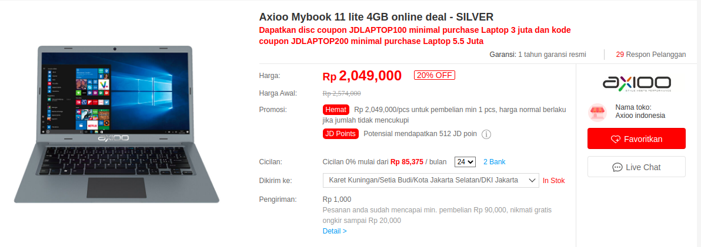

Beli Laptop Murah Untuk Data Science
================

Selama beberapa tahun ini saya menggunakan Galaxy Tab A berukuran 10
inch sebagai second *daily driver* saya. Alasannya simpel: layar besar
dan bisa digunakan untuk melakukan *analytics on the go* (menggunakan
[*cloud*](https://ikanx101.github.io/blog/r-cloud/) atau [*hard
install*](https://passingthroughresearcher.wordpress.com/2019/06/12/analytics-on-the-go-cara-install-r-ke-gadget-android/)).

Jadi saya bukan gaya-gayaan pake tablet segede talenan yah. Tapi memang
ada alasan kuat dibalik itu.

Sepanjang perjalanannya, ternyata saya butuh sesuatu yang lebih powerful
tapi tidak juga menepikan unsur mobilitas. Saya diberikan laptop kantor
yang sangat powerful tapi bobotnya lumayan berat.

> Harus ada laptop lain berukuran kecil yang bisa digunakan untuk
> pekerjaan saya sehari-hari menggunakan **R**.

Setelah cek sana-sini, pilihan jatuh pada laptop *Axioo Mybook 11 lite*.
Kebetulan juga, sedang ada [*flash sale* di
**jd.id**](https://www.jd.id/product/axioo-mybook-11-lite-4gb-online-deal-silver_603033132/603034079.html).
Tanpa pikir panjang, maka saya beli saja langsung laptop tersebut.

``` r

```


> Kenapa sih pilihnya Axioo?

Saya dan istri punya sejarah panjang dengan merek ini.

Dulu waktu kuliah, saya menggunakan laptop Axioo sejak semester III
sampai kerja. Alhamdulillah Allah mengizinkan saya lulus kuliah
menggunakan laptop tersebut.

Pun demikian dengan istri saya saat kuliah dulu. Saya berhasil
meracuninya agar membeli laptop merek sama. Laptop tersebut menemani dia
dan adiknya saat kuliah dulu. Bahkan laptop tersebut masih hidup sampai
sekarang dan masih digunakan oleh mertua saya.

Kembali ke topik, jika dilihat dari speknya yang pas-pasan, maka dari
awal memang saya akan memasang **OS** non *Windows* ke dalam laptop
tersebut.

> Pasang Ubuntu juga nih. Biar greget\!
