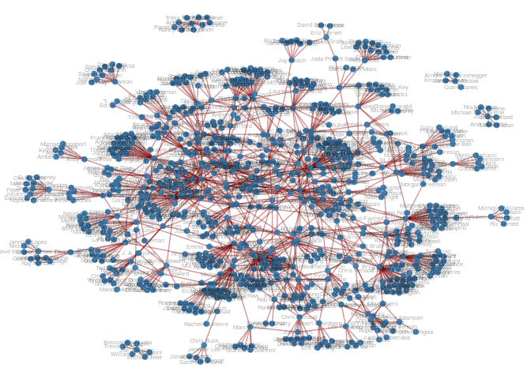
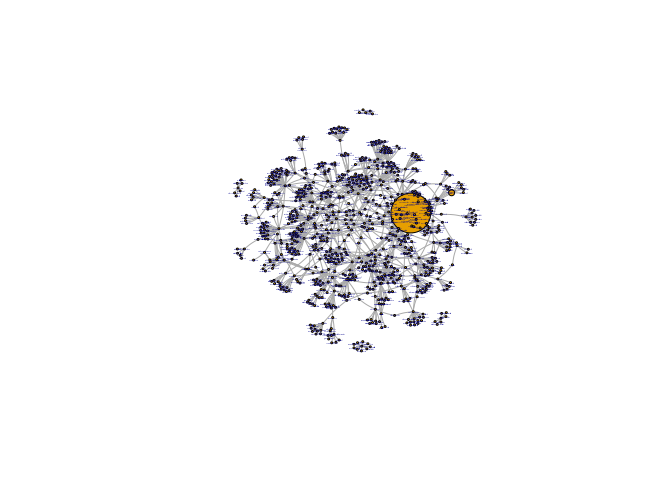

Frequent Collaborators In Movies
================

Percaya atau tidak, dalam bekerja biasanya kita memilih rekan kerja yang
memang kita nyaman bekerja dengannya. Hal ini berlaku untuk semua bidang
pekerjaan.

Sama saat para sutradara terbaik dunia dalam membuat film, ternyata ada
beberapa aktor atau aktris yang menjadi **langganan** mereka untuk
bekerja sama.

Terinspirasi dari [**Six Degree of Kevin
Bacon**](https://en.m.wikipedia.org/wiki/Six_Degrees_of_Kevin_Bacon),
saya iseng akan membuat aktor atau aktris siapa yang memiliki koneksi
kerjasama banyak dengan sutradara-sutradara tersebut.

Datanya akan saya scrap dari informasi detail yang tersedia di
**Wikipedia** yah.

Contohnya, pada film [Spider-Man: Far From
Home](https://en.wikipedia.org/wiki/Spider-Man:_Far_From_Home), data
hasil *scrap*-nya seperti ini:

    ##                        judul sutradara            aktors
    ## 1  Spider-Man: Far From Home Jon Watts       Tom Holland
    ## 2  Spider-Man: Far From Home Jon Watts Samuel L. Jackson
    ## 3  Spider-Man: Far From Home Jon Watts           Zendaya
    ## 4  Spider-Man: Far From Home Jon Watts    Cobie Smulders
    ## 5  Spider-Man: Far From Home Jon Watts       Jon Favreau
    ## 6  Spider-Man: Far From Home Jon Watts      J. B. Smoove
    ## 7  Spider-Man: Far From Home Jon Watts     Jacob Batalon
    ## 8  Spider-Man: Far From Home Jon Watts      Martin Starr
    ## 9  Spider-Man: Far From Home Jon Watts      Marisa Tomei
    ## 10 Spider-Man: Far From Home Jon Watts   Jake Gyllenhaal

Nah, kita akan *scrap* data 10 film dengan *highest grossing* dari tahun
2000 - 2019. Kita dapatkan data sebagai berikut:

    ## 'data.frame':    1553 obs. of  3 variables:
    ##  $ judul    : chr  "Spider-Man: Far From Home" "Spider-Man: Far From Home" "Spider-Man: Far From Home" "Spider-Man: Far From Home" ...
    ##  $ sutradara: chr  "Jon Watts" "Jon Watts" "Jon Watts" "Jon Watts" ...
    ##  $ aktors   : chr  "Tom Holland" "Samuel L. Jackson" "Zendaya" "Cobie Smulders" ...

Berapa banyak film yang saya dapatkan?

    ## [1] 200

<!-- -->

    ##                          nama close between degree
    ## 1                 David Yates     0       0     39
    ## 2               Peter Jackson     0       0     39
    ## 3      Anthony RussoJoe Russo     0       0     35
    ## 4                Bryan Singer     0       0     34
    ## 5                 Jon Favreau     0      66     29
    ## 6                 Michael Bay     0       0     29
    ## 7                J. J. Abrams     0       0     28
    ## 8                 Bill Condon     0       0     24
    ## 9           Christopher Nolan     0       0     24
    ## 10                 Tim Burton     0       0     23
    ## 11                Joss Whedon     0       0     19
    ## 12               Ridley Scott     0       0     19
    ## 13                Zack Snyder     0       0     19
    ## 14                 James Gunn     0       0     18
    ## 15                 Ron Howard     0       0     18
    ## 16             Andrew Stanton     0       0     17
    ## 17                  James Wan     0       0     17
    ## 18             Chris Columbus     0       0     16
    ## 19               David Leitch     0       0     15
    ## 20          Wolfgang Petersen     0       0     15
    ## 21                Alan Taylor     0       0     14
    ## 22             Alfonso Cuarón     0       0     14
    ## 23                Chris Weitz     0       0     14
    ## 24           Francis Lawrence     0       0     14
    ## 25        Jennifer Yuh Nelson     0       0     14
    ## 26                  Jon Watts     0       0     14
    ## 27               Rian Johnson     0       0     14
    ## 28          Steven Soderbergh     0       0     14
    ## 29                Josh Cooley     0       0     13
    ## 30                Lee Unkrich     0       0     13
    ## 31                Mike Newell     0       0     13
    ## 32                Pete Docter     0       0     13
    ## 33  Pierre Coffin\nKyle Balda     0       0     13
    ## 34                  Sam Raimi     0       0     13
    ## 35             Andrew Adamson     0       0     12
    ## 36                  Brad Bird     0       0     12
    ## 37               Brett Ratner     0       0     12
    ## 38   Byron Howard\nRich Moore     0       0     12
    ## 39                Guy Ritchie     0       0     12
    ## 40 John StevensonMark Osborne     0       0     12
    ## 41                 Justin Lin     0       0     12
    ## 42                  Marc Webb     0       0     12
    ## 43              Todd Phillips     0       0     12
    ## 44           Barry Sonnenfeld     0       0     11
    ## 45               Chris Renaud     0       0     11
    ## 46                 David Ayer     0       0     11
    ## 47               F. Gary Gray     0       0     11
    ## 48             Gore Verbinski     0       0     11
    ## 49               Ryan Coogler     0       0     11

<!-- -->
