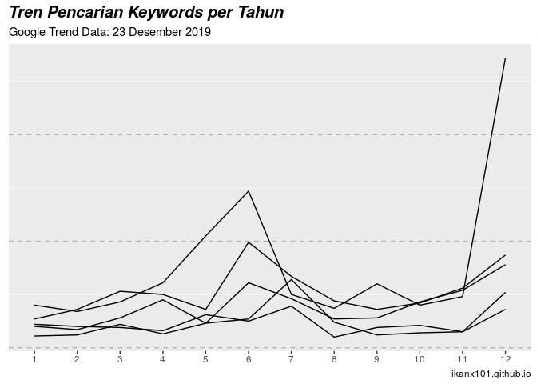

Melihat Antusiasme Warganet Mengenai Tol Japek Elevated
================

Beberapa waktu yang lalu, Pak Presiden Jokowi [meresmikan tol layang
Jakarta Cikampek
elevated](https://www.liputan6.com/bisnis/read/4132366/jokowi-resmikan-tol-layang-jakarta-cikampek-siang-ini).
Pembangunan jalan layang yang berhasil membuat kemacetan parah selama
ini akhirnya selesai juga.

Menarik bagi saya untuk melihat antusiasme warganet terhadap jalan
layang ini.

Kali ini, saya tidak akan mengambil data dari **twitter** atau sosial
media lainnya. Saya akan mencari *keywords* apa yang ditelusuri warganet
di Google terkait dengan topik ini.

Untuk itu, saya akan menggunakan `library(gtrendsR)` di **R**. Topik
yang akan saya cari adalah semua topik yang berkaitan dengan dua
*keywords* utama, yakni:

1.  `tol jakarta cikampek`
2.  `japek`

Tak butuh waktu satu detik, saya sudah mendapatkan hasilnya pencarian
saya. Ada empat *dataset* yang saya terima, yakni:

1.  `interest_over_time`
2.  `interest_by_region`
3.  `interest_by_city`
4.  `related_queries`

Seperti biasa, mari kita bedah satu-persatu:

# `interest_over_time`

Apa saja sih isi dari *dataset* ini?

    ## 'data.frame':    520 obs. of  7 variables:
    ##  $ date    : POSIXct, format: "2014-12-28" "2015-01-04" ...
    ##  $ hits    : int  3 2 3 2 3 4 6 2 3 3 ...
    ##  $ geo     : chr  "ID" "ID" "ID" "ID" ...
    ##  $ time    : chr  "today+5-y" "today+5-y" "today+5-y" "today+5-y" ...
    ##  $ keyword : chr  "tol jakarta cikampek" "tol jakarta cikampek" "tol jakarta cikampek" "tol jakarta cikampek" ...
    ##  $ gprop   : chr  "web" "web" "web" "web" ...
    ##  $ category: int  0 0 0 0 0 0 0 0 0 0 ...

Inti dari *dataset* ini adalah *trend* pencarian dua *keywords* ini
perwaktu. Dengan mudahnya saya bisa membuat *lineplot* dari *dataset*
ini
sbb:

<!-- -->

Sepertinya penggunaan singkatan **japek** baru nge- *hype* akhir-akhir
ini yah.

Coba kalau saya rapikan kembali datanya. Saya akan gabungkan pencarian
kedua *keywords* ini lalu akan saya jadikan dalam level bulanan. Saya
penasaran, apakah ada pola *seasonal* dari pencarian ini.

> Siapa tahu pencarian mengenai jalan tol ini meningkat **hanya** di
> saat-saat tertentu saja. Misalkan: pada saat liburan lebaran atau
> natal.

<!-- -->

Gimana? Sudah terlihat ada pola *seasonal*-nya? Oke, kalau saya ubah ke
bentuk grafik berikut ini
gimana:

<!-- -->

Dugaan saya, ada peningkatan pencarian di dekat-dekat musim liburan
lebaran.

    ## Adding missing grouping variables: `bulan`

<!-- -->

``` r
str(data$interest_by_region)
```

    ## 'data.frame':    68 obs. of  5 variables:
    ##  $ location: chr  "West Java" "Banten" "Special Capital Region of Jakarta" "Lampung" ...
    ##  $ hits    : int  100 51 43 14 12 9 5 4 4 2 ...
    ##  $ keyword : chr  "tol jakarta cikampek" "tol jakarta cikampek" "tol jakarta cikampek" "tol jakarta cikampek" ...
    ##  $ geo     : chr  "ID" "ID" "ID" "ID" ...
    ##  $ gprop   : chr  "web" "web" "web" "web" ...

``` r
str(data$interest_by_city)
```

    ## 'data.frame':    14 obs. of  5 variables:
    ##  $ location: chr  "Cikampek" "East Telukjambe" "Karawang" "Bekasi" ...
    ##  $ hits    : chr  "100" "61" "55" "41" ...
    ##  $ keyword : chr  "tol jakarta cikampek" "tol jakarta cikampek" "tol jakarta cikampek" "tol jakarta cikampek" ...
    ##  $ geo     : chr  "ID" "ID" "ID" "ID" ...
    ##  $ gprop   : chr  "web" "web" "web" "web" ...

``` r
str(data$related_queries)
```

    ## 'data.frame':    80 obs. of  6 variables:
    ##  $ subject        : chr  "100" "97" "93" "85" ...
    ##  $ related_queries: chr  "top" "top" "top" "top" ...
    ##  $ value          : chr  "jalan tol cikampek jakarta" "jalan tol cikampek" "jalan tol" "info tol jakarta cikampek" ...
    ##  $ geo            : chr  "ID" "ID" "ID" "ID" ...
    ##  $ keyword        : chr  "tol jakarta cikampek" "tol jakarta cikampek" "tol jakarta cikampek" "tol jakarta cikampek" ...
    ##  $ category       : int  0 0 0 0 0 0 0 0 0 0 ...
    ##  - attr(*, "reshapeLong")=List of 4
    ##   ..$ varying:List of 1
    ##   .. ..$ value: chr "top"
    ##   .. ..- attr(*, "v.names")= chr "value"
    ##   .. ..- attr(*, "times")= chr "top"
    ##   ..$ v.names: chr "value"
    ##   ..$ idvar  : chr "id"
    ##   ..$ timevar: chr "related_queries"
