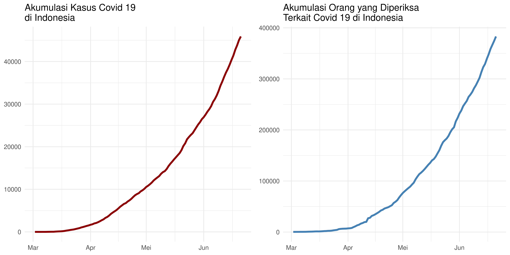

Mencoba SHINYAPPS: Visualisasi COVID19
================

# Shiny Web App

Banyak orang bilang bahwa R tidak *powerful enough* untuk dijadikan
basis suatu aplikasi. Memang benar adanya, karena awalnya R digunakan
sebagai *data analisys tools*. Namun, dengan perkembangan yang ada, kini
R bisa digunakan untuk membuat suatu aplikasi *web-based* seperti
**Shiny Apps**.

Awalnya saya agak malas untuk mempelajari hal ini. *Rmarkdown Xaringan*
menurut saya sudah cukup untuk pekerjaan sehari-hari membuat *report*
market riset dan *data science* di kantor. Untuk urusan *dashboard*,
saya sudah fasih menggunakan **Qlik Sense** [sejak
lama](https://passingthroughresearcher.wordpress.com/2015/06/22/big-data-series-your-big-data-project-starts-with-your-own-data/)
dan kini kantor memilih untuk *deploy* **Tableau**.

> Buat apa saya harus belajar Shiny lagi?

Begitu pikir saya.

Namun minggu lalu, saat saya dihadapkan untuk membuat *dashboard* hasil
riset di **Tableau**, saya menemukan kesulitan saat membuat struktur
data dari *multiple answer questions*. Susah banget ternyata. Tidak
semudah Qlik Sense.

Dengan metode pivot sampai *export pre-processed data* ke format
**.json** sudah saya lakukan. Belum ada satupun yang memuaskan saya.

Sampai akhirnya saya mencoba si *Shiny*.

Ternyata cukup mudah yah. Jika kalian sudah terbiasa membuat *Rmarkdown*
dan memang menyimpan *functions* visualisasi, ini adalah cara yang
termudah dalam membuat *Shiny*.

Singkat cerita, dalam sehari saya bisa membuat semacam mini *dashboard*
visualisasi untuk [Covid 19](https://ikanx.shinyapps.io/covid_19/).
Bukan hanya visualisasi, tapi saya meng- *embed* algoritma *scraping*
data otomatis setiap kali saya *republish to server*.

## Analisa yang Dilakukan

Salah satu pertanyaan yang sering muncul adalah:

> Kapan pandemi ini berakhir?

Jika pada tulisan sebelumnya, saya banyak membahas mengenai *math
modelling*, sekarang saya akan coba melihat dari data yang ada.

Dua minggu pasca lebaran, jika kita perhatikan angka kenaikan kasus
positif Covid 19 di Indonesia perharinya mencapai angka sekitar 1.000
orang. Ini membuat sebagian dari kita bertanya-tanya.

Namun, perlu diperhatikan. Data kenaikan kasus positif adalah data
akibat. Lalu apa data sebabnya? Yaitu adalah data banyaknya tes yang
dijalankan.

Dengan membandingkan data tes dan data kenaikan kasus positif, kita bisa
mendapatkan gambaran yang lebih baik mengenai kondisi terkini di
Indonesia.

    ## New names:
    ## * `` -> ...1
    ## * `` -> ...29

<!-- -->
