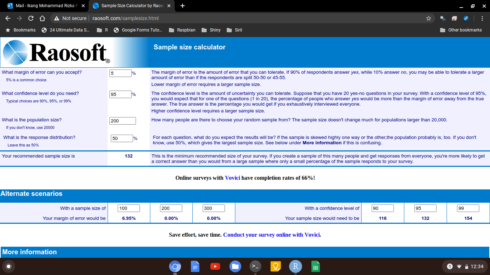
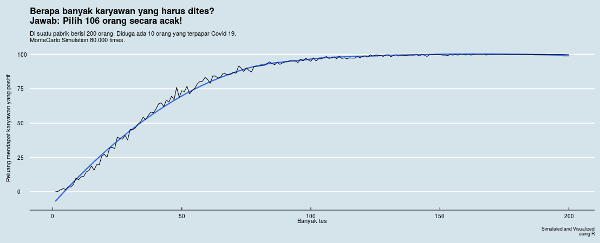

```{r setup, include=FALSE}
knitr::opts_chunk$set(echo = TRUE)

library(dplyr)
library(ggplot2)


```

Kayaknya hampir semua orang kaget saat mendengar kabar bahwa [pabrik Unilever di Cikarang](https://www.cnnindonesia.com/nasional/20200703141857-20-520535/36-positif-corona-dari-klaster-unilever-bekasi-bupati-gusar) sudah ada 36 orang karyawan yang terpapar Covid 19. Tentunya ini adalah pukulan bagi perusahaan tersebut.

Hal serupa juga hantu yang membayangi setiap perusahaan manufaktur. Jika saja ada satu orang karyawan yang positif, bisa jadi merembet ke mana-mana.

Beberapa hari yang lalu, HP saya berdering. Teman saya di ujung telepon bertanya:

> Di pabrik saya ada sekitar 2.000 orang, kira-kira saya butuh ngetes berapa banyak orang karyawan agar bisa mendapatkan gambaran kondisi di perusahaan saya aman atau tidak?

_Mmh_, mendengar pertanyaan dari teman saya tersebut saya coba berpikir sejenak. Apa tujuan sebenarnya dari tes ini? Lalu apa yang akan dilakukan saat mendapati karyawan yang positif Covid 19?

Untuk menghitung berapa banyak sampel, setidaknya ada beberapa cara yang bisa digunakan. TAPI, izinkan saya membuat analogi berikut ini:

> Misal, di komplek perumahan saya tinggal 200 orang. Saya penasaran, apakah ada orang dari suku Betawi yang hidup bersama saya di komplek ini. 

Setelah dihitung menggunakan _sample size calculator online_ seperti milik [raosoft](http://www.raosoft.com/samplesize.html), saya harus mewawancarai 132 orang. 

```{r,echo=FALSE}

```

Jika menggunakan cara ini, setidaknya kita membutuhkan tiga informasi, yakni:

1. N, berapa banyak populasi.
2. _Margin of error_.
3. _Confidence level_.

Penjelasan mengenai _margin of error_ dan _confidence level_ sudah pernah saya tulis di [sini](https://passingthroughresearcher.wordpress.com/2019/04/18/research-101-mengenal-margin-of-error-dan-confidence-level/).

## Komplikasi

Nah, misalkan saya hendak bertanya ke 132 orang secara acak. Bisa jadi  saat saya bertanya ke orang pertama saya sudah mendapatkan orang Betawi. Bisa jadi saya baru mendapatkan orang Betawi pada saat bertanya ke orang ke-90. Bisa jadi pada saat orang ke-130.

Jadi apakah memungkinkan kita menghitung berapa sampel yang dibutuhkan plus peluang mendapatkan orang positif dengan efisien?

> Karena sejatinya saya cukup mendapatkan satu orang Betawi saja tanpa harus menghitung berapa banyak orang Betawi di komplek saya!

Nah, di sini saya mencoba menghitungnya dengan menggunakan simulasi Monte Carlo. Prosesnya cukup simpel, yakni dengan menghitung peluang dari ribuan kombinasi yang mungkin muncul dari kondisi ini.

Untuk membangun algoritma simulasinya, saya membutuh dua hal:

1. N populasi,
1. Dugaan berapa banyak orang Betawi yang ada di komplek saya.

Jadi kalau dikembalikan ke kasus teman saya tadi, seandainya ada 10 orang yang positif, maka dibutuhkan:

```{r,echo=FALSE}

```

Jadi saat saya mewawancarai 106 orang secara acak, saya berpeluang besar sudah mendapatkan setidaknya satu orang betawi.

Bahkan saat saya mewawancari 50 orang saja, saya mendapatkan peluang 60% - 75% saya sudah mendapatkan orang betawi.

____

Simulasinya saya taruh di [shinyapps Covid 19](https://ikanx.shinyapps.io/covid_19/) saya ya. _Feel free to use it_.