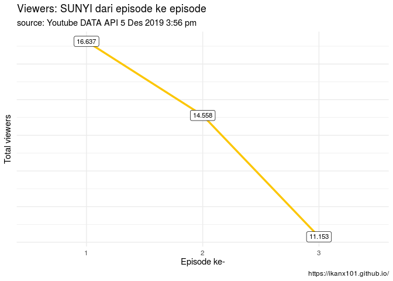
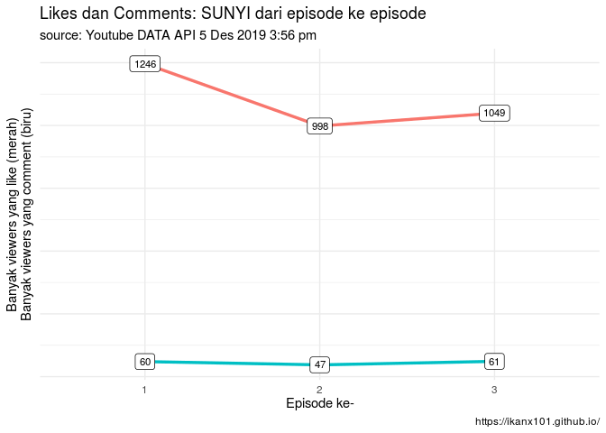

Sunyi Web Series by Tropicana Slim
================

> Data is the new oil

Masih ingat dengan *quotes* di atas? Di tulisan saya yang
[lalu](https://ikanx101.github.io/blog/kuliah-umum-tel-u/), saya pernah
menyebutkan bahwa salah satu tantangan bagi kita saat ini terkait data
adalah **di mana kita bisa mendapatkannya**. Sejatinya di zaman digital
ini, data bertebaran di mana-mana.

Kembali ke judul tulisan ini, **Tropicana Slim** selalu saja membuat
*web series* yang menarik dan layak ditunggu di *channel*
**Youtube**-nya. Setelah meluncurkan *web series* **Sore** dan
**Janji**, kini ada **Sunyi**. Hal yang paling serunya lagi adalah
**Sunyi** bertemakan dunia *difabel* atau *disabilitas*.

*Cobain deh*, nonton episode
[pertamanya](https://www.youtube.com/watch?v=7_0V14TYVzc). Dijamin bikin
penasaran (*dan mungkin baper bagi Anda yang jomblo*). *hehe*

Sampai tulisan ini saya buat, **Sunyi** sudah sampai episode 3 *lhoo*.
*Viewers*-nya sudah belasan ribu.

*Nah*, sekarang saya coba *iseng* mengambil data dari **Youtube**
terkait *web series* ini. Untuk melakukannya saya menggunakan bantuan
~~Python~~ **R** dan **Youtube Data API**.

Proses membuat *Google Authetication* -nya mirip dengan layanan *Google
Vision AI*, yakni tidak menggunakan **API**. Bagian ini saya *skip* yah.
Kita langsung ke bagian ambil dan ekstrak datanya. Penasaran data apa
saja yang bisa diambil? *Yuk cekidot\!*

## Data pertama

Data yang paling mudah diambil adalah data berapa banyak *view*, *like*,
*dislike*, *favourite*, dan *comment*. Sepertinya hal yang receh yah.
Gak pake bantuan **R** sebenarnya bisa diambil sendiri *manual*
satu-persatu. Tapi kalau *web series*-nya kayak
[Tersanjung](https://id.wikipedia.org/wiki/Tersanjung) *gimana hayo*?

Hasil datanya seperti
    ini:

    ##   viewCount likeCount dislikeCount favoriteCount commentCount episode
    ## 1     16637      1246            3             0           60       1
    ## 2     14558       998            1             0           47       2
    ## 3     11153      1049            4             0           61       3

Heran yah, padahal sudah bagus gitu *web series*-nya, masih ada aja yang
*dislike*. *hehe*

Kalau dilihat sekilas, *viewers*-nya menurun tiap episode. Bisa jadi
karena memang *web series*-nya baru saja mulai. Jadi belum banyak yang
menonton.

<!-- -->

Walaupun begitu, tren yang berbeda ditunjukkan pada variabel `likeCount`
dan `commentCount`. Sempat menurun pada episode kedua tapi naik di
episode
ketiga.

<!-- -->
