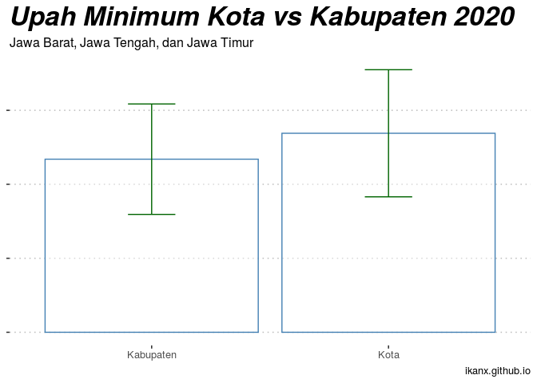

Upah Minimum Kota di Pulau Jawa
================

Sebagai seorang orang yang berkecimpung di dunia *recruitment* dan *HR*,
nyonya malam ini mengajak diskusi terkait dengan data hasil survey
mengenai **Indonesia Salary Benchmark** yang dilakukan oleh lembaga
bernama *Michael Page*.

> *Seharusnya gaji kamu itu segini lho…* Katanya sambil menunjuk ke
> hasil surveynya.

> *Oh begitu yah?* Jawab saya sambil tersenyum.

Persoalan mengenai gaji memang tiada habisnya. Dari level yang tinggi
sampai yang paling bawah. Terlebih lagi saat kita membahas masalah
**Upah Minimum Provinsi atau Kota** yang ada di Pulau Jawa.
Masing-masing provinsi dan kota memiliki cara perhitungan masing-masing
sehingga besarannya juga berbeda.

Ada yang masih menjadi polemik, ada yang tenang-tenang saja dan minim
pemberitaan.

Penasaran dengan besaran UMK tersebut, saya coba *Googling* sana-sini
untuk mendapatkan datanya.

> *Kalau nemu dalam bentuk tabel, enak banget nih scrap-nya* Pikir saya.

Tapi setelah mencari-cari kok tidak ketemu yah.

Akhirnya saya putuskan untuk mengambil datanya dari teks di [halaman
berita
ini](https://www.kompas.com/tren/read/2019/11/22/191520565/disahkan-berikut-rincian-ump-dan-umk-2020-di-dki-jakarta-jawa-barat-jawa?page=all).

## Scrap data

Saya mulai dengan scrap data menggunakan `library(rvest)` di **R**. Tapi
sayang sekali, formatnya masih *unstructured* sebagai berikut:

    ##  [1] "Kabupaten Karawang Rp 4.594.324"     
    ##  [2] "Kota Bekasi Rp 4.589.708"            
    ##  [3] "Kabupaten Bekasi Rp. 4.498.961"      
    ##  [4] "Kota Depok Rp 4.202.105"             
    ##  [5] "Kota Bogor Rp 4.169.806"             
    ##  [6] "Kabupaten Bogor Rp 4.083.670"        
    ##  [7] "Kabupaten Purwakarta Rp 4.039.067"   
    ##  [8] "Kota Bandung Rp 3.623.778"           
    ##  [9] "Kabupaten Bandung Barat Rp 3.145.427"
    ## [10] "Kabupaten Sumedang Rp 3.139.275"     
    ## [11] "Kabupaten Bandung Rp 3.139.275"      
    ## [12] "Kota Cimahi Rp 3.139.274"            
    ## [13] "Kabupaten Sukabumi Rp 3.028.531"     
    ## [14] "Kabupaten Subang Rp 2.965.468"       
    ## [15] "Kabupaten Cianjur Rp 2.534.798"

## Data carpentry

Bentuk data itu harus saya ubah dulu agar bisa dianalisa lebih lanjut.
Sebenarnya caranya simpel yah, jika diperhatikan baik - baik, saya bisa
melakukan `separate` dengan memanfaatkan pola adanya tanda **Rp** di
setiap baris data.

Setelah itu, saya akan tambahkan informasi mengenai nama provinsi
sebagai variabel. Sehingga didapatkan data sebagai berikut:

    ##      provinsi      tipe                 kota_kab     umk
    ## 1  Jawa Barat Kabupaten      Kabupaten Karawang  4594324
    ## 2  Jawa Barat      Kota             Kota Bekasi  4589708
    ## 3  Jawa Barat Kabupaten        Kabupaten Bekasi  4498961
    ## 4  Jawa Barat      Kota              Kota Depok  4202105
    ## 5  Jawa Barat      Kota              Kota Bogor  4169806
    ## 6  Jawa Barat Kabupaten         Kabupaten Bogor  4083670
    ## 7  Jawa Barat Kabupaten    Kabupaten Purwakarta  4039067
    ## 8  Jawa Barat      Kota            Kota Bandung  3623778
    ## 9  Jawa Barat Kabupaten Kabupaten Bandung Barat  3145427
    ## 10 Jawa Barat Kabupaten      Kabupaten Sumedang  3139275
    ## 11 Jawa Barat Kabupaten       Kabupaten Bandung  3139275
    ## 12 Jawa Barat      Kota             Kota Cimahi  3139274
    ## 13 Jawa Barat Kabupaten      Kabupaten Sukabumi  3028531
    ## 14 Jawa Barat Kabupaten        Kabupaten Subang  2965468
    ## 15 Jawa Barat Kabupaten       Kabupaten Cianjur  2534798

## Mulai oprek-oprek

Nah, berhubung datanya sudah rapih, mari kita lihat satu-persatu yah.

### Kota vs Kabupaten

Banyak orang (termasuk saya) tidak bisa membedakan apa itu kota dan
kabupaten. Apakah kota selalu lebih maju dibanding kabupaten? Untuk
urusan upah minimum ini, mari kita lihat perbandingan kota dan kabupaten
di Jawa Barat, Jawa Tengah, dan Jawa Timur.

``` r
data %>% filter(tipe!='DKI') %>% group_by(tipe) %>%
  summarise(rata=mean(umk),stdev=sd(umk)) %>%
  ggplot(aes(x=tipe,y=rata)) + geom_col(color='steelblue',fill='white',alpha=.4) +
  geom_errorbar(aes(ymin=rata-stdev, ymax=rata+stdev), width=.2,color='darkgreen') +
  theme_pubclean() +
  labs(title = 'Upah Minimum Kota vs Kabupaten 2020',
       subtitle = 'Jawa Barat, Jawa Tengah, dan Jawa Timur',
       caption = 'ikanx.github.io') +
  theme(axis.text.y = element_blank(),
        axis.title = element_blank(),
        plot.title = element_text(size=25,face='bold.italic'))
```

<!-- -->
