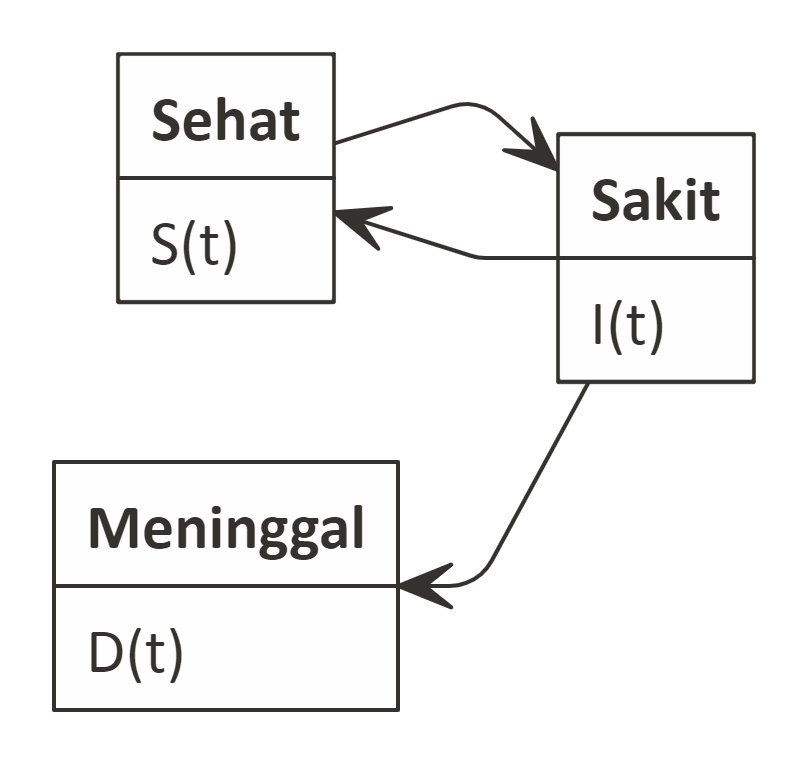

```{r setup, include=FALSE}
knitr::opts_chunk$set(echo = TRUE)
rm(list=ls())
setwd("/cloud/project/Bukan Infografis/covid 19")
```

# Pendahuluan

Sebagaimana yang kita ketahui bersama, __WHO__ beberapa hari yang lalu telah mengumumkan bahwa kasus __COVID-19__ menjadi [pandemi](https://www.nbcnews.com/health/health-news/live-blog/coronavirus-updates-live-u-s-cases-top-1-000-spread-n1155241). Penyebarannya dinilai semakin masif dan tidak terkontrol di beberapa negara. Politisi, artis, bahkan olahragawan dunia sudah terserang penyakit tersebut.

# Angka Statistik __COVID-19__

Konon katanya, secara perhitungan statistika, __COVID-19__ [tidak begitu berbahaya](https://time.com/5798168/coronavirus-mortality-rate/) dibandingkan dengan penyakit lainnya. Jika saya mengambil sumber dari situs [www.worldometers.info](https://www.worldometers.info/coronavirus/), justru persentase kesembuhannya lebih tinggi.

Namun hal ini jangan membuat kita lengah dan tidak waspada. 

Kenapa? Karena nilai __R0__ dari __COVID-19__ berada di rentang yang relatif tidak jauh dari penyakit [_mumps_](https://en.wikipedia.org/wiki/Mumps) yang pernah mampir di beberapa tempat tahun lalu.

```{r,echo=FALSE,warning=FALSE,message=FALSE}
library(dplyr)
library(ggplot2)
library(ggthemes)

dise = c('Smallpox','Rubella','Mumps','SARS','COVID-19','Influenza','MERS')
r0_min = c(5,5,4,2,1.4,2,.3)
r0_max = c(7,7,7,5,3.9,3,.8)

data = data.frame(dise,r0_min,r0_max)

data %>% ggplot(aes(x=reorder(dise,-r0_min))) + 
  geom_errorbar(aes(ymin=r0_min, ymax=r0_max), width=.5) +
  theme_economist() +
  labs(title = 'Rentang R0 dari Beberapa Penyakit yang Ditularkan Melalui\nDroplet Airborne',
       subtitle = 'Sumber: wikipedia.org',
       caption = 'Visualized using R\nikanx101.github.io') +
  theme(axis.title = element_blank())
```

Apa itu __R0__? Penjelasannya bisa dilihat di [sini](https://en.wikipedia.org/wiki/Basic_reproduction_number). Angka ini nantinya yang akan membantu saya dalam membuat model penyebaran penyakit.

# Pertanyaan yang Sering Muncul

Di beberapa _WhatsApp Group_ yang saya ikuti, sering saya menemukan pertanyaan:

1. _Sampai kapan virus ini akan menyebar?_
2. _Apa sih yang harus dilakukan untuk meminimalisir penyebaran virus ini?_

Untuk menjawab pertanyaan-pertanyaan tersebut, lebih mudah bagi saya untuk membuat modelnya sehingga saya bisa sekalian memperlihatkan apa yang mungkin bisa terjadi. 

> Model ini tidak saya tujukan untuk membuat prediksi atau _forecast_. Saya hanya ingin menjelaskan kondisi saat ini dan apa yang bisa kita lakukan bersama.

# Model Penyebaran Penyakit

Sewaktu kuliah di Matematika dulu, saya pernah mempelajari dan membuat model matematika sederhana untuk memformulasikan penyebaran penyakit Kusta di Jawa Barat. Kerja sama antara ITB dan Dinkes Provinsi Jawa Barat.

Berdasarkan ilmu yang saya ketahui, saya mencoba membuat model matematika sederhana yang bisa menggambarkan situasi penyebaran virus ini.

## Apa perbedaan model matematika dan model statistika?

Perbedaan mendasar adalah model matematika bisa dibangun tanpa menggunakan data. Data hanya digunakan untuk __menaksir parameter__ dalam model. Walaupun demikian, model ini tetap _robust_ karena bisa divalidasi menggunakan data juga.

Sedangkan model statistika dibangun berdasarkan keseluruhan atau sebagian dari data yang ada.

## Membuat model matematika

Dalam membuat model penyebaran penyakit __COVID-19__ ini, masih ada beberapa limitasi dan asumsi yang saya gunakan. Oleh karena itu, saya tekankan kembali bahwa model ini adalah sebagai indikasi saja.

## _Compartment Model_

Model penyebaran penyakit biasa disebut _compartmental model_. Ada dua jenis model, yakni:

1. SIR model.
2. SIS model.

Apa bedanya? 

### __SIR model__

Merupakan singkatan dari _Susceptible_, _Infectious_, dan _Recovered_.

- _Susceptible_, yakni orang-orang yang sehat dan rentan terhadap penyakit.
- _Infectious_, yakni orang-orang yang sudah tertular penyakit dan bisa menularkan ke orang yang sehat.
- _Recovered_, yakni orang-orang yang sudah sembuh dan menjadi imun terhadap penyakit tersebut.

Digunakan untuk memodelkan perubahan jumlah orang per satuan waktu di masing-masing kelompok di atas.

> Asumsi dasar pada model ini adalah orang yang sembuh tidak mungkin tertular kembali.

```{r out.width = '70%',echo=FALSE}

```

### __SIS Model__

Merupakan singkatan dari _Susceptible_, _Infectious_, dan _Susceptible_.

- _Susceptible_, yakni orang-orang yang sehat (atau orang yang sudah sembuh) dan rentan terhadap penyakit.
- _Infectious_, yakni orang-orang yang sudah tertular penyakit dan bisa menularkan ke orang yang sehat.

Digunakan untuk memodelkan perubahan jumlah orang per satuan waktu di masing-masing kelompok di atas.

> Asumsi dasar pada model ini adalah orang yang sembuh mungkin tertular kembali.

```{r out.width = '70%',echo=FALSE}

```

# Lalu Pilih Model yang Mana?

Dari kasus __COVID-19__, kita tahu bahwa pasien yang sembuh ternyata [bisa tertular lagi](https://www.cnnindonesia.com/nasional/20200308155149-20-481538/pemerintah-sebut-pasien-sembuh-dari-corona-bisa-tertular-lagi).

Oleh karena itu saya akan menggunakan __SIS Model__ yang akan dimodifikasi. 

> Modifikasi di bagian apa?

Kita ketahui bersama-sama bahwa ada peluang pasien yang terkena penyakit __COVID-19__ meninggal akibat komplikasi. Karena pada __SIS Model__, secara _default_ tidak ada kelompok pasien yang meninggal akibat penyakit tersebut.

# Membuat __SIS Model__

## Persamaan Differensial

Perlu saya sampaikan bahwa model matematika yang akan dibangun ini berlandaskan persamaan diferensial. Jika kita ingat pelajaran saat SMA dulu, kita pernah belajar mengenai __turunan__. _Nah_ itu adalah persamaan diferensial.

> Kenapa menggunakan persamaan diferensial?

Persamaan diferensial biasa digunakan untuk menyelesaikan permasalahan yang menyangkut __perubahan dalam kondisi atau satuan tertentu__.

___

Masih ingat pelajaran __Fisika Klasik__ saat SMA dulu? Itu adalah salah satu contoh persamaan diferensial.

- Misalkan $s(t)$ adalah jarak pada waktu tertentu $(t)$.
- Kecepatan bisa kita definisikan sebagai perubahan jarak dalam satuan waktu, yakni: $v(t) = \frac{d s(t)}{dt}$.
- Sedangkan percepatan bisa kita definisikan sebagai perubahan kecepatan dalam satuan waktu, yakni: $a(t) = \frac{d v(t)}{dt} = \frac{d s(t)}{dt^2}$

___

Kembali ke __SIS model__ _yah_. Sekarang saya akan membangun `tiga` persamaan diferensial yang merepresentasikan kelompok pada __SIS model__ saya. Satuan waktu yang saya gunakan adalah __hari__. 

Berikut adalah tiga kelompok yang akan dibangun persamaannya?

$$S(t), I(t), D(t)$$

```{r,echo=FALSE}

```

## _Susceptible_ $S(t)$

Pada awalnya, hampir semua orang termasuk ke dalam kelompok ini, yakni sehat namun rentan. Tidak ada bukti yang cukup bahwa ada orang yang secara alami imun terhadap virus ini. Sehingga kita bisa buat hipotesa sementara bahwa semua orang yang sehat berpeluang untuk menjadi sakit.

Saya bisa tuliskan saat awal waktu, ($t = 0$) banyaknya $S(0)$ sama dengan banyaknya orang di populasi minus seorang yang sakit (saya tulis sebagai $N - 1$).

Perubahan banyaknya orang yang sehat diasumsikan __HANYA__ berasal dari dua hal:

### Orang Sehat yang Menjadi Sakit

Orang sehat menjadi sakit akibat berinteraksi dengan orang yang sakit (sehingga tertular). Interaksi ini dituliskan dalam bahasa matematika: 

$$\beta*S(t)*I(t)$$ 

Dimana $\beta$ adalah laju orang yang sehat menjadi tertular karena berinteraksi dengan orang yang sakit. 

Pada model sederhana ini, diasumsikan orang sehta dan sakit saling berinteraksi. Belum ada karantina atau _social distancing_ antara kedua kelompok tersebut.

_Nah_, dalam model ini menentukan nilai $\beta$ adalah hal yang krusial. 

> Bagaimana caranya?

Akan saya bahas di _section_ di bawah _yah_.

### Orang Sakit yang Telah Pulih 

Orang yang pulih dari kondisi sakitnya dan berpeluang yang kemudian untuk sakit kembali. Kondisi ini bisa dituliskan dalam bahasa matematika:

$$\gamma * I(t)$$

Dimana $\gamma$ adalah _recovery rate_: laju kesembuhan pasien yang sakit menjadi sehat dengan sendirinya (tanpa pengobatan) dalam satuan waktu. Sebagaimana yang kita ketahui bersama, __COVID-19__ diklaim sebagai _self limiting disease_ yang bisa sembuh dengan sendirinya.

$$\gamma = 1 / days$$

Dimana $days$ adalah lama hari yang diperlukan hingga seseorang yang sakit sembuh sendiri.

> Sehingga kita bisa tuliskan persamaan final untuk _Susceptible_ adalah sebagai berikut:

$$dS(t) = -\beta*S(t)*I(t) + \gamma * I(t)$$

> Jadi diasumsikan perubahan angka orang sehat ini tidak dipengaruhi oleh __angka kelahiran__, __angka kematian normal__, dan __angka migrasi__.

## _Infectious_ $I(t)$

_Infectious_ adalah kumpulan orang-orang yang sakit. Saya bisa tuliskan saat awal waktu, ($t = 0$) banyaknya $I(0)$ adalah `1` orang. 

Perubahan banyaknya orang yang sakit diasumsikan __HANYA__ berasal dari tiga hal:

### Orang Sehat yang Menjadi Sakit

Penjelasan _section_ ini sama dengan _section_ sebelumnya.

### Orang Sakit yang Telah Pulih

Penjelasan _section_ ini sama dengan _section_ sebelumnya.

### Orang Sakit yang Meninggal

Kita ketahui bersama bahwa __COVID-19__ bisa menyebabkan komplikasi yang berujung pada [kematian](https://www.theguardian.com/world/2020/mar/13/coronavirus-what-happens-to-peoples-lungs-when-they-get-covid-19). Walau dinilai angkanya relatif masih kecil, tapi perlu saya masukkan ke dalam model.

Kelompok ini saya tuliskan dalam persamaan berikut ini:

$$D(t) = \zeta * I(t)$$
Dimana $\zeta$ adalah angka _death rate_ seorang pasien meninggal dalam satuan hari.

> Sehingga kita bisa tuliskan persamaan final untuk _Infectious_ adalah sebagai berikut:

$$dI(t) = \beta*S(t)*I(t) - \gamma * I(t) - \zeta * I(t)$$

### _Death_ $D(t)$

Merupakan kelompok pasien __COVID-19__ yang meninggal akibat komplikasi yang dialaminya. Penjelasannya sama dengan _section_ sebelumnya.

# Menaksir Parameter Model

Berdasarkan uraian di atas, maka persamaan diferensial untuk model saya adalah sebagai berikut:

$$dS(t) = -\beta*S(t)*I(t) + \gamma * I(t)$$
$$dI(t) = \beta*S(t)*I(t) - \gamma * I(t) - \zeta * I(t)$$
$$dD(t) = \zeta * I(t)$$

Untuk menaksir parameter, saya akan menggunakan data dan informasi publik yang tersedia. Jika ada data yang berada dalam _range_, maka saya akan gunakan _expected value_ dari data _range_ tersebut.

_Expected value_ yang saya ambil adalah nilai tengah dari _range_ tersebut.

## Menaksir $\beta$

Menurut literatur dari [_Stanford University_](https://web.stanford.edu/~jhj1/teachingdocs/Jones-on-R0.pdf), __R0__ dihitung dari:

$$R0 = \tau*c*d$$

- $\tau$ adalah _transmissibility_ yakni _probability of infection given contact between a susceptible and infected individual_.
- $c$ adalah _average rate of contact between susceptible and infected individuals_.
- $d$ adalah _duration of infectiousness_.

Sayangnya saya tidak memiliki data yang cukup untuk menghitung $\tau$, $c$, dan $d$. Oleh karena itu, saya memerlukan cara alternatif untuk menghitung $\beta$.

Dari literatur lain dari [UC Santa Barbara](https://sites.engineering.ucsb.edu/~moehlis/APC514/tutorials/tutorial_seasonal/node2.html) __R0__ juga bisa dihitung dari hubungan antara:

$$R0 = \frac{\beta}{\gamma}$$

```{r,include=FALSE}
r_nol = (1.4+3.9)/2
```

_Expected value_ dari __R0__ adalah: __`r round(r_nol,3)`__.

Maka, nilai $\beta$ akan bisa ditaksir saat kita mengetahui $\gamma$.

## Menaksir $\gamma$

Pada _section_ sebelumnya kita tahu bahwa:

$$\gamma = 1 / days$$

Menurut [informasi](https://t.co/Yq3uNDdbNW) yang saya dan beberapa teman kumpulkan, beberapa pasien __COVID-19__ bisa _self healing_ dalam waktu sekitar `14` hari.

Maka bisa saya taksir bahwa $\gamma$ = __`r round(1/14,3)`__.

```{r, include=FALSE}
gamm = 1/14
beta = (1.4+3.9)/2 * gamm
```

Maka nilai $\beta$ menjadi __`r round(beta,3)`__.

## Menaksir $\zeta$

Dari data yang ada di [worldometers.info](https://www.worldometers.info/coronavirus/), saya akan menaksir _death rate_ dalam satuan hari dengan cara:

$$\zeta = \frac{totaldeaths}{allcases} * \frac{1}{totaldays}$$
Yakni, berapa persen pasien meninggal dari keseluruhan kasus dalam rentang waktu mulai dari pertama kali kasus ini muncul hingga saat ini.

Pertama kali __COVID-19__ terdeteksi adalah pada [31 Desember](https://www.nytimes.com/article/coronavirus-timeline.html).

```{r}
zeta = (5821 / 156433) * (1 / (1+31+29+15))
```

Maka bisa saya taksir bahwa $\zeta$ = __`r round(zeta,6)`__.

# Menyelesaikan Model Persamaan Diferensial

Berdasarkan penaksiran parameter tersebut, maka kita dapatkan persamaannya menjadi:

$$dS(t) = -0.189*S(t)*I(t) + 0.071 * I(t)$$
$$dI(t) = 0.189*S(t)*I(t) - 0.071 * I(t) - 4.910^{-4} * I(t)$$
$$dD(t) = 4.910^{-4} * I(t)$$

Untuk menyelesaikan persamaan ini, saya menggunakan __R__ dengan _packages_ `deSolve`.

```{r,warning=FALSE,message=FALSE}
library(deSolve)
SIS.model <- function(N,I,t, b, g, z){
  require(deSolve)
  init <- c(S=(N-I)/N,I=I/N,D=0)
  parameters <- c(bet=b,gamm=g,zet=z)
  time <- seq(0,t,by=t/(2*length(1:t)))
  eqn <- function(time,state,parameters){
    with(as.list(c(state,parameters)),{
      dS <- -bet*(S)*I + gamm*I
      dI <- bet*S*I - gamm*I - zet*I 
      dD <- zet*I
      return(list(c(dS,dI,dD)))})}
  out<-ode(y=init,times=time,eqn,parms=parameters)
  out.df<-as.data.frame(out)
  
  subtit <- bquote(list(beta==.(parameters[1]),
                        ~gamma==.(parameters[2]),
                        ~zeta==.(parameters[3])))
  
  ggplot(out.df,aes(x=time))+
    ggtitle(bquote(atop(bold(.(title)),atop(bold(.(subtit))))))+
    geom_line(aes(y=S,colour="Susceptible"),size=1.5)+
    geom_line(aes(y=I,colour="Infected"))+
    geom_line(aes(y=D,colour="Death"))+
    labs(x = 'Waktu dalam hari',
         y = 'Proporsi',
         title = 'Simple SIS Model',
         caption = 'Solved and Visualized\nusing R\nikanx101.github.io',
         subtitle = subtit) +
    theme(legend.position='bottom')+
    theme(legend.title=element_text(size=12,face="bold"),
          legend.background = element_rect(fill='#FFFFFF',
                                           size=0.5,linetype="solid"),
          legend.text=element_text(size=10),
          legend.key=element_rect(colour="#FFFFFF",
                                  fill='#C2C2C2',
                                  size=0.25,
                                  linetype="solid"))+
    scale_colour_manual("Compartments",
                        breaks=c("Susceptible","Infected",'Death'),
                        values=c("blue","red",'black'))
}
```

Misalkan dalam satu lingkungan berisi `1000` orang dengan `999` orang sehat dan `1` orang yang sakit, maka kondisinya dalam `200` hari menjadi sebagai berikut:

```{r}
SIS.model(1000,1,200,beta,gamm,zeta)
```

Dimulai pada hari ke-`60`an, maka persentase orang sakit akan mulai melebihi persentase orang yang sehat.

> Saya ingatkan kembali _yah_, kondisi di atas terjadi sesuai dengan asumsi saat saya membuat modelnya.

Menjawab pertanyaan pertama pada _section_ sebelumnya:

> _Infectious_ akan mencapai _peak_ saat porporsi orang sehat tinggal `r round(1/r_nol*100,2)`%.

Atau dari kurva di atas terlihat di medio hari ke-`75` hingga hari ke-`100`. Setelah itu laju _infectious_ akan terus menurun.

## Simulasi untuk Berbagai Nilai Parameter $\beta$

Kita tahu bahwa nilai __R0__ berada pada range tertentu. Oleh karena itu, saya akan coba simulasi untuk beberapa nilai __R0__ tersebut.

### Simulasi pada saat __R0__ `max`

```{r}
beta_max = 3.9 * gamm
SIS.model(1000,1,200,beta_max,gamm,zeta)
```

### Simulasi pada saat __R0__ `min`

```{r}
beta_min = 1.4 * gamm
SIS.model(1000,1,1000,beta_min,gamm,zeta)
```

# Kondisi _Real_ Saat Ini

Kalau kita melihat grafik-grafik di atas, saya merasa hal ini masih lebih __aman__ dibandingkan kejadian _real_ saat ini di Indonesia atau Jabodetabek.

Kenaikan _real_ yang ada jauh lebih tinggi.

> _Tau gak kenapa?_

__Karena banyaknya $I(0)$ pada ilustrasi di atas hanya `1`.__

Sedangkan dalam kasus _real_, $I(0)$ adalah sejumlah pasien yang terkena __COVID-19__ dari _imported cases_. Tiba-tiba saja beberapa orang yang baru pulang dari luar negeri terinfeksi. Jadi bukan dari `1` orang lalu menyebar, tapi dimulai dari sekian orang lalu menyebar.

Kita akan lakukan simulasi untuk beberapa nilai $I(0)$ dengan nilai __R0__ tetap (_expected value_) sebagai berikut yah:

## Saat $I(0) = 10$

```{r}
SIS.model(1000,10,200,beta,gamm,zeta)
```

## Saat $I(0) = 15$

```{r}
SIS.model(1000,15,200,beta,gamm,zeta)
```

## Saat $I(0) = 20$

```{r}
SIS.model(1000,20,200,beta,gamm,zeta)
```

## Saat $I(0) = 25$

```{r}
SIS.model(1000,25,200,beta,gamm,zeta)
```

## Saat $I(0) = 40$

```{r}
SIS.model(1000,40,200,beta,gamm,zeta)
```

# Kesimpulan

Bagaimana menjawab pertanyaan kedua pada _section_ sebelumnya?

## Menurunkan $\beta$

Berdasarkan model sederhana ini, hal paling mudah yang bisa dilakukan adalah dengan menurunkan angka $\beta$. Dari persamaan di atas kita tahu bahwa $\beta$ berbanding lurus dengan $\tau$, $c$, $d$.

$$\beta \sim \tau*c*d$$

Parameter $d$ tidak mungkin kita turunkan karena itu adalah karakteristik dari virus itu sendiri. Oleh karena itu, hal yang paling mungkin kita lakukan adalah menurunkan $\tau$ dan $c$.

Konkritnya:

1. Menurunkan _transmissibility_ salah satunya dengan cara menggunakan masker bagi yang sakit sesuai anjuran dari WHO.
2. Menurunkan _average rate of contact between susceptible and infected individuals_ dengan cara karantina dan tidak sering bertemu dengan orang banyak.

## Meninggikan $\gamma$

Apakah mungkin $\gamma$ dinaikkan? Sementara waktu ini kita hanya bisa berharap riset-riset yang dilakukan di berbagai negara bisa membuat obat yang efektif dan vaksin untuk __COVID-19__ ini.

## Mengetahui angka pasti $I(0)$

Semakin besar $I(0)$ akan semakin mempercepat penyebaran infeksi kepada masyarakat. Oleh karena itu, penting sekali bagi pemerintah untuk mendeteksi secara dini berapa banyak $I(0)$ lalu segera melakukan karantina terhadap mereka.

# _What's next?_

Saya sadar betul bahwa model ini dibangun atas keterbatasan yang dimiliki dari data publik. Oleh karena itu, untuk iterasi berikutnya semoga saja data publik yang ada sudah cukup untuk membangun model yang lebih baik lagi.

Proses validasi akan dilakukan untuk menaksir parameter model dengan lebih akurat lagi.

_Stay safe_.