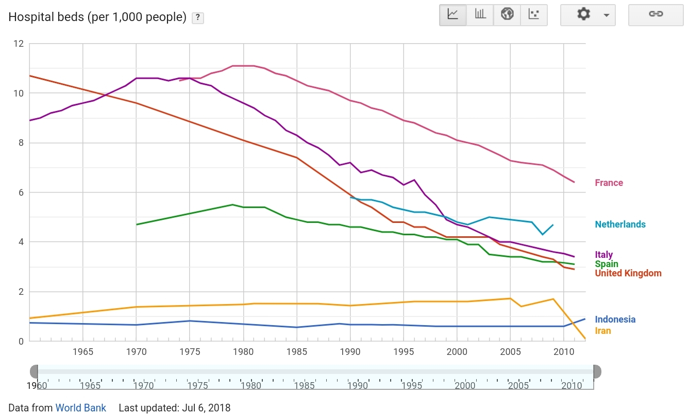
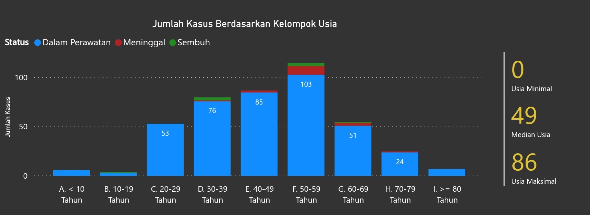

```{r setup, include=FALSE}
knitr::opts_chunk$set(echo = TRUE)
rm(list=ls())
setwd("/cloud/project/Bukan Infografis/covid angka real")
```

Tulisan ini masih bertemakan COVID-19, karena banyak sekali sisi yang bisa dibahas terkait dengan fenomena wabah ini secara matematis.

Kali ini saya mencoba untuk menjawab beberapa pertanyaan yang sering ada di WAG kita semuanya. Apa saja?

1. [Wabah ini kapan selesainya](https://ikanx101.github.io/blog/covid/#pertanyaan-yang-sering-muncul)? Akan _peak_ saat _infected person_ berapa persen dari populasi Indonesia (atau Jakarta)?
2. [Kenapa banyak korban jiwa COVID-19 di Indonesia](https://ikanx101.github.io/blog/sir-covid/#kenapa-mortality-rate-di-indonesia-tinggi)?

# Pertanyaan Pertama

Saya pernah menyinggung mengenai pertanyaan ini di tulisan saya yang pertama terkait [SIS model](https://ikanx101.github.io/blog/covid/) untuk COVID-19. Saya sarankan untuk bisa membacanya terlebih dahulu agar bisa lebih cepat _catch-up_ dengan pembahasan saya ini.

Banyak pihak (baca: matematikawan lain) telah membuat berbagai macam model dengan berbagai macam cara. Mulai dari pendekatan deterministik seperti yang saya buat hingga pendekatan statistik. Namun perlu diperhatikan bahwa [setiap model memiliki batasan](https://passingthroughresearcher.wordpress.com/2018/04/08/kenapa-sih-harus-belajar-sains/) walau itu adalah _tools_ terbaik yang dimiliki kita saat ini untuk menggambarkan kondisi dan bahkan membuat prediksi.

Namun ada yang perlu saya garis bawahi. Khusus di Indonesia, saya berpikir bahwa membangun model berdasarkan _curve fitting_ tidak bisa dilakukan. Kalaupun dilakukan bisa jadi akan cenderung bias.

__Kenapa?__

Pada awal penanganan COVID-19, pemerintah pusat [hanya mampu melakukan tes sebanyak 1.700 tes dalam sehari](https://tirto.id/siapkah-pemerintah-hadapi-pandemi-corona-covid-19-eFqf). Setelah [beberapa lembaga diperbolehkan untuk melakukan tes](https://katadata.co.id/berita/2020/03/16/unair-dan-eijkman-jadi-laboratorium-corona-berapa-lama-hasil-tesnya), kapasitas tersebut sudah naik. Apalagi dengan tambahan pemeriksaan dengan metode _rapid test_. 

> KONSEKUENSInya adalah terjadi lonjakan kasus positif setelah kapasitas pemeriksaan ditambah!

Jadi penambahan tinggi itu sejatinya adalah penambahan _new reported cases_ bukan _new infected cases_.

Dari data yang saya ambil dari situs [kawalcovid19](https://kawalcovid19.blob.core.windows.net/viz/statistik_harian.html), pada 1 April 2020 pukul 09.24 WIB kita bisa melihat grafiknya sebagai berikut:

```{r,echo=FALSE,warning=FALSE,message=FALSE,fig.retina=5}
library(readxl)
library(ggplot2)
library(dplyr)

data = read_excel('Kasus Harian.xlsx',skip=1)
colnames(data) = janitor::make_clean_names(colnames(data))
data %>% mutate(kasus_baru = ifelse(is.na(kasus_baru),0,kasus_baru)) %>%
  ggplot(aes(x=dt,y=kasus_baru)) +
  geom_col(color='black',alpha=.4) +
  geom_label(aes(label=kasus_baru),size=2) +
  theme_minimal() +
  labs(title='Penambahan New Reported Cases di Indonesia',
       subtitle='sumber: kawalcovid19.id',
       caption='Scraped and Visualised\nusing R\nikanx101.github.io',
       x='Tanggal') +
  theme(axis.title.y=element_blank(),
        axis.text.y=element_blank())
```

Jika diperhatikan, lonjakan _new reported cases_ terjadi setelah pemerintah mengizinkan lembaga lain untuk melakukan tes COVID-19 (setelah 16 Maret 2020). Lonjakan tinggi terjadi kembali [saat _rapid test_ mulai dilakukan sekitar seminggu yang lalu](https://katadata.co.id/berita/2020/03/20/deteksi-corona-pemerintah-mulai-lakukan-rapid-test-hari-ini).

Salah satu alasan saya membuat model adalah ingin [menggambarkan situasi dan mencoba memberikan solusi](https://ikanx101.github.io/blog/covid/#kesimpulan) dari kondisi saat ini. Tidak untuk membuat prediksi karena ada [satu hal yang paling penting untuk diketahui tapi tidak kita ketahui](https://ikanx101.github.io/blog/covid/#mengetahui-angka-pasti-) sampai saat ini.

__Apa itu?__

Berapa banyak $I_0$?

__Kenapa menjadi penting?__

COVID-19 merupakan penyakit yang berasal dari Wuhan, China. Jika sekarang wabah tersebut ada di Indonesia, berarti ada orang sakit yang masuk ke Indonesia.

Masalahnya adalah, saat terjadi epidemi di China, kita tidak melakukan pembatasan penerbangan dan alur manusia masuk dari negara lain yang sudah terjangkit wabah tersebut.

Sudah lihat [video penelusuran](https://www.narasi.tv/buka-mata/ceroboh-di-cianjur-jejak-buram-pemerintah-menangani-pandemi-covid-19) pasien positif asal Bekasi yang meninggal di Cianjur?

Hal ini menunjukkan bahwa COVID-19 bisa jadi sudah ada di Indonesia sebelum kasus `01` dan `02` diumumkan oleh presiden.

Dengan mengetahui $I_0$, kita bisa melihat seberapa cepat penyebaran wabah ini. Oleh karena kita tidak tahu ada berapa banyak $I_0$ yang ada di masyarakat. Akibatnya, kita tidak tahu posisi Indonesia sekarang di mana.

> Apakah berada di awal kurva? 

Baru mulai naik.

> Apakah berada di tengah? 

Mulai naik eksponensial.


> Atau berada di akhir kurva?

Akan landai sebentar lagi.

```{r,echo=FALSE}
knitr::include_graphics('https://raw.githubusercontent.com/ikanx101/belajaR/master/Bukan%20Infografis/covid%20sir%20new/posting_files/figure-gfm/unnamed-chunk-7-1.png')
```

Tanpa informasi $I_0$ yang tepat (atau mendekati), kita akan sulit menghitung kecepatan penyebaran wabah. Namun demikian, kita masih bisa menghitung pada persentase berapa _infected person_ ada di _peak position_ dengan mengandalkan $R_0$.

Saya coba lihat, hampir semua perhitungan model rekan-rekan matematikawan berada di kisaran `40%` - `65%` untuk _peak position_ dari _infected person_ (perhitungan model tanpa ada karantina atau _physical distancing_).

# Jawaban Pertanyaan Kedua

Sebelum memulai pembahasan kedua ini, saya perlu nyatakan bahwa setiap korban jiwa ini memiliki nama, memiliki keluarga, memiliki kehidupannya sendiri. Jadi _put your empathy please, this is not about number and statistics !_. Kita sama-sama doakan agar para korban tersebut mendapatkan tempat terbaik dari Allah dan keluarga yang ditinggalkan diberikan kesehatan dan kesabaran. _Aamiin_

_Oke, saya mulai yah:_

Di Indonesia, banyak korban jiwa yang berjatuhan. Sebagaimana yang kita ketahui, hal yang membunuh adalah [kondisi dan komplikasi yang datang bersamaan](https://www.kompas.com/sains/read/2020/03/28/180000523/angka-kematian-akibat-virus-corona-di-indonesia-tinggi-apa-sebabnya-?page=all#page3) dengan COVID-19 ini.

Berdasarkan data yang saya ambil dari [worldometers](https://www.worldometers.info/coronavirus/coronavirus-age-sex-demographics/#pre-existing-conditions), _death rates_ yang tinggi terjadi saat pasien telah memiliki kondisi kesehatan yang kurang baik.

```{r,echo=FALSE,warning=FALSE,message=FALSE,fig.retina=5}
data = data.frame(disease=c(1:6),rate=c(1:6))
data$disease = c('Cardiovascular disease',
                 'Diabetes',
                 'Chronic respiratory disease',
                 'Hypertension',
                 'Cancer',
                 'no pre-existing conditions')
data$rate = c(10.5,7.3,6.3,6,5.6,.9)

caption = 'Scraped and Visualised\nusing R\nikanx101.github.io'
judul = 'Probability of Dying If Infected by the Virus (%)'
sub_judul = 'For a patient with a given pre-existing condition,\nthe risk of dying if infected by COVID-19.'

data %>% ggplot(aes(x=reorder(disease,rate),
                    y=rate,
                    label=paste0(rate,'%'))) +
  geom_col(color='black',alpha=.4) +
  geom_label(size=3.3) +
  coord_flip() +
  labs(title=judul,
       subtitle=sub_judul,
       caption=caption,
       x='Pre Exsiting Condition') +
  theme_minimal() +
  theme(axis.title.x = element_blank(),
        axis.text.x=element_blank())
```

Mari kita lihat data _death rates_ per pagi ini pukul 07.00 WIB yang dihimpun di situs [wordometers](https://www.worldometers.info/coronavirus/) berikut:

```{r,echo=FALSE,warning=FALSE,message=FALSE,fig.retina=5}
data = read.csv('data corona.csv')
data$country_other = as.character(data$country_other)
data$rate = round(data$rate*100,2)
mean = mean(data$rate)

data %>% filter(!grepl('total',country_other,ignore.case = T)) %>%
  arrange(desc(total_deaths)) %>%
  filter(total_deaths>100) %>%
  ggplot(aes(x=reorder(country_other,-rate),
             y=rate,
             label=paste0(rate,'%'))) +
  geom_col(color='black',alpha=.4) +
  geom_label(size=2) +
  theme_minimal() +
  theme(axis.text.x = element_text(angle=90),
        axis.text.y = element_blank()) +
  labs(caption = caption,
       title = 'Negara dengan Banyak Korban di Atas 100 Jiwa',
       subtitle = 'sumber: worldometers.info',
       x = 'Negara',
       y = 'Deaths Rate')
```

Indonesia memiliki persentase tertinggi ketiga sekarang.

Jika kita lihat kembali di atas, kematian akibat COVID-19 disebabkan oleh kondisi dan komplikasi yang dimiliki oleh pasien.

Lalu, kenapa di Indonesia bisa setinggi itu?

Setidaknya ada dua hipotesa saya:

## Hipotesa Pertama

Kualitas kesehatan individual di Indonesia relatif buruk. 

Oleh karena COVID-19 menyerang sistem pernafasan, saya jadi menduga kondisi seperti TBC jadi hal yang berpengaruh. Sebagaimana yang kita tahu, bahwa angka penderita TBC di [Indonesia cukup tinggi di dunia](https://databoks.katadata.co.id/datapublish/2019/10/09/who-kasus-tbc-indonesia-2017-terbesar-ketiga-dunia).

Beberapa tahun lalu, istri saya divonis menderita TBC sehingga harus diobati selama 9 bulan padahal tidak ada gejala klinis sama sekali yang terlihat. Tapi hasil _rontgen_ dan pemeriksaan oleh beberapa dokter spesialis paru menyatakan demikian.

Oleh karena itu, saya jadi berpikir mungkin ini adalah dugaan yang tepat. Bisa jadi banyak juga penderita TBC yang tidak mengetahui dirinya terjangkit TBC sehingga saat terpapar COVID-19 kondisinya jadi memburuk.

Ini baru TBC saja, belum kondisi lainnya seperti kardiovaskular, kanker, dan diabetes.

Tapi jika saya ambil data dari [WorldBank](https://www.google.com/publicdata/explore?ds=d5bncppjof8f9_&ctype=l&met_y=sh_xpd_publ#!ctype=l&strail=false&bcs=d&nselm=h&met_y=sh_tbs_incd&scale_y=lin&ind_y=false&rdim=region&idim=country:IDN:ITA:ESP:NLD:FRA&ifdim=region&hl=en_US&dl=en_US&ind=false):

```{r,echo=FALSE}

```

Kita bisa lihat bersama, angka insiden TBC di Indonesia relatif sangat tinggi dibandingkan negara lain yang memiliki korban COVID-19 > 100 jiwa. 

Tapi jika ini berkorelasi, seharusnya hal ini tidak akan terjadi untuk negara-negara Eropa yang relatif lebih sehat dan siap secara fasilitas.

Oke, sekarang kita lihat data lain terkait faskes dan tenaga kesehatan, didapatkan data sebagai berikut:

```{r,echo=FALSE}


```

Sayangnya saya tidak menemukan angka perbandingan kardiovaskular, diabetes, kanker, dan kondisi lainnya yang berbahaya bagi penderita COVID-19.

Berdasarkan informasi terbatas di atas, mungkin hipotesa pertama saya menjadi lemah.

Lalu saya berpikir kembali, jangan-jangan korban jiwa di Indonesia ini dikarenakan oleh usia.

Kita tahu bahwa virus ini lebih berbahaya bagi orang yang sudah tua. Berdasarkan data yang dihimpun di [webm.net](https://www.cebm.net/covid-19/global-covid-19-case-fatality-rates/) saya dapatkan informasi bahwa semakin tua usia pasien COVID-19, maka peluang penyakit ini berbahaya juga semakin tinggi.

```{r,echo=FALSE}

```

Mari kita bandingkan dengan kejadian di Indonesia berikut ini. Data saya dapatkan dari [kawalcovid19](https://kawalcovid19.blob.core.windows.net/viz/statistik_harian.html) per 2 April 2020 pukul 11.00.

```{r,echo=FALSE}

```

Pada rentang usia 50-59 tahun, ada 9 orang yang meninggal dari 115 kasus yang tercatat. Artinya _case fatality rate_ (CFR) pada rentang usia ini adalah `r paste0(round(9/115*100,2),'%')` lebih tinggi dibandingkan angka di webm.net tersebut.

Hal yang sama pun terjadi di rentang usia 60-69 tahun, ada 5 orang yang meninggal dari 55 kasus yang tercatat. Artinya CFR pada rentang usia ini adalah `r paste0(round(5/55*100,2),'%')` masih relatif lebih tinggi dibandingkan angka di webm.net tersebut.

Indonesia masih memiliki angka _rate_ yang lebih tinggi. Saya jadi mempertanyakan pertanyaan saya ini. Jangan-jangan bukan KENAPA RATE DI INDONESIA TINGGI? tapi:

> Apakah kita sudah benar menghitung death rate di Indonesia?

Oleh karena itu, _this new question lead me to a new hypothesis_.

## Hipotesa Kedua

Hipotesa kedua ini mungkin lebih provokatif tapi menurut saya masuk akal.

Berdasarkan [informasi dan kalkulasi dari WHO](https://www.worldometers.info/coronavirus/coronavirus-death-rate/), _mortality rate_ COVID-19 adalah `3.4%`. Sedangkan beberapa studi lainnya, secara _nationwide_ di China menunjukkan angka sebesar `3.8%`.

Coba kita lihat kembali _density plot_ dari sebaran data _mortality rate_ semua negara yang ada.

```{r,echo=FALSE,warning=FALSE,message=FALSE,fig.retina=5}
data = read.csv('data corona.csv')
data$country_other = as.character(data$country_other)
data$rate = round(data$rate*100,2)
mean = mean(data$rate)

data =
data %>% 
  filter(!grepl('total',country_other,ignore.case = T),
         !grepl('diamond',country_other,ignore.case = T),
         !grepl('zaandam',country_other,ignore.case = T))

data %>% 
  ggplot(aes(x=rate)) +
  geom_density() +
  theme_minimal() +
  theme(axis.text.y = element_blank()) +
  geom_vline(xintercept=3.4, color='blue') +
  annotate(geom='text',label='WHO',x=3.4,y=.2,color='blue') +
  geom_vline(xintercept = 8.63,color='red') +
  annotate(geom='text',label='Indonesia',x=8.63,y=.1,
           color='red') +
  labs(caption = caption,
       title = 'Density Plot dari Mortality Rate',
       subtitle = 'sumber: worldometers.info',
       x = 'Mortality Rate',
       y = 'Density')
```

Distribusinya terlihat mirip _pareto distribution_ atau _lognormal distribution_ dimana hampir semua data berkumpul di sebelah kiri. 

```{r,include=FALSE}
length(data$rate)
persen = data %>% filter(rate<=3.4) %>% summarise(n()/200)
persen = as.numeric(persen)
persen = persen*100
```

Kalau saya hitung,`r persen`% negara-negara yang ada di data tersebut memiliki _rate_ berada di bawah angka WHO (`3.4%`).

_____

### Catatan terkait pembuktian distribusi lognormal atau pareto:

Saya bisa saja melakukan pengecekan apakah memang data _rate_ ini memiliki distribusi pareto atau lognormal. Tapi dengan catatan _lower bound_ dari data harus sangat kecil tapi tidak `nol` (_near zero_). Sedangkan data _real_-nya banyak negara yang memiliki _mortality rate_ = `0%`.

Pembuktiannya bisa dilakukan dengan menggunakan [__Cullen Frey Diagram__](https://passingthroughresearcher.wordpress.com/2019/08/09/mencari-peluang-kegagalan-dari-data-yang-tak-pernah-gagal/), contohnya:

```{r,echo=FALSE,fig.retina=5,warning=FALSE,message=FALSE}
library(fitdistrplus)
data$rate = ifelse(data$rate==0,
                   1/589,
                   data$rate)
descdist(data$rate)
hasil = fitdist(data$rate,'lnorm',method='mme')
plot(hasil)
```


_______

Oke, kita kembali ke pembahasan hipotesa saya.

Saya jadi berpikir menggunakan argumen di __jawaban pertanyaan pertama__ dimana ada keterbatasan-keterbatasan yang dilakukan pemerintah dalam melakukan tes sehingga angka yang didapatkan adalah _reported cases_ bukan _real infected person_.

> Jadi berapa real infected person di Indonesia?

Per 2 April 2020, ada `157` orang yang meninggal akibat COVID-19.

Jika saya asumsikan _death rates_ milik WHO bisa dijadikan acuan, maka angka _real infected_ di Indonesia seharusnya:

$$ \frac{3.4}{100} = \frac{157}{infected} $$

$$ infected = 157 * \frac{100}{3.4} = 4617.647 \approx 4617$$
Jadi _expected infected person_ COVID-19 ada sekitar `4.617` orang.

> Besar juga _yah_...

Sekarang kita coba lakukan simulasi menggunakan rentang _rate_ disebelah kiri garis merah (Indonesia) pada _density plot_.

Saya gunakan prinsip simullasi MonteCarlo dengan `9.000` kali pengulangan

```{r,echo=FALSE,fig.retina=5}
rate_sim = data %>% filter(rate>0.2 & rate<8.63)
rate_sim = rate_sim$rate

simulasi = function(n){
  n
  sim = sample(rate_sim,1)
  sim = 157*100/sim
  return(sim)
}

data_simulasi = data.frame(id = c(1:9000),infected = 1)
data_simulasi$infected = sapply(data_simulasi$id,simulasi)

median_sim = median(data_simulasi$infected)
median_sim = round(median_sim,0)
q1_sim = quantile(data_simulasi$infected,.25)
q1_sim = round(q1_sim,0)
mean_sim = mean(data_simulasi$infected)
mean_sim = round(mean_sim,0)

data_simulasi %>% 
  ggplot(aes(x=infected)) +
  geom_density() +
  geom_vline(xintercept = median_sim,color='red') +
  geom_vline(xintercept = q1_sim,color='steelblue') +
  annotate(geom='text',
           label=paste0('Median = ',median_sim),
           x=median_sim+6000,
           y=.00005,
           color='red') +
  annotate(geom='text',
           label=paste0('Quantile 1 = ',q1_sim),
           x=q1_sim+7000,
           y=.00003,
           color='steelblue') +
  geom_vline(xintercept = mean_sim,color='darkred') +
  annotate(geom='text',
           label=paste0('Mean = ',mean_sim),
           x=mean_sim+6000,
           y=.00004,
           color='darkred') +
  theme_minimal() +
  labs(caption = 'Simulated and Visualized\nusing R\nikanx101.github.io',
       title = 'Simulasi untuk Menghitung Real Infected Person',
       subtitle = 'Menggunakan MonteCarlo',
       x = 'Number of infected person') +
  theme(axis.text.y = element_blank(),
        axis.title.y = element_blank())

```

Dari grafik di atas, saya memperkirakan bahwa _real infected person_ di Indonesia berada di rentang antara `r median_sim` sampai `r mean_sim` orang.

Wallahu a'lam.

Jika ada yang mau didiskusikan, silakan _drop me a message_ yah.