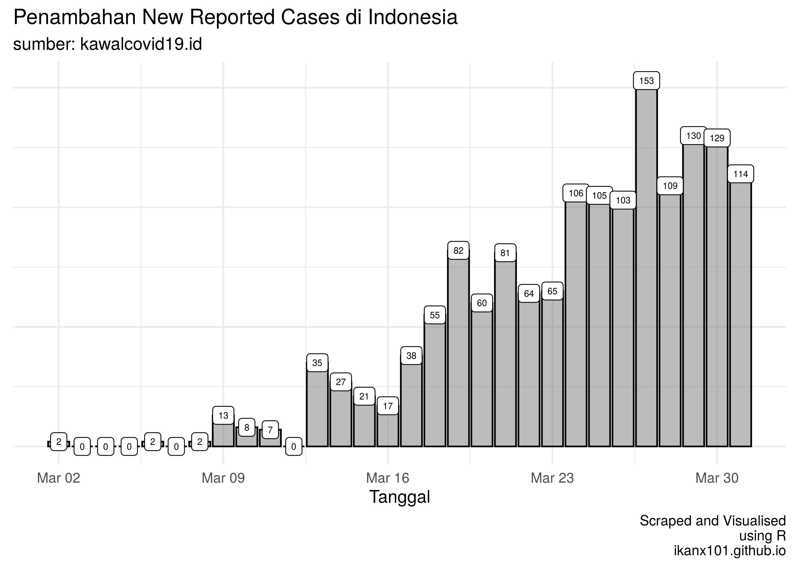
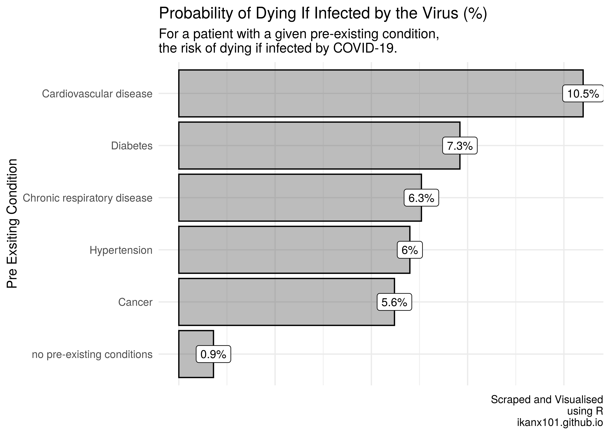

Mencoba Menjawab Pertanyaan Seputar COVID-19
================

Tulisan ini masih bertemakan COVID-19, karena banyak sekali sisi yang
bisa dibahas terkait dengan fenomena wabah ini secara matematis.

Kali ini saya mencoba untuk menjawab beberapa pertanyaan yang sering ada
di WAG kita semuanya. Apa saja?

1.  [Wabah ini kapan
    selesainya](https://ikanx101.github.io/blog/covid/#pertanyaan-yang-sering-muncul)?
    Akan *peak* saat *infected person* berapa persen dari populasi
    Indonesia (atau Jakarta)?
2.  [Kenapa banyak korban jiwa COVID-19 di
    Indonesia](https://ikanx101.github.io/blog/sir-covid/#kenapa-mortality-rate-di-indonesia-tinggi)?

# Pertanyaan Pertama

Saya pernah menyinggung mengenai pertanyaan ini di tulisan saya yang
pertama terkait [SIS model](https://ikanx101.github.io/blog/covid/)
untuk COVID-19. Saya sarankan untuk bisa membacanya terlebih dahulu agar
bisa lebih cepat *catch-up* dengan pembahasan saya ini.

Banyak pihak (baca: matematikawan lain) telah membuat berbagai macam
model dengan berbagai macam cara. Mulai dari pendekatan deterministik
seperti yang saya buat hingga pendekatan statistik. Namun perlu
diperhatikan bahwa [setiap model memiliki
batasan](https://passingthroughresearcher.wordpress.com/2018/04/08/kenapa-sih-harus-belajar-sains/)
walau itu adalah *tools* terbaik yang dimiliki kita saat ini untuk
menggambarkan kondisi dan bahkan membuat prediksi.

Namun ada yang perlu saya garis bawahi. Khusus di Indonesia, saya
berpikir bahwa membangun model berdasarkan *curve fitting* tidak bisa
dilakukan. Kalaupun dilakukan bisa jadi akan cenderung bias.

**Kenapa?**

Pada awal penanganan COVID-19, pemerintah pusat [hanya mampu melakukan
tes sebanyak 1.700 tes dalam
sehari](https://tirto.id/siapkah-pemerintah-hadapi-pandemi-corona-covid-19-eFqf).
Setelah [beberapa lembaga diperbolehkan untuk melakukan
tes](https://katadata.co.id/berita/2020/03/16/unair-dan-eijkman-jadi-laboratorium-corona-berapa-lama-hasil-tesnya),
kapasitas tersebut sudah naik. Apalagi dengan tambahan pemeriksaan
dengan metode *rapid test*.

> KONSEKUENSInya adalah terjadi lonjakan kasus positif setelah kapasitas
> pemeriksaan ditambah\!

Jadi penambahan tinggi itu sejatinya adalah penambahan *new reported
cases* bukan *new infected cases*.

Dari data yang saya ambil dari situs
[kawalcovid19](https://kawalcovid19.blob.core.windows.net/viz/statistik_harian.html),
pada 1 April 2020 pukul 09.24 WIB kita bisa melihat grafiknya sebagai
berikut:

Jika diperhatikan, lonjakan *new reported cases* terjadi setelah
pemerintah mengizinkan lembaga lain untuk melakukan tes COVID-19
(setelah 16 Maret 2020). Lonjakan tinggi terjadi kembali [saat *rapid
test* mulai dilakukan sekitar seminggu yang
lalu](https://katadata.co.id/berita/2020/03/20/deteksi-corona-pemerintah-mulai-lakukan-rapid-test-hari-ini).

Salah satu alasan saya membuat model adalah ingin [menggambarkan situasi
dan mencoba memberikan
solusi](https://ikanx101.github.io/blog/covid/#kesimpulan) dari kondisi
saat ini. Tidak untuk membuat prediksi karena ada [satu hal yang paling
penting untuk diketahui tapi tidak kita
ketahui](https://ikanx101.github.io/blog/covid/#mengetahui-angka-pasti-)
sampai saat ini.

**Apa itu?**

Berapa banyak ?

**Kenapa menjadi penting?**

COVID-19 merupakan penyakit yang berasal dari Wuhan, China. Jika
sekarang wabah tersebut ada di Indonesia, berarti ada orang sakit yang
masuk ke Indonesia.

Masalahnya adalah, saat terjadi epidemi di China, kita tidak melakukan
pembatasan penerbangan dan alur manusia masuk dari negara lain yang
sudah terjangkit wabah tersebut.

Sudah lihat [video
penelusuran](https://www.narasi.tv/buka-mata/ceroboh-di-cianjur-jejak-buram-pemerintah-menangani-pandemi-covid-19)
pasien positif asal Bekasi yang meninggal di Cianjur?

Hal ini menunjukkan bahwa COVID-19 bisa jadi sudah ada di Indonesia
sebelum kasus `01` dan `02` diumumkan oleh presiden.

Dengan , kita
bisa melihat seberapa cepat penyebaran wabah ini. Oleh karena kita tidak
tahu ada berapa banyak  yang ada di masyarakat. Akibatnya, kita tidak tahu posisi
Indonesia sekarang di mana.

> Apakah berada di awal kurva?

Baru mulai naik.

> Apakah berada di tengah?

Mulai naik eksponensial.

> Atau berada di akhir kurva?

Akan landai sebentar
lagi.

<!-- -->

# Jawaban Pertanyaan Kedua

Sebelum memulai pembahasan kedua ini, saya perlu nyatakan bahwa setiap
korban jiwa ini memiliki nama, memiliki keluarga, memiliki kehidupannya
sendiri. Jadi *put your empathy please, this is not about number and
statistics \!*. Kita sama-sama doakan agar para korban tersebut
mendapatkan tempat terbaik dari Allah dan keluarga yang ditinggalkan
diberikan kesehatan dan kesabaran. *Aamiin*

*Oke, saya mulai yah:*

Di Indonesia, banyak korban jiwa yang berjatuhan. Sebagaimana yang kita
ketahui, hal yang membunuh adalah [kondisi dan komplikasi yang datang
bersamaan](https://www.kompas.com/sains/read/2020/03/28/180000523/angka-kematian-akibat-virus-corona-di-indonesia-tinggi-apa-sebabnya-?page=all#page3)
dengan COVID-19 ini.

Berdasarkan data yang saya ambil dari
[worldometers](https://www.worldometers.info/coronavirus/coronavirus-age-sex-demographics/#pre-existing-conditions),
*death rates* yang tinggi terjadi saat pasien telah memiliki kondisi
kesehatan yang kurang
baik.

