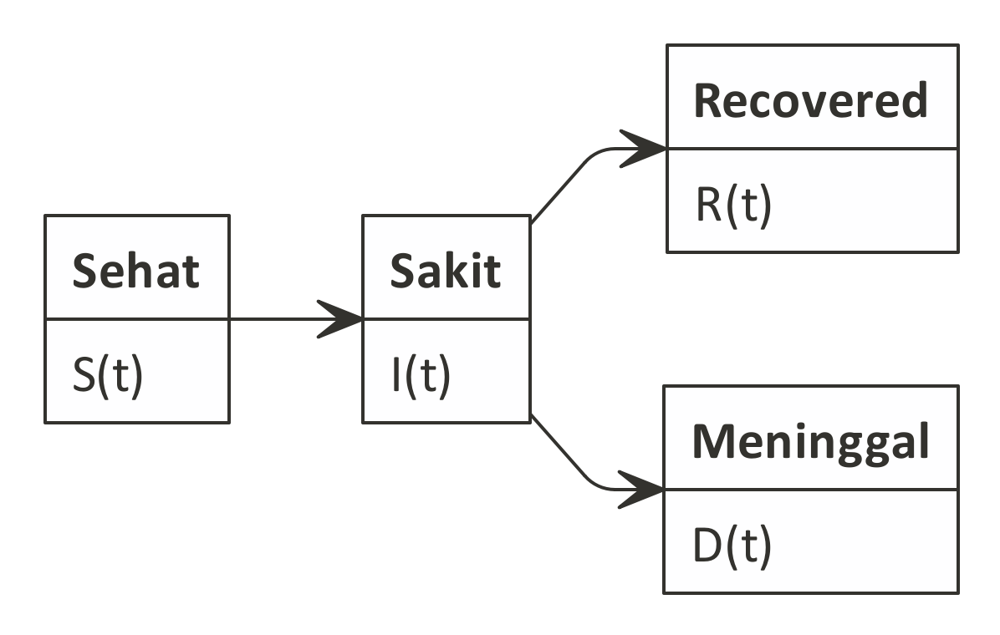
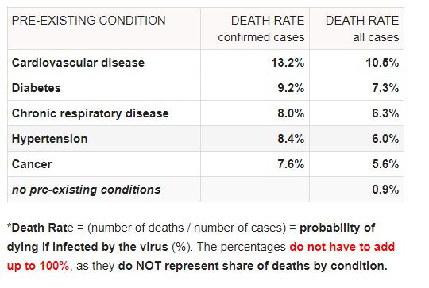
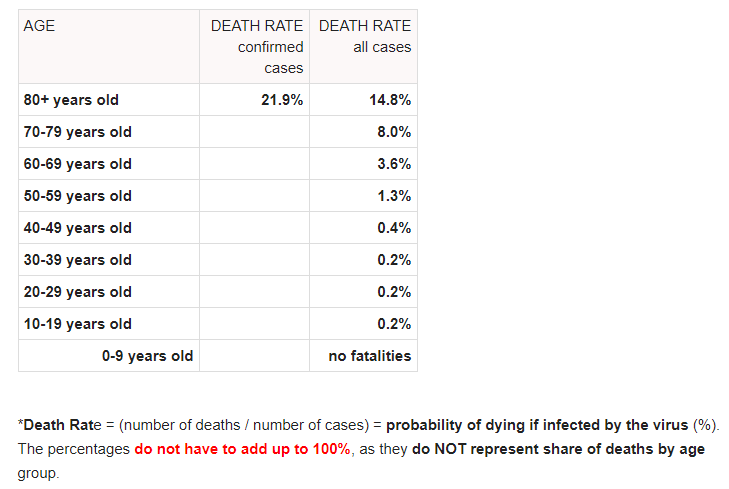

```{r setup, include=FALSE}
knitr::opts_chunk$set(echo = TRUE)
rm(list=ls())
setwd("/cloud/project/Bukan Infografis/covid sir new")
library(ggplot2)
library(dplyr)
```

# Pendahuluan

Tulisan ini adalah _update_ dari [tulisan saya sebelumnya](https://ikanx101.github.io/blog/covid/) mengenai __SIS Model__ dalam penyebaran __COVID-19__.

Saya merasa ada beberapa yang harus diupdate terkait perkembangan yang terjadi.

> Apa itu?

_Update_ paling utama adalah penggunaan _SIR Model_ yang menurut hemat saya lebih tepat. Apa alasannya?

1. Penjelasan virolog bahwa virus yang dilawan oleh antibodi akan menyisakan _cell memory_ sehingga tubuh akan relatif kebal jika ada virus yang berusaha menginfeksi kembali.
2. Tidak ada penambahan kasus baru di Wuhan karena _local transmission_ sehingga rumah sakit di sana ditutup.

Oleh karena itu, saya akan mengubah model saya yang kemarin dengan __SIR Model__. Penjelasan detailnya sudah saya tulis di tulisan kemarin _yah_. Jika belum baca, saya sarankan untuk membacanya sehingga lebih cepat _nyambung_ dengan tulisan ini.

# SIR Model

Sekarang kita akan membangun SIR Model yang dimodifikasi _yah_.

Berikut adalah empat kelompok yang akan dibangun persamaannya?

$$S(t), I(t), R(t), D(t)$$

```{r out.width = '70%',echo=FALSE}

```

## _Recovered_ $R(t)$

_Recovered_ adalah kumpulan orang yang telah sembuh dari penyakit dan dinilai telah resisten terhadap serang virus kembali.

Penambahannya hanya berasal dari __orang sakit yang telah sembuh__ karena belum ada vaksin yang bisa menangkal penyakit ini.

# Menaksir Parameter Model

Berdasarkan uraian di atas, maka persamaan diferensial untuk model saya adalah sebagai berikut:

$$dS(t) = -\beta*S(t)*I(t)$$
$$R(t) = \gamma * I(t)$$
$$dI(t) = \beta*S(t)*I(t) - \gamma * I(t) - \zeta * I(t)$$
$$dD(t) = \zeta * I(t)$$

Untuk menaksir parameter, saya akan menggunakan data dan informasi publik yang tersedia. Jika ada data yang berada dalam _range_, maka saya akan gunakan _expected value_ dari data _range_ tersebut.

_Expected value_ yang saya ambil adalah nilai tengah dari _range_ tersebut.

## Menaksir $\beta$, $\gamma$, dan $\zeta$

Saya masih akan menggunakan __sumber data__ yang sama dengan sebelumnya untuk menaksir parameter yang ada.

```{r,include=FALSE}
r_nol = (1.4+3.9)/2
gamm = 1/17
beta = r_nol * gamm
zeta = (11419 / 173292) * (1 / (1+31+29+21))
```

- $\gamma$ = __`r round(gamm,3)`__.
- $\beta$ = __`r round(beta,3)`__.
- $\zeta$ = __`r round(zeta,6)`__.

# Menyelesaikan Model Persamaan Diferensial

Berdasarkan penaksiran parameter tersebut, untuk menyelesaikan persamaan ini, saya menggunakan __R__ dengan _packages_ `deSolve`.

```{r,warning=FALSE,message=FALSE}
library(deSolve)
SIR.model <- function(N,I,t, b, g, z){
  require(deSolve)
  init <- c(S=(N-I)/N,I=I/N,D=0,R=0)
  parameters <- c(bet=b,gamm=g,zet=z)
  time <- seq(0,t,by=t/(2*length(1:t)))
  eqn <- function(time,state,parameters){
    with(as.list(c(state,parameters)),{
      dS <- -bet*(S)*I 
      dR <- gamm*I
      dI <- bet*S*I - gamm*I - zet*I 
      dD <- zet*I
      return(list(c(dS,dI,dD,dR)))})}
  out<-ode(y=init,times=time,eqn,parms=parameters)
  out.df<-as.data.frame(out)
  
  subtit <- bquote(list(beta==.(parameters[1]),
                        ~gamma==.(parameters[2]),
                        ~zeta==.(parameters[3])))
  
  ggplot(out.df,aes(x=time))+
    ggtitle(bquote(atop(bold(.(title)),atop(bold(.(subtit))))))+
    geom_line(aes(y=S,colour="Susceptible"),size=1.5)+
    geom_line(aes(y=I,colour="Infected"))+
    geom_line(aes(y=D,colour="Death"))+
    geom_line(aes(y=R,colour="Recovered"))+
    labs(x = 'Waktu dalam hari',
         y = 'Proporsi',
         title = 'Simple SIR Model',
         caption = 'Solved and Visualized\nusing R\nikanx101.github.io',
         subtitle = subtit) +
    theme(legend.position='bottom')+
    theme(legend.title=element_text(size=12,face="bold"),
          legend.background = element_rect(fill='#FFFFFF',
                                           size=0.5,linetype="solid"),
          legend.text=element_text(size=10),
          legend.key=element_rect(colour="#FFFFFF",
                                  fill='#C2C2C2',
                                  size=0.25,
                                  linetype="solid"))+
    scale_colour_manual("Compartments",
                        breaks=c("Susceptible","Infected",'Death','Recovered'),
                        values=c("blue","red",'black','green'))
}
```

Misalkan dalam satu lingkungan berisi `1000` orang dengan `999` orang sehat dan `1` orang yang sakit, maka kondisinya dalam `200` hari menjadi sebagai berikut:

```{r}
SIR.model(1000,1,200,beta,gamm,zeta)
```

## Simulasi untuk Berbagai Nilai Parameter $\beta$

Kita tahu bahwa nilai __R0__ berada pada range tertentu. Oleh karena itu, saya akan coba simulasi untuk beberapa nilai __R0__ tersebut.

### Simulasi pada saat __R0__ `max`

```{r}
beta_max = 3.9 * gamm
SIR.model(1000,1,200,beta_max,gamm,zeta)
```

### Simulasi pada saat __R0__ `min`

```{r}
beta_min = 1.4 * gamm
SIR.model(1000,1,750,beta_min,gamm,zeta)
```

# Simulasi saat $I(0)$ berbeda-beda di $\beta$ maximum

## Saat $I(0) = 10$

```{r}
SIR.model(1000,10,200,beta_max,gamm,zeta)
```

## Saat $I(0) = 15$

```{r}
SIR.model(1000,15,200,beta_max,gamm,zeta)
```

## Saat $I(0) = 20$

```{r}
SIR.model(1000,20,200,beta_max,gamm,zeta)
```

## Saat $I(0) = 25$

```{r}
SIR.model(1000,25,200,beta_max,gamm,zeta)
```

## Saat $I(0) = 40$

```{r}
SIR.model(1000,40,200,beta_max,gamm,zeta)
```

## Saat $I(0) = 100$

```{r}
SIR.model(1000,100,200,beta_max,gamm,zeta)
```

## Saat $I(0) = 150$

```{r}
SIR.model(1000,150,200,beta_max,gamm,zeta)
```

> Perbedaan nilai $I(0)$ mempengaruhi seberapa cepat wabah menyebar tapi tidak menjadikan puncak semakin tinggi.

# Kesimpulan Sementara

_Update_ model kali ini memberikan gambaran bahwa orang yang sakit akan mencapai _peak position_ di sekitar `40%` populasi. 

> Tapi perlu diperhatikan bahwa semua orang sehat akan terinfeksi pada akhirnya dan menjadi resisten dengan waktu relatif cepat (sekitar `30` hari).

Dengan mempertimbangkan maksimum kapasitas fasilitas dan tenaga kesehatan yang ada saat ini, saya tetap menghimbau agar kita harus melakukan langkah konkrit untuk menurunkan $\beta$ dengan gerakan _social distancing_ dan __WFH__.

____

# Komentar Lainnya 

## Persentase Bisa Menipu

Di awal-awal penanganan __COVID-19__ di Indonesia, kita mendengar beberapa pejabat dan politisi yang berkata bahwa tingkat kematian akibat __COVID-19__ ini relatif kecil, hanya `~3%` saja. 

> Persentase itu masih lebih kecil dibandingkan SARS dan MERS. _katanya..._

Dengan data yang ada sampai saat ini, tentunya pernyataan tersebut tidak salah tapi kurang bijak. Kenapa begitu? Secara psikologi, penyampaian pernyataan tersebut tanpa disadari membuat sebagian masyarakat meremehkan penyakit ini. _Gak_ percaya? Lihat aja lokasi wisata di Puncak dan Pantai Carita beberapa saat lalu. 

Coba _deh_ cari informasi berapa angka absolut kematian antara __COVID-19__, SARS, dan MERS lalu coba kalian bandingkan.

Oleh karena itu, akan sangat bijak saat kita melihat nilai absolut dari kasus kematian yang ada. 

## Kenapa _Mortality Rate_ di Indonesia Tinggi?

Ada hal yang cukup mencengangkan terjadi di Indonesia. _Mortality rate_ dari __COVID-19__ sudah menembus angka `~10%`. Salah satu yang tertinggi di dunia.

> Mengapa demikian?

Berdasarkan pendapat para ahli, __COVID-19__ sendiri tidak bisa menimbulkan kematian namun komplikasi yang menyertainya yang bisa menimbulkan kematian.

```{r out.width = '40%',echo=FALSE}

```

Angka ini sendiri menurut saya menjadi cerminan buruknya kualitas kesehatan bangsa Indonesia sebagai individual.

Ada yang bisa bantu carikan hasil Riskesdas terbaru terkait kondisi kesehatan tersebut di atas?

## Bukan Terdistribusi Normal tapi Terdistribusi Pareto!

Kita tahu bahwa __COVID-19__ ini lebih berbahaya bagi warga senior.

```{r out.width = '60%',echo=FALSE}

```

Saya menduga bahwa data ini terdistribusi pareto, tidak berbentuk _bell curved_. Ini akan saya jadikan bahan tulisan di _blog_ selanjutnya _yah_.

_Stay safe_ dan _stay healthy_ yah.