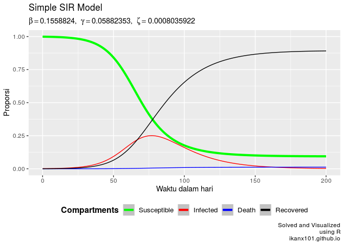
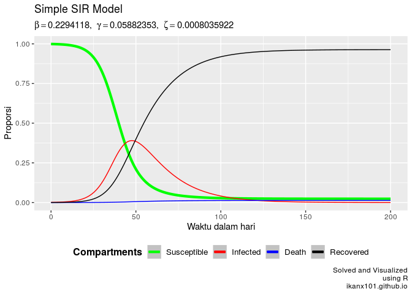
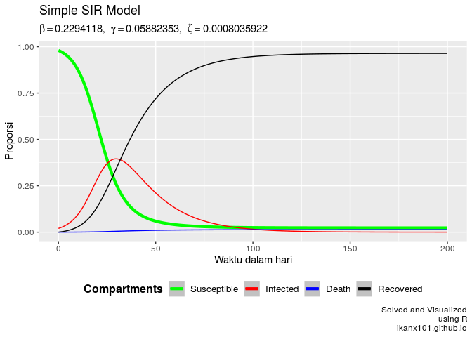
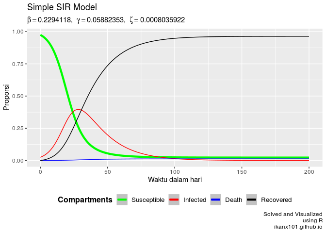
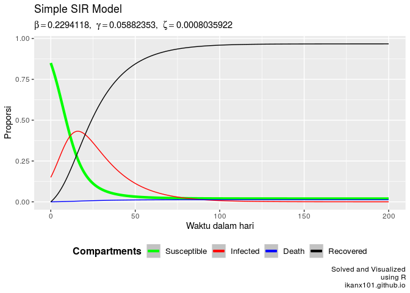

Updated: SIR Compartment Model
================

# Pendahuluan

Tulisan ini adalah *update* dari [tulisan saya
sebelumnya](https://ikanx101.github.io/blog/covid/) mengenai **SIS
Model** dalam penyebaran **COVID-19**.

Saya merasa ada beberapa yang harus diupdate terkait perkembangan yang
terjadi.

> Apa itu?

*Update* paling utama adalah penggunaan *SIR Model* yang menurut hemat
saya lebih tepat. Apa alasannya?

1.  Penjelasan virolog bahwa virus yang dilawan oleh antibodi akan
    menyisakan *cell memory* sehingga tubuh akan relatif kebal jika ada
    virus yang berusaha menginfeksi kembali.
2.  Tidak ada penambahan kasus baru di Wuhan karena *local transmission*
    sehingga rumah sakit di sana ditutup.

Oleh karena itu, saya akan mengubah model saya yang kemarin dengan **SIR
Model**. Penjelasan detailnya sudah saya tulis di tulisan kemarin *yah*.
Jika belum baca, saya sarankan untuk membacanya sehingga lebih cepat
*nyambung* dengan tulisan ini.

# SIR Model

Sekarang kita akan membangun SIR Model yang dimodifikasi *yah*.

Berikut adalah empat kelompok yang akan dibangun persamaannya?

  
, I(t), R(t), D(t)")  


## *Recovered* ")

*Recovered* adalah kumpulan orang yang telah sembuh dari penyakit dan
dinilai telah resisten terhadap serang virus kembali.

Penambahannya hanya berasal dari **orang sakit yang telah sembuh**
karena belum ada vaksin yang bisa menangkal penyakit ini.

# Menaksir Parameter Model

Berdasarkan uraian di atas, maka persamaan diferensial untuk model saya
adalah sebagai berikut:

  
 = -\\beta*S(t)*I(t)")  
  
 = \\gamma * I(t)")  
  
 = \\beta*S(t)*I(t) - \\gamma * I(t) - \\zeta * I(t)")  
  
 = \\zeta * I(t)")  

Untuk menaksir parameter, saya akan menggunakan data dan informasi
publik yang tersedia. Jika ada data yang berada dalam *range*, maka saya
akan gunakan *expected value* dari data *range* tersebut.

*Expected value* yang saya ambil adalah nilai tengah dari *range*
tersebut.

## Menaksir , , dan 

Saya masih akan menggunakan **sumber data** yang sama dengan sebelumnya
untuk menaksir parameter yang ada.

  - 
    = **0.059**.
  -  =
    **0.156**.
  -  =
    **8.0410^{-4}**.

# Menyelesaikan Model Persamaan Diferensial

Berdasarkan penaksiran parameter tersebut, untuk menyelesaikan persamaan
ini, saya menggunakan **R** dengan *packages* `deSolve`.

``` r
library(deSolve)
SIR.model <- function(N,I,t, b, g, z){
  require(deSolve)
  init <- c(S=(N-I)/N,I=I/N,D=0,R=0)
  parameters <- c(bet=b,gamm=g,zet=z)
  time <- seq(0,t,by=t/(2*length(1:t)))
  eqn <- function(time,state,parameters){
    with(as.list(c(state,parameters)),{
      dS <- -bet*(S)*I 
      dR <- gamm*I
      dI <- bet*S*I - gamm*I - zet*I 
      dD <- zet*I
      return(list(c(dS,dI,dD,dR)))})}
  out<-ode(y=init,times=time,eqn,parms=parameters)
  out.df<-as.data.frame(out)
  
  subtit <- bquote(list(beta==.(parameters[1]),
                        ~gamma==.(parameters[2]),
                        ~zeta==.(parameters[3])))
  
  ggplot(out.df,aes(x=time))+
    ggtitle(bquote(atop(bold(.(title)),atop(bold(.(subtit))))))+
    geom_line(aes(y=S,colour="Susceptible"),size=1.5)+
    geom_line(aes(y=I,colour="Infected"))+
    geom_line(aes(y=D,colour="Death"))+
    geom_line(aes(y=R,colour="Recovered"))+
    labs(x = 'Waktu dalam hari',
         y = 'Proporsi',
         title = 'Simple SIR Model',
         caption = 'Solved and Visualized\nusing R\nikanx101.github.io',
         subtitle = subtit) +
    theme(legend.position='bottom')+
    theme(legend.title=element_text(size=12,face="bold"),
          legend.background = element_rect(fill='#FFFFFF',
                                           size=0.5,linetype="solid"),
          legend.text=element_text(size=10),
          legend.key=element_rect(colour="#FFFFFF",
                                  fill='#C2C2C2',
                                  size=0.25,
                                  linetype="solid"))+
    scale_colour_manual("Compartments",
                        breaks=c("Susceptible","Infected",'Death','Recovered'),
                        values=c("blue","red",'black','green'))
}
```

Misalkan dalam satu lingkungan berisi `1000` orang dengan `999` orang
sehat dan `1` orang yang sakit, maka kondisinya dalam `200` hari menjadi
sebagai berikut:

``` r
SIR.model(1000,1,200,beta,gamm,zeta)
```

<!-- -->

## Simulasi untuk Berbagai Nilai Parameter 

Kita tahu bahwa nilai **R0** berada pada range tertentu. Oleh karena
itu, saya akan coba simulasi untuk beberapa nilai **R0** tersebut.

### Simulasi pada saat **R0** `max`

``` r
beta_max = 3.9 * gamm
SIR.model(1000,1,200,beta_max,gamm,zeta)
```

<!-- -->

### Simulasi pada saat **R0** `min`

``` r
beta_min = 1.4 * gamm
SIR.model(1000,1,750,beta_min,gamm,zeta)
```

<!-- -->

# Simulasi saat ") berbeda-beda di  maximum

## Saat  = 10")

``` r
SIR.model(1000,10,200,beta_max,gamm,zeta)
```

<!-- -->

## Saat  = 15")

``` r
SIR.model(1000,15,200,beta_max,gamm,zeta)
```

<!-- -->

## Saat  = 20")

``` r
SIR.model(1000,20,200,beta_max,gamm,zeta)
```

<!-- -->

## Saat  = 25")

``` r
SIR.model(1000,25,200,beta_max,gamm,zeta)
```

<!-- -->

## Saat  = 40")

``` r
SIR.model(1000,40,200,beta_max,gamm,zeta)
```

<!-- -->

## Saat  = 100")

``` r
SIR.model(1000,100,200,beta_max,gamm,zeta)
```

<!-- -->

## Saat  = 150")

``` r
SIR.model(1000,150,200,beta_max,gamm,zeta)
```

<!-- -->

> Perbedaan nilai ") mempengaruhi seberapa cepat wabah menyebar tapi tidak
> menjadikan puncak semakin tinggi.

# Kesimpulan Sementara

*Update* model kali ini memberikan gambaran bahwa orang yang sakit akan
mencapai *peak position* di sekitar `40%` populasi.

> Tapi perlu diperhatikan bahwa semua orang sehat akan terinfeksi pada
> akhirnya dan menjadi resisten dengan waktu relatif cepat (sekitar `30`
> hari).

Dengan mempertimbangkan maksimum kapasitas fasilitas dan tenaga
kesehatan yang ada saat ini, saya tetap menghimbau agar kita harus
melakukan langkah konkrit untuk menurunkan
 dengan
gerakan *social distancing* dan **WFH**.

-----

# Komentar Lainnya

## Persentase Bisa Menipu

Di awal-awal penanganan **COVID-19** di Indonesia, kita mendengar
beberapa pejabat dan politisi yang berkata bahwa tingkat kematian akibat
**COVID-19** ini relatif kecil, hanya `~3%` saja.

> Persentase itu masih lebih kecil dibandingkan SARS dan MERS.
> *katanya…*

Dengan data yang ada sampai saat ini, tentunya pernyataan tersebut tidak
salah tapi kurang bijak. Kenapa begitu? Secara psikologi, penyampaian
pernyataan tersebut tanpa disadari membuat sebagian masyarakat
meremehkan penyakit ini. *Gak* percaya? Lihat aja lokasi wisata di
Puncak dan Pantai Carita beberapa saat lalu.

Coba *deh* cari informasi berapa angka absolut kematian antara
**COVID-19**, SARS, dan MERS lalu coba kalian bandingkan.

Oleh karena itu, akan sangat bijak saat kita melihat nilai absolut dari
kasus kematian yang ada.

## Kenapa *Mortality Rate* di Indonesia Tinggi?

Ada hal yang cukup mencengangkan terjadi di Indonesia. *Mortality rate*
dari **COVID-19** sudah menembus angka `~10%`. Salah satu yang tertinggi
di dunia.

> Mengapa demikian?

Berdasarkan pendapat para ahli, **COVID-19** sendiri tidak bisa
menimbulkan kematian namun komplikasi yang menyertainya yang bisa
menimbulkan kematian.


Angka ini sendiri menurut saya menjadi cerminan buruknya kualitas
kesehatan bangsa Indonesia sebagai individual.

Ada yang bisa bantu carikan hasil Riskesdas terbaru terkait kondisi
kesehatan tersebut di atas?

## Bukan Terdistribusi Normal tapi Terdistribusi Pareto\!

Kita tahu bahwa **COVID-19** ini lebih berbahaya bagi warga senior.


Saya menduga bahwa data ini terdistribusi pareto, tidak berbentuk *bell
curved*. Ini akan saya jadikan bahan tulisan di *blog* selanjutnya
*yah*.

*Stay safe* dan *stay healthy* yah.
