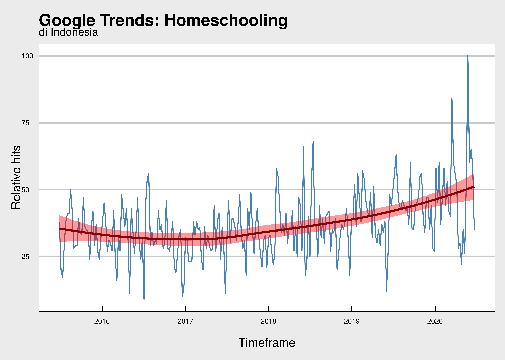

Akhir Saga Sekolah Si Sulung
================

Pada awal tahun ini, saya dan istri sudah berencana untuk [memindahkan
sekolah si sulung](https://ikanx101.github.io/blog/sekolah-cula/).
*Qodarullah*, selama wabah ini beberapa kali terjadi konflik antara wali
murid dan pihak sekolah. Puncaknya sampai kami berpikir bahwa keputusan
di awal tahun sudah benar.

Namun demikian, karena tidak ada yang tahu kapan pandemi ini selesai,
kami sempat berpikir untuk meng- *homeschooling*-kan si sulung.
Alasannya jelas yah\! Kesehatan nomor satu.

Setelah mencari-cari beberapa informasi yang ada, tampaknya istilah
*homeschooling* memang lagi naik daun yah. Ini tergambar dari tren
pencarian *term* `homeschooling` di Google.

    ## `geom_smooth()` using formula 'y ~ x'

Kami sempat mengikuti beberapa webinar terkait *homeschooling*. Ada dari
rumah inspirasi dan sekolahmu.
