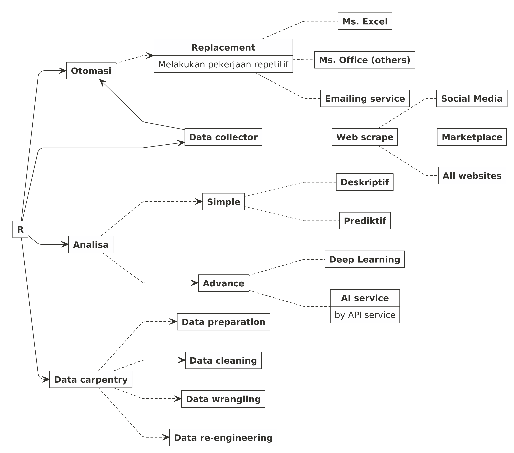

My R Origin Stories
================

Pada blog saya yang
[dulu](https://passingthroughresearcher.wordpress.com/2018/12/18/kapan-saya-harus-belajar-machine-learning/),
saya pernah bercerita mengenai awal mula kenapa saya **harus** belajar
**R**.

Kali ini saya ingin melengkapi cerita tersebut.

Jadi sejak 2014, saya sudah berkenalan dengan **R** namun baru di
pertengahan 2018 saya baru mulai intens menggunakan **R** dalam
pekerjaan sehari - hari.

Salah satu keengganan bagi saya untuk segera menggunakan **R** di 2014
itu adalah karena saya belum mengetahui **benefit** yang bisa saya
dapatkan dari **R**. Kenapa? Karena setiap kali kita *googling* terkait
**R**, kita hanya melihat benefitnya sebagai *tools* untuk melakukan
prediksi dan klasifikasi saja.

Padahal sejatinya ada banyak hal yang bisa dilakukan selain hanya
melakukan prediksi. Apa saja?

<!-- -->
