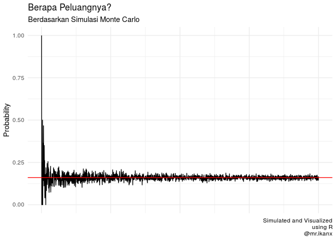

Kegunaan Monte Carlo Lagi (Daily Use)
================

Ternyata saya sudah puasa *ngeblog* beberapa minggu ini. Padahal *draft*
tulisan yang saya buat ada lumayan banyak. Tapi entah kenapa saya
seperti belum menemukan momen yang pas *to publish those drafts*.

Kalau mau lihat, bisa cek **github** saya dan lihat masing-masing
markdown yang tercipta selama 2 minggu belakangan.

Nah, kali ini saya hendak membahas simulasi **Monte Carlo** (lagi) untuk
menghitung dan menyelesaikan masalah yang *receh*.

Seberapa *receh*?

*Receh* banget lah.

-----

# Masalah 1: Absensi Karyawan

Suatu ketika, seorang manager suatu bagian tertentu di kantor
mendapatkan email laporan dari bagian HR terkait absensi seorang anak
buahnya yang agak bermasalah. Kira-kira, begini highlight emailnya:

> Anak buah Anda bernama XYZ memiliki catatan keterlambatan yang tinggi.
> Ia biasa terlambat datang ke kantor rata-rata dua dari lima hari
> kerja.

Sayangnya tidak ada keterangan data historikal pada hari apa saja si XYZ
biasa terlambat.

Berdasarkan informasi yang ada, si manager ingin menghitung berapa
peluang si XYZ terlambat di hari **Senin DAN Jumat** dalam seminggu.

Bagaimana caranya?

## Yuk kita selesaikan\!

Saya akan membuat beberapa baris algoritma untuk membuat simulasi ini
yah. Mungkin bukan algoritma yang *tidy*, tapi saya akan buat yang
sangat simpel sehingga mudah dimengerti.

Pertama, kita buat dulu fungsi apakah karyawan tersebut datang telat
atau tidak dalam suatu hari?

``` r
telat = function(){
  sample(c(T,F),1,prob = c(2/5,3/5))
}
telat()
```

    ## [1] TRUE

Kedua, berbekal fungsi di atas, kita buat fungsi untuk menghitung berapa
kali dia akan datang telat dalam 5 hari kerja.

``` r
telat_seminggu = function(){
  sample(c(T,F),5,replace = T,prob = c(2/5,3/5))
}
minggu_ini = telat_seminggu()
minggu_ini # keterlambatan yang terjadi dalam seminggu ini
```

    ## [1] FALSE  TRUE  TRUE FALSE FALSE

``` r
sum(minggu_ini) # berapa kali telat dalam 5 hari kerja?
```

    ## [1] 2

Ketiga, berbekal fungsi di atas, kita buat fungsi yang mengecek apakah
karyawan tersebut terlambat di Senin dan Jumat.

``` r
senin_jumat_telat = function(){
  minggu = telat_seminggu()
  senin = minggu[1]
  jumat = minggu[5]
  dummy = sum(senin+jumat)
  ifelse(dummy == 2, 1, 0) # jika terjadi keterlambatan di Senin dan Jumat, akan diberi skor = 1
}
senin_jumat_telat()
```

    ## [1] 0

Keempat, kita akan buat fungsi untuk melakukan simulasi berkali-kali
lalu kita hitung peluangnya.

``` r
simulasi = function(n){
  hasil = 0
  for(i in 1:n){
    dummy = senin_jumat_telat()
    hasil = hasil + dummy
  }
  return(hasil/n)
}
```

Kelima, sekarang kita lakukan simulasinya yah.

``` r
data = data.frame(langkah=c(1:2000))
data$peluang_simulasi = sapply(data$langkah,simulasi)

# hasil 10 simulasi pertama
head(data,10)
```

    ##    langkah peluang_simulasi
    ## 1        1        0.0000000
    ## 2        2        0.5000000
    ## 3        3        0.0000000
    ## 4        4        0.5000000
    ## 5        5        0.0000000
    ## 6        6        0.1666667
    ## 7        7        0.2857143
    ## 8        8        0.1250000
    ## 9        9        0.2222222
    ## 10      10        0.2000000

``` r
# hasil 10 simulasi terakhir
tail(data,10)
```

    ##      langkah peluang_simulasi
    ## 1991    1991        0.1667504
    ## 1992    1992        0.1435743
    ## 1993    1993        0.1460110
    ## 1994    1994        0.1599799
    ## 1995    1995        0.1729323
    ## 1996    1996        0.1513026
    ## 1997    1997        0.1442163
    ## 1998    1998        0.1561562
    ## 1999    1999        0.1610805
    ## 2000    2000        0.1455000

### Jadi berapa peluang si karyawan itu datang telat di Senin DAN Jumat?

``` r
mean(data$peluang_simulasi)
```

    ## [1] 0.1606792

<!-- -->

-----

# Masalah 2: Mencari Responden Horang Kayah

Suatu ketika saya diminta untuk melaksanakan survey di suatu kota. Salah
satu kriteria responden yang dicari adalah memiliki sosial ekonomi
status yang **tinggi** alias **horang kayah**.

> Berdasarkan data yang saya punya dari **AC Nielsen**, proporsi
> **horang kayah** di kota tersebut ada sebesar `16%` dari populasi kota
> tersebut.

Pertanyaannya:

Jika pemilihan respondenn dilakukan secara *random*, berapa banyak orang
responden yang harus saya temui sampai saya bisa mendapatkan `30` orang
responden **horang kayah** tersebut?

## Bagaimana cara menjawabnya?

### *Gak usah pake simulasi, ribet banget sih\!*

Oke, sekarang kita akan menghitungnya tanpa menggunakan simulasi.
Bagaimana caranya?

> Tinggal dibagi saja `30` dengan `16%` yah\!

``` r
n = 30 / (16/100)
n
```

    ## [1] 187.5

Setidaknya saya membutuh sekitar `187` orang responden agar saya bisa
mendapatkan `30` orang responden **horang kayah**.

### Sekarang kita selesaikan dengan simulasi:

> Kenapa sih harus diselesaikan dengan simulasi?

Kadang simulasi dibutuhkan karena kita ingin mendapatkan jawaban berupa
selang atau rentang karena kita berhadapan dengan masalah peluang di
sini. Sedangkan jawaban `187.5` adalah jawaban eksak.

Nanti hasil *expected value* dari simulasi seharusnya mirip dengan
jawaban eksak.

Mari kita buat simulasinya *yah*.

Fungsi pertama adalah melihat apakah kita mendapatkan responden yang
tepat.

``` r
tepat = function(){
  sample(c(1,0),1,prob = c(16/100,84/100))
}
tepat()
```

    ## [1] 0

Fungsi kedua adalah untuk melakukan *looping* dengan `while()` agar
didapatkan sampel 30 **horang kayah**.

``` r
cari_n = function(){
  n = 0
  i = 0
    while(n<30){
      dummy = tepat()
      n = n+dummy
      i = i+1
    }
return(i)
}
```

Sekarang, kita akan lakukan simulasinya berulang kali sehingga
didapatkan hasil sebagai berikut:

``` r
data = data.frame(id=c(1:2500))
data$banyak_resp = 0

for(i in 1:length(data$id)){
  data$banyak_resp[i] = cari_n()
}
```

Sekarang, *expected value* dari simulasi ini adalah sebesar:

``` r
mean(data$banyak_resp)
```

    ## [1] 187.9764
