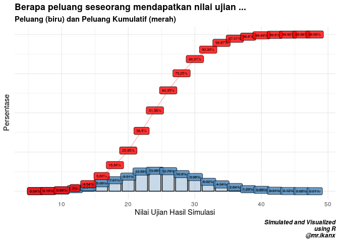

Jawab *Ngasal* Saat Ujian
================

Pada waktu SMP dulu, ada salah seorang teman saya yang selalu
mendapatkan nilai bagus saat ujian. Saat ditanyakan, dengan
*cengengesan* dia selalu bilang:

> *“Gw cuma hoki aja. Cuma nembak aja ngasal kok…”*

Pernah *gak* menemukan orang yang mirip dengan teman saya ini?

> Selalu bilang *gak* pernah belajar tapi selalu dapat nilai bagus.
> *hehe*

*Mmh*, mungkin *gak* sih ada orang yang selalu menjawab *ngasal* pada
soal ujian pilihan ganda dan (hampir) benar semua?

-----

## Kita hitung peluangnya

Mari kita coba hitung peluangnya dengan menggunakan pendekatan simulasi
**Monte Carlo**\!

**Begini Asumsi yang Digunakan:**

1.  Misalkan ada `50` soal ujian pilihan ganda dengan `4` pilihan
    jawaban dan hanya ada `1` jawaban yang benar.
2.  Nilai ujian dihitung dari persentase berapa banyak pertanyaan dengan
    jawaban benar dibagi `50`.

**Berapa peluang ada orang yang mendapatkan nilai bagus? Misalkan
mendapatkan nilai: `80` - `100`\!**

``` r
# benar atau tidak jawaban ngasal tersebut?
betul = function(){
  sample(c(1,0),1,prob = c(1/4,3/4))
}

# berapa banyak jawaban yang benar?
# berapa nilainya?
ujian = function(n){
  n
  x = 0
  for(i in 1:50){
    x = x + betul()
  }
  return(100*x/50)
}

# iterasi 900 kali
data = data.frame(iterasi = c(1:8000))
data$nilai_simulasi = sapply(data$iterasi,ujian)
```

*Expected value* dari simulasi ini adalah 24.93. Sebenarnya ini selaras
dengan peluang jawaban benar, yakni `1/4` = `25%`.

## Kita lihat sebarannya yah

<!-- -->

-----

Ternyata setelah dilihat, peluang seseorang mendapatkan nilai bagus
(misalkan `80`-`100`) dengan cara menjawab dengan *ngasal* adalah `0%`.

## **Kesimpulan**

> **Apakah bisa kita simpulkan bahwa teman saya itu berbohong?**

Dari hasil simulasi di atas, dengan mantap kita bisa mengatakan bahwa
sangat kecil sekali (hampir tidak mungkin) seseorang mendapatkan nilai
bagus dengan cara menjawab *ngasal* dalam ujian tersebut\!
