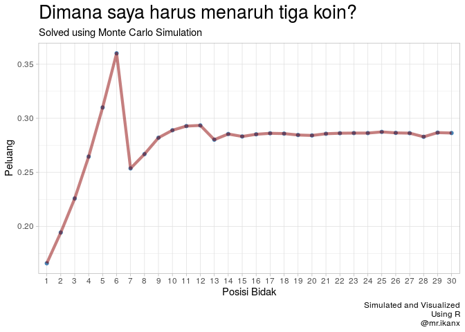

Another Puzzle: Deadly Board Game
================

Sudah baca *puzzles* saya sebelumnya di
[sana](https://ikanx101.github.io/blog/puzzle-usia/) dan
[sini](https://ikanx101.github.io/blog/elevator-problem/)?

Dua *puzzles* tersebut adalah beberapa contoh aplikasi simulasi **Monte
Carlo** untuk menyelesaikan masalah *real*.

Sekarang, saya punya *puzzle* lagi. Begini ceritanya:

-----

> Suatu waktu, saya mengunjungi Kerajaan Wakanda. Singkat cerita, saya
> dituduh melakukan kejahatan. Saya diberikan kesempatan untuk lolos
> dari hukuman jika mau bermain dalam *deadly board game*.

Bagaimana cara bermainnya:

  - *Board* berisi kotak bernomor dari satu hingga tiga puluh secara
    berurutan.
      - Kotak nol menjadi posisi awal saya.
  - Saya diberikan:
      - Tiga koin.
      - Satu dadu.
      - Satu bidak.
  - Saya harus memilih dan menaruh tiga koin di tiga kotak berbeda.
      - Setelah menaruh koin, saya tidak diperbolehkan untuk
        mengubahnya.
  - Lalu saya diharuskan melempar dadu.
      - Saya akan memindahkan bidak sesuai dengan angka yang keluar di
        dadu.
      - Proses ini terus berulang hingga selesai tiga puluh kotak
        dilalui oleh bidak saya.
  - Seandainya dalam seluruh proses ini, bidak saya **tidak pernah sama
    sekali berhenti di kotak yang memiliki koin**, maka saya akan
    dieksekusi.
      - Kebalikannya, jika dalam seluruh prosesnya bidak saya pernah
        minimal sekali berhenti di kotak yang memiliki koin, maka saya
        selamat.

-----

## Pertanyaannya:

> Di kotak nomor berapa saja saya harus menaruh koin?

-----

## Ada yang punya ide bagaimana cara menjawabnya?

> Kita akan mencari **tiga angka** yang memiliki peluang paling tinggi
> keluar dengan kondisi seperti di atas.

Bagaimana caranya? Dengan simulasi **Monte Carlo** kembali.

Berikut adalah contoh saat saya melempar dadu satu kali putaran:

    ##    lempar_dadu posisi_bidak
    ## 1            2            2
    ## 2            2            4
    ## 3            4            8
    ## 4            6           14
    ## 5            1           15
    ## 6            6           21
    ## 7            3           24
    ## 8            1           25
    ## 9            3           28
    ## 10           3           31

-----

Bagaimana jika saya melempar dadu lima kali putaran?

    ## [1] "Putaran ke: 1"
    ##    lempar_dadu posisi_bidak
    ## 1            6            6
    ## 2            2            8
    ## 3            1            9
    ## 4            1           10
    ## 5            6           16
    ## 6            1           17
    ## 7            6           23
    ## 8            2           25
    ## 9            3           28
    ## 10           3           31
    ## [1] "Putaran ke: 2"
    ##    lempar_dadu posisi_bidak
    ## 1            1            1
    ## 2            1            2
    ## 3            4            6
    ## 4            1            7
    ## 5            1            8
    ## 6            4           12
    ## 7            3           15
    ## 8            3           18
    ## 9            3           21
    ## 10           4           25
    ## 11           3           28
    ## 12           4           32
    ## [1] "Putaran ke: 3"
    ##   lempar_dadu posisi_bidak
    ## 1           1            1
    ## 2           1            2
    ## 3           4            6
    ## 4           5           11
    ## 5           5           16
    ## 6           3           19
    ## 7           6           25
    ## 8           2           27
    ## 9           5           32
    ## [1] "Putaran ke: 4"
    ##   lempar_dadu posisi_bidak
    ## 1           4            4
    ## 2           4            8
    ## 3           5           13
    ## 4           3           16
    ## 5           4           20
    ## 6           4           24
    ## 7           3           27
    ## 8           5           32
    ## [1] "Putaran ke: 5"
    ##    lempar_dadu posisi_bidak
    ## 1            2            2
    ## 2            1            3
    ## 3            5            8
    ## 4            5           13
    ## 5            6           19
    ## 6            4           23
    ## 7            3           26
    ## 8            1           27
    ## 9            1           28
    ## 10           2           30
    ## 11           2           32

-----

> Bagaimana jika saya melempar dadu jutaan kali putaran? Lalu setiap
> angka yang keluar akan saya hitung berapa peluang muncul angka
> tersebut dari jutaan kali putaran
itu.

<!-- -->

Sudah ada bayangan, mau taruh koin di kotak mana saja?
