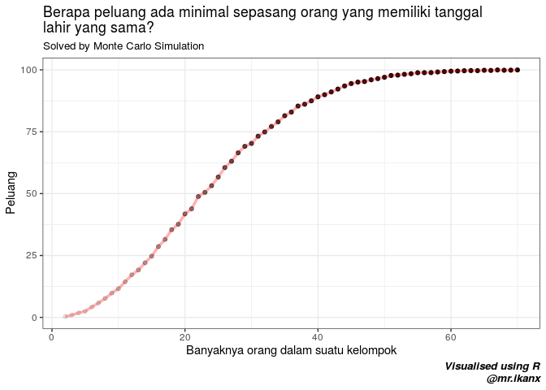

Monte Carlo Simulation: Same Ages Puzzle
================

*Posting* ini melanjuti *posting* saya sebelumnya mengenai [simulasi
Monte Carlo](https://ikanx101.github.io/blog/wheel-fortune/). Ternyata
**faedah** dari simulasi ini banyak juga *yah*. Salah satunya adalah
untuk menyelesaikan *puzzle* statistik. *hehe*

Sekarang saya punya *puzzle* berjudul *Same Ages Puzzle*.

Konon katanya:

> Dalam setiap kelompok `n` orang, pasti ada minimal sepasang orang yang
> memiliki tanggal lahir yang sama.

Tanggal di sini maksudnya hanya tanggal dan bulannya saja yang sama.
Sedangkan tahun kelahiran kita abaikan.

Sekarang pertanyaannya:

1.  Bisakah kita buktikan pernyataan tersebut?
2.  Apakah ada `n` tertentu di mana pernyataan tersebut tidak berlaku?
3.  Pada nilai `n` berapa pernyataan tersebut selalu benar?

Sekarang, coba rekan-rekan pikirkan cara untuk menjawab ketiga
pertanyaan di atas yah.

Saya coba bantu untuk kasih kunci jawabannya tapi *thinking process*-nya
coba dicari
yah.

<!-- -->
