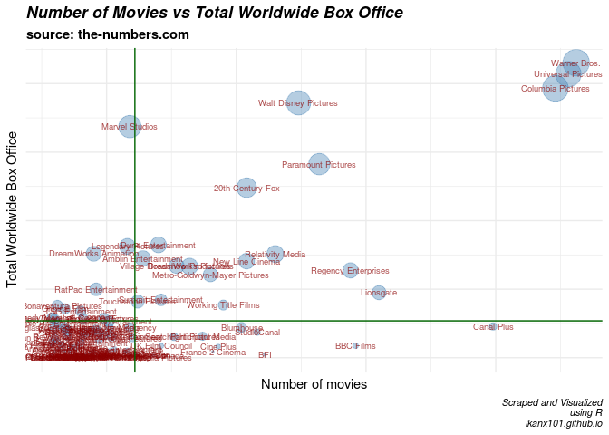

Movie Production Companies: a Clustering Story
================

Dalam beberapa waktu ini, saya sedang sering melihat data terkait film
yang dihimpun di situs
[**the-numbers**](https://www.the-numbers.com/movies/production-companies/).

> **“Sepertinya ada beberapa topik yang bisa dijadikan tulisan di
> blog”**, Pikir saya.

# Data **Movie Production Companies**

Dari *web* tersebut, kita mendapatkan data `12.891` *movie production
companies* yang tersebar di seluruh dunia.

``` r
head(data,10)
```

    ##    production_companies no_of_movies total_domestic_box_office
    ## 1          Warner Bros.          231           $18,453,647,421
    ## 2     Columbia Pictures          223           $17,371,001,173
    ## 3    Universal Pictures          228           $17,049,084,761
    ## 4  Walt Disney Pictures          124           $15,230,973,162
    ## 5        Marvel Studios           59           $12,978,459,542
    ## 6    Paramount Pictures          132           $11,808,196,121
    ## 7      20th Century Fox          104            $9,873,807,280
    ## 8      Relativity Media          115            $7,234,385,696
    ## 9   DreamWorks Pictures           82            $6,682,910,223
    ## 10   Dune Entertainment           70            $6,307,177,998
    ##    total_worldwide_box_office
    ## 1             $43,048,125,888
    ## 2             $39,302,081,581
    ## 3             $41,373,043,036
    ## 4             $37,187,782,141
    ## 5             $33,725,086,281
    ## 6             $28,251,464,054
    ## 7             $24,814,189,534
    ## 8             $15,131,894,432
    ## 9             $13,335,520,162
    ## 10            $16,471,533,740

``` r
str(data)
```

    ## 'data.frame':    12891 obs. of  4 variables:
    ##  $ production_companies      : chr  "Warner Bros." "Columbia Pictures" "Universal Pictures" "Walt Disney Pictures" ...
    ##  $ no_of_movies              : int  231 223 228 124 59 132 104 115 82 70 ...
    ##  $ total_domestic_box_office : chr  "$18,453,647,421" "$17,371,001,173" "$17,049,084,761" "$15,230,973,162" ...
    ##  $ total_worldwide_box_office: chr  "$43,048,125,888" "$39,302,081,581" "$41,373,043,036" "$37,187,782,141" ...

Variabel yang didapatkan antara lain:

1.  `production_companies`: nama perusahaan produsen film.
2.  `no_of_movies`: banyaknya film yang diproduksi.
3.  `total_domestic_box_office`: pendapatan film di pasar domestik.
4.  `total_worldwide_box_office`: pendapatan film total *worldwide*.

Sekarang, mari kita buat *scatter plot* dari data tersebut yah. Sumbu
`x` akan saya isi dengan `no_of_movies` dan sumbu `y` akan saya isi
dengan `total_worldwide_box_office`, sementara *size* dari *point*
tergantung dari besarnya
`total_domestic_box_office`.

## *Scatter plot* dari data

<!-- -->

*Gimana?* sudah terlihat `production_companies` favorit kamu?

## *Clustering Analysis* dari data

Sekarang kita akan mencoba mengelompokkan `production_companies` dari
data-data yang ada. Saya akan menggunakan algoritma **k-means
clustering**.

Contoh lain penggunaan k-means clustering sudah pernah saya tulis di
[blog saya yang
lama](https://passingthroughresearcher.wordpress.com/2019/11/24/clustering-negara-berdasarkan-gdp-happiness-index-dan-populasi/).

Agar memudahkan, angka real dari masing-masing variabel `no_of_movies`,
`total_domestic_box_office`, dan `total_worldwide_box_office` akan saya
buat dalam rentang 1-10 dengan fungsi `cut()` di **R**.
