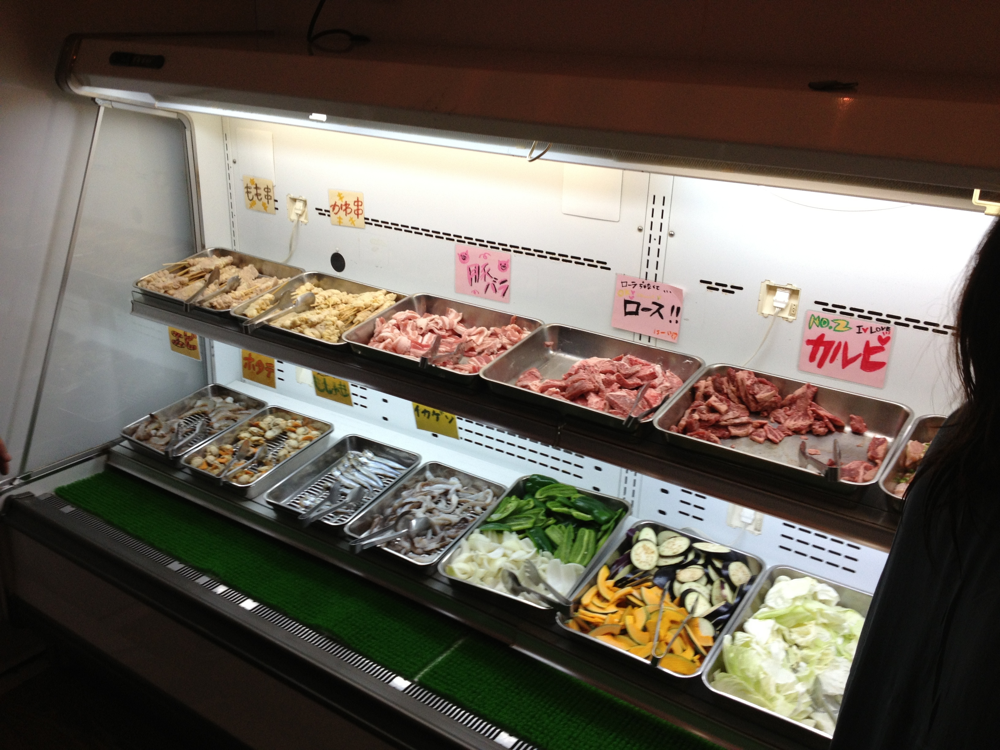
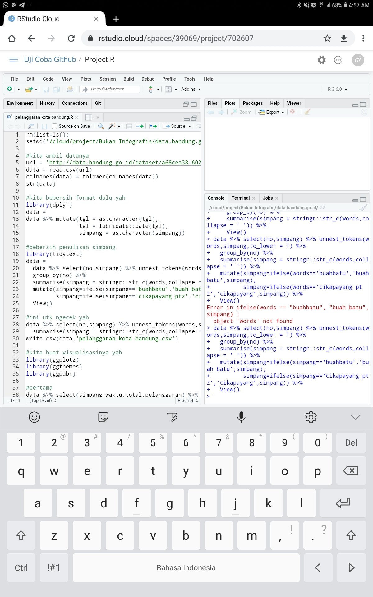
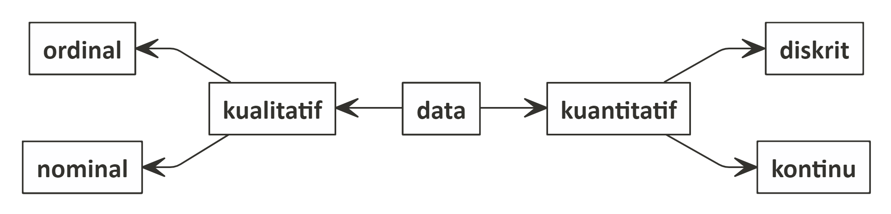
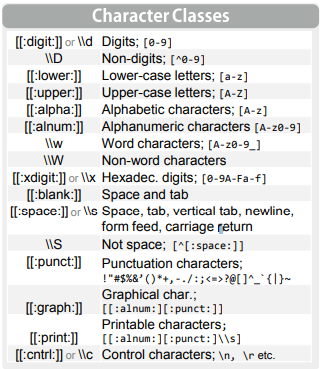
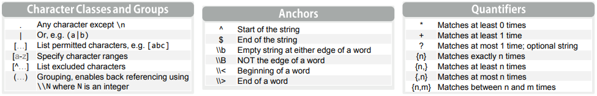
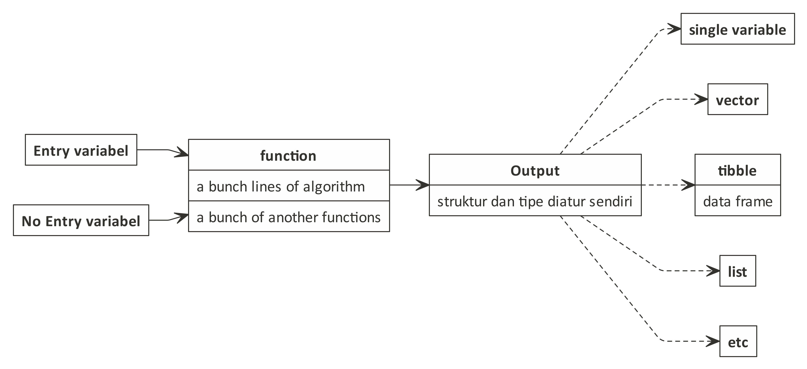
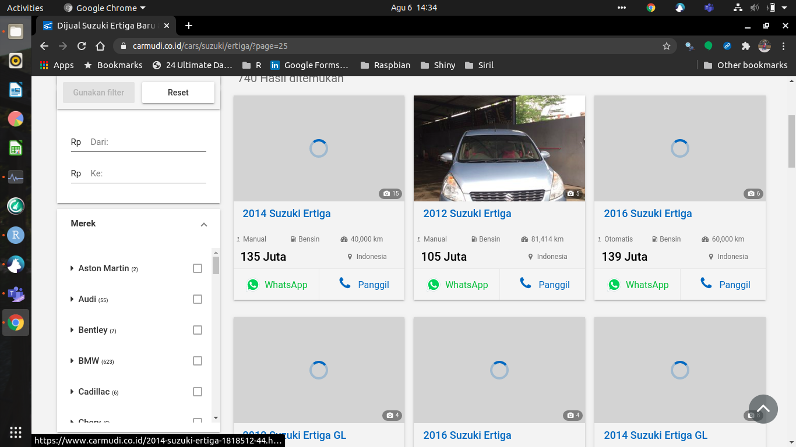

\newpage
\tableofcontents

```{r setup, include=FALSE}
knitr::opts_chunk$set(echo = TRUE)
rm(list=ls())
setwd("~/Documents/belajaR/Materi Training/Day 1 - R Series")
library(dplyr)
library(tidyr)
library(ggrepel)
```

\newpage
&nbsp;
\pagebreak

```{r out.width = '60%',echo=FALSE, fig.align='center'}

```

__Bayangkan Anda berada di restoran _all you can eat_ dimana semua makanan yang Anda mau ada semua di sana...__

____

\newpage
&nbsp;
\pagebreak

# Untuk apa saya belajar __R__? {-}

Di era digitalisasi ini, disadari atau tidak data tersebar di mana-mana. Data juga dihasilkan dengan _volume_ yang besar dalam waktu singkat. 

> _Analoginya seperti ada sungai yang memiliki arus yang deras dan kencang._
Seperti itulah kondisi saat ini.

_Tools_ analisa data klasik seperti __Ms. Excel__ dan __SPSS__ sudah tidak mampu lagi melakukan analisa _big data_ yang seringkali berbentuk _unstructured data_.

__R__ tidak sendirian, ada juga _software_ lain bernama __Python__. Keduanya digunakan untuk membuat algoritma _artificial intelligence_ (bahasa keren dari _machine learning_. Bahasa kerennya dari _computational science_).

____

\newpage
&nbsp;
\pagebreak

# Pendahuluan

**R** merupakan salah satu bahasa pemrograman yang biasa digunakan untuk
menyelesaikan permasalahan terkait dengan data. Kita bisa membuat model
prediksi (*machine learning*, *artificial intelligence*, dan *deep
learning*) sampai membuat algoritma automasi menggunakan **R**.

> Apa perbedaan R dan Python?
Salah satu kelebihan **R** adalah:

> R is made by statistician for statistician.
Setiap *package* atau *library* yang di-*launching* di **R** biasanya
disertakan dengan jurnal ilmiah sehingga kita bisa dengan yakin
memakainya.

**R** tersedia secara *open source* sehingga *software* ini gratis dan
dikembangkan secara massal oleh komunitas-komunitas di seluruh dunia.
Sehingga *package* atau *library* yang disediakan untuk analisis
statistika dan analisa numerik juga sangat lengkap dan terus bertambah
setiap saat.

Bagaimana dengan __Python__?

> Sejatinya Python digunakan untuk membangun aplikasi. Namun, belakangan ini ternyata Python disadari bisa untuk melakukan pengolahan data.
Berbeda dengan __R__ yang memang dibangun untuk kebutuhan _data science_, __Python__ membutuhkan _libraries_ setiap kali melakukan pengolahan data.

Materi _training_ ini saya kumpulkan dari berbagai sumber dan saya _customize_ sesuai dengan kebutuhan __Nutrifood__ berdasarkan pengalaman selama ini berkutat dengan data yang ada (dari mulai data pabrik hingga _finance_). Semoga menjadi manfaat bagi _Nutrifooders_ semua. 


## Sejarah

__R__ Merupakan bahasa yang digunakan dalam komputasi statistik yang pertama kali dikembangkan oleh _Ross Ihaka_ dan _Robert Gentlement_ di _University of Auckland New Zealand_ yang merupakan akronim dari nama depan kedua pembuatnya. Sebelum __R__ dikenal ada __S__ yang dikembangkan oleh _John Chambers_ dan rekan-rekan dari _Bell Laboratories_ yang memiliki fungsi yang sama untuk komputasi statistik. Hal yang membedakan antara keduanya adalah __R__ merupakan sistem komputasi yang bersifat gratis.

## Fitur dan Karakteristik

Sama halnya dengan bahasa pemograman lainnya. Berbeda bahasa berarti berbeda peraturan / cara menulis _code_ (algoritma). Tapi jangan khawatir, dengan memanfaatkan _tidy principle_ di __R__, kita bisa menulis algoritma dengan mudah (bagi kita dan pembaca algoritmanya).

> Oleh karena itu, menurut saya __R__ menawarkan _learning curve_ yang jauh lebih baik dibandingkan _Python_.
Beberapa karakter dari __R__ adalah sebagai berikut:

1. Bahasa __R__ bersifat _case sensitive_. Setiap perbedaan cara penulisan (kapital vs non kapital) akan membedakan suatu objek. Contoh:

```{r}
x = 'Nutrifood'
y = 'nutrifood'
x == y
```

\newpage

2. Segala sesuatu yang ada pada program __R__ akan diangap sebagai objek. konsep objek ini sama dengan bahasa pemrograman berbasis objek yang lain seperti _Java_, _C++_, _Python_, dll. Perbedaannya adalah bahasa __R__ relatif lebih sederhana dibandingkan bahasa pemrograman berbasis objek yang lain.
3. _Interpreted language_ atau _script_. Bahasa __R__ memungkinkan pengguna untuk melakukan kerja pada __R__ tanpa perlu melakukan _compile_ menjadi _executionable_ file (.exe).
4. Mendukung proses _loop_, _decision making_, dan menyediakan berbagai jenis operator (aritmatika, logika, dll).
5. Mendukung _export_ dan _import_ berbagai _format file_, seperti: `.txt`, `.xlsx`, `.csv`, `.json`, `sql`, dll.
6. Mudah ditingkatkan melalui penambahan fungsi atau _library_. Penambahan ini dapat dilakukan secara _online_ melalui __CRAN__ atau melalui sumber seperti __github__.
7. Menyedikan berbagai fungsi untuk keperluan visualisasi data. Visualisasi data pada __R__ dapat menggunakan _library_ bawaan atau lainnya seperti `ggplot2`, `ggvis`, `plotly`, dll.

## Kelebihan dan Kekurangan __R__

Selain karena __R__ dapat digunakan secara gratis terdapat kelebihan lain yang ditawarkan, antara lain:

1. _Protability_, penggunaan _software_ dapat digunakan kapanpun tanpa terikat oleh masa berakhirnya lisensi.
2. _Multiplatform_, __R__ bersifat _Multiplatform Operating Systems_, dimana __R__ bisa dijalankan di OS manapun. Baik Windows, iOS, Linux, Raspbian, bahkan [Android](https://passingthroughresearcher.wordpress.com/2019/07/30/install-r-3-5-2-di-android/)! Dengan fitur yang sama (tidak ada perbedaan fitur di semua OS).
3. _Programable_, pengguna dapat membuat fungsi dan metode baru atau mengembangkan modifikasi dari analisis statistika yang telah ada pada sistem __R__.
4. Fasiltas grafik yang lengkap.

Adapun kekurangan dari R antara lain:

* _Point and Click GUI_, interaksi utama dengan __R__ bersifat __CLI__ (_Command Line Interface_), walaupun saat ini telah dikembangkan _library_ yang memungkinkan kita berinteraksi dengan __R__ menggunakan __GUI__ (_Graphical User Interface_) sederhana menggunakan `library(R-Commander)` yang memiliki fungsi yang terbatas.

## R vs R Studio

Pada dasarnya, _software_ __R__ bisa di-_download_ dan di-_install_ langsung dari situs [CRAN](https://cran.r-project.org/bin/windows/base/). _Software_ __R__ ini bersifat __CLI__.

> Bayangkan Anda membuka aplikasi __notepad__. Putih dan bersih kan? 
Seperti itulah _software_ __R__.

Bagi Kamu yang kaget dan tidak terbiasa melihat tampilan yang _intimidating_ seperti itu, Kamu bisa meng-_install software_ __R Studio__. Sebuah _software_ GUI yang bisa membuat __R__ terlihat lebih _user friendly_. __R Studio__ bisa di-_download_ [di sini](https://rstudio.com/products/rstudio/download/). 

> Tapi tolong diperhatikan bahwa __R Studio__ hanya tambahan tampilan dari __R__ standar. Jadi Kamu tetap harus meng- _install_ __R__ yah!

\newpage

Kelebihan R Studio antara lain:

1. _Free_, kita bisa memilih versi gratis dari __R Studio__ tanpa ada pengurangan fitur dasar dari __R__.
2. _R Studio Cloud_, tersedia layanan _cloud_ sehingga bisa diakses dan digunakan menggunakan _browser_ di _gadget_ manapun. Layanan _cloud_ ini bisa diakses [di sini](https://rstudio.cloud) dan dikoneksikan ke akun __github__ Kamu. Kira-kira seperti ini tampilannya jika dibuka di _Chrome for Android_:

```{r out.width = '40%',echo=FALSE,fig.align='center'}

```

3. _Shiny Apps_, kita bisa membuat _apps_ berbasis _web_ dari __R__. _Apps_ ini bisa dijadikan _dashboard_ atau mesin kalkulasi otomatis. Tergantung seberapa jauh Kamu membuat _coding_ algoritmanya.
4. _R Markdown_, ini fitur yang paling saya sukai. Bahkan untuk menulis _web_ ini, saya menggunakan _R Markdown_. Output files -nya beragam, mulai dari `docx`, `pptx`, `pdf`, `html`, `md`, dll. Bahkan kita bisa membuat [_e-book_](https://bookdown.org/) dengan memanfaatkan `library(bookdown)`.

Jadi, setelah membaca bagian ini pastikan Kamu sudah meng- _install_ __R__ dan __R Studio__ yah. 

> Jangan sampai terbalik urutan instalasinya!

\newpage

## Mengenal operator dasar

Beberapa operator dasar di __R__ antara lain:

1. `=` atau `<-`, digunakan untuk melakukan pendefinisian suatu objek. Contoh:
```{r}
a = 10
b <- 3
a + b
```
2. `' '` atau `" "`, digunakan untuk menandai tipe variabel berupa `character`. Lalu apa beda penggunaan `' '` dengan `" "`? `" "` digunakan saat `'` dibutuhkan dalam suatu `character`. Contoh:
```{r}
a = 'saya hendak pergi ke pasar'
b = "i don't want to buy it"
a
b
```

3. `==`, `<`, `>`, `<=`, atau `>=`, digunakan untuk mengecek apakah dua variabel itu memiliki kesamaan atau tidak. _Output_ dari operator ini adalah `logic` (_TRUE or FALSE_). Contoh:
```{r}
a = 5
b = 3
a == b
a > b
```

4. `;` atau _<enter>_, digunakan untuk memisahkan baris kode pada skrip algoritma. Contoh:
```{r}
a = 5;b = 3;a*b
```

\newpage

## Working Directory

Apa itu _working directory_?

> _Working directory_ adalah _folder path default_ untuk __R__ melakukan _import_ dan _export_ data.
Untuk mengetahui di mana _working directory_ kita, bisa digunakan perintah:

```{r}
getwd()
```

Secara _default_, __R__ menggunakan `C:\\My Documents` sebagai _working directory_.

### Bagaimana mengubah _working directory_?

_Working directory_ bisa diubah sesuai kemauan kita memanfaatkan perintah `setwd()`, tanda dalam kurung diisi dengan _folder path_ yang diinginkan.

```{r}
setwd("~/Documents/belajaR/Materi Training/Day 1 - R Series")
```

### Apa keuntungan mengubah-ubah _working directory_?

Perubahan _working directory_ akan sangat berguna saat kita ingin memgambil data dari _folder path_ tertentu dan menyimpan hasil analisa kita ke _folder path_ yang berbeda.

## Mengenal _packages_ atau _library_

`packages` atau `library` adalah sekumpulan fungsi yang telah dibuat dan dibakukan untuk kemudian disertakan di halaman _web_ CRAN atau github. `library` bisa kita _install_ dan gunakan dengan mudah.

Seperti yang sudah saya infokan di bagian pendahuluan. Banyak orang atau komunitas yang mengembangkan berbagai macam `library` sehingga memudahkan kita untuk menyelesaikan masalah di data kita. Kita tidak perlu lagi membuat algoritma dari nol. Cukup memanfaatkan `library` yang tepat saja.

Beberapa contoh `library` yang sering saya gunakan:

1. `dplyr`: _data carpentry_ menggunakan _tidy principle_.
2. `ggplot2`: _data visualization_.
3. `rvest`: _web scraping_.
4. `tidytext`: _text analysis_.
5. `reshape2`: _data manipulation_.
6. `readxl` atau `openxlsx`: _export_ dan _import_ _excel files_.
7. `officer`: membuat _Ms. Office files_ seperti _excel_, _docx_, dan _powerpoint_.
8. `expss`: __SPSS__ di __R__.
8. `xaringan`: membuat _file_ presentasi berformat `html`.

### Instalasi _Packages_

`library` di __R__ bisa di-_install_ dengan mudah dengan menggunakan perintah `install.packages('nama packages')`. Tanda dalam kurung diisi `character` nama `library`. Bisa menggunakan `" "` atau `' '`. 

Proses instalasi `library` ini membutuhkan koneksi internet karena __R__ akan otomatis terhubung ke dalam situs _web_ __CRAN__. Setelah proses instalasi selesai, maka koneksi internet tidak diperlukan lagi (kecuali untuk melakukan _web scraping_). 

Contoh:

`install.packages('readxl')`

`install.packages("rvest")`

### Mengaktifkan _Packages_

`library` yang sudah di-_install_ bisa diaktifkan dengan menggunakan perintah `library(nama packages)` tanpa menggunakan tanda `" "` atau `' '`.

Pengaktifan `library` cukup dilakukan sekali saja di awal pengerjaan _project_ (tidak perlu dilakukan berulang kali). Contoh:

```{r}
library(dplyr)
```

Beberapa `library` saat diaktifkan akan menghasilkan pesan tertentu seperti di atas ini. Hal ini merupakan sesuatu yang __normal__ terjadi.

### Serba-Serbi Tentang _Packages_

Untuk beberapa `library` ada kemungkinan (kecil) ditemukan kasus saat mereka tidak kompatibel. Akibatnya beberapa fungsi perintah di `library` tersebut akan menjadi kacau.

Misalnya pada saat kita memanggil `library(tidyverse)` dan `library(plyr)`, maka perintah `filter()` yang dimiliki `tidyverse` akan tidak berjalan dengan baik. 

\newpage

Ada beberapa solusi yang bisa kita lakukan:

1. Selalu mengaktifkan `library` sesuai dengan urutannya. Biasanya setiap kali kita mengaktifkan `library` akan muncul _warnings_ mengenai kompatibilitas `library` tersebut dengan `library` lain.
2. Menonaktikan `library` yang sudah tidak perlu digunakan dengan perintah:

`detach("package:tidytext", unload = TRUE)`

3. Memanggil `library` tanpa harus mengaktifkannya. Kita bisa melakukannya dengan menggunakan tanda `nama packages::`. Contoh:

`reshape2::melt(data)`

### _Help_

Setiap `library` yang telah di-_install_ dan aktif disertai dengan fitur _help_ yang berfungsi sebagai informasi kepada _user_. Jika kita ingin mengetahui bagaimana isi dari perintah suatu fungsi, kita bisa gunakan perintah `help(nama fungsi)` atau `?nama fungsi`. _Help_ akan muncul pada tab _help_ di __R Studio__. Contoh:

```{r}
help(sum)
```

atau

```{r}
?sum
```

### _Example_

Selain _help_, kita bisa melihat contoh pemakaian dari suatu fungsi di __R__ dengan menggunakan perintah `example()`. Contoh:

```{r}
example(sum)
```

\newpage
&nbsp;
\pagebreak

# Mulai Bekerja dengan __R__

## Mengenal Data

Sebelum memulai bekerja dengan __R__, ada baiknya saya jelaskan dan ingatkan kembali beberapa hal penting terkait data. Dengan demikian, kita bisa memilih jenis analisa statistika apa yang tepat untuk tipe-tipe data yang berbeda.

### Tipe Data (statistika)

Secara statistika, berikut adalah pembagian data berdasarkan tipenya:

```{r out.width = '60%',echo=FALSE,fig.align='center'}

```

1. Data kualitatif: adalah data yang tidak bisa dilakukan operasi aritmatika (penjumlahan, pengurangan, pembagian, dan perkalian). Data seperti ini, kita akan sebut sebagai __data kategorik__. 
  * __Nominal__; Representasi dari sesuatu. Contoh: `gender`, `1` saya tulis sebagai `pria` dan `2` saya tulis sebagai `wanita`. 
  * __Ordinal__; Urutan dari data menjadi penting. Contoh: skala _likert_ 1 - 6.
2. Data kuantitatif: adalah data yang bisa dilakukan operasi aritmatika (penjumlahan, pengurangan, pembagian, dan perkalian). Data seperti ini, kita akan sebut sebagai __data numerik__. 
  * __Diskrit__; bilangan bulat (_integer_). 
  * __Kontinu__; bilangan _real_ (mengandung koma).

### Tipe Data di __R__

Di __R__ ada beberapa tipe data yang sering digunakan. Secara hierarki, bisa diurutkan sebagai berikut:

`character > numeric > integer > logical`

Oke, saya coba jelaskan satu persatu yah:

1. `character`: merupakan tipe data berupa karakter atau `string`. Semua data bisa dilihat sebagai `character`. Oleh karena itu, secara hierarki tipe data ini ditempatkan di urutan paling atas. Namun, data tipe ini tidak bisa dilakukan operasi aritmatika _yah_.
2. `numeric`: merupakan tipe data angka berupa bilangan _real_. Kalau saya boleh bilang, tipe data ini mirip dengan data numerik di poin __2.1.1__.
3. `integer`: merupakan tipe data angka berupa bilangan bulat. Sekilas mirip dengan tipe data diskrit di poin __2.1.1__. Namun di beberapa kondisi, tipe data ini bisa dijadikan data __kategorik__ sehingga kita bisa sebut tipenya menjadi `factor`.
4. `logical`: merupakan tipe data _boolean_. Hanya berisi `TRUE` atau `FALSE`. Tipe data ini sangat berguna saat kita melakukan _if conditional_, _looping_, atau membuat _regex_ (_reguler expression_).


### Struktur Data di __R__

Ada beberapa bentuk struktur data di __R__, yakni: 

1. _Single value_; satu objek yang berisi satu _value_ saja.
2. _Vector_; kumpulan dari beberapa _single value(s)_ yang menjadi satu objek. Bayangkan sebagai satu buah kolom di _file Ms. Excel_.
3. _Data frame_ atau _tibble_; merupakan kumpulan dari beberapa _vectors_ yang memiliki ukuran sama. Bayangkan sebagai satu tabel di _Ms. Excel_ yang banyaknya baris di setiap kolom sama.
4. _List_; merupakan bentuk struktur data yang sangat kompleks. Berisi _multiple data_ dengan struktur bermacam-macam.

### Apa gunanya kita mengetahui jenis dan struktur data di __R__?

Beberapa algoritma yang tersedia di _library_ mengharuskan kita memiliki _input_ yang ter-standar, baik dari segi jenis dan strukturnya.

Dengan mengetahui jenis dan struktur data, kita bisa lebih mudah bekerja dengan algoritma yang ada di _library_.

Contoh:

> Algoritma analisa _simple linear regression_ (`lm()`) memerlukan input berupa `data.frame()` dengan masing-masing _variables_ yang ada di dalamnya berjenis _numeric_.

## Tata Cara Memberikan Nama _Object_ atau Variabel

Setiap _object_ atau variabel di __R__ bisa diberikan nama sesuai dengan keinginan kita. Tidak ada aturan baku dalam memberikan nama. 

> Tapi, dengan memberikan nama yang __tepat__ kita bisa bekerja dengan ebih cepat dan efisien.
Berikut adalah tata cara pemberian nama yang akan membuat pekerjaan kita lebih efisien:

1. Seragamkan kapital atau non kapital dari nama variabel kita. Jika menggunakan _lowercase_, maka harus konsisten di setiap data yang ada di _environment_ __R__. 
2. Hindari penggunaan spasi " ". Jika memang tidak bisa dihindari, gunakan tanda "." atau "_". 
  * Contoh: variabel `tinggi badan` akan lebih baik ditulis dalam bentuk `tinggi.badan` atau `tinggi_badan`.
Jika sudah terlanjur memiliki nama variabel yang tidak seragam atau mengandung spasi (biasanya terjadi saat kita meng- _import_ data dari sumber lain seperti: _excel_), kita bisa merapikannya dengan otomatis dengan memanfaatkan `library(janitor)` fungsi `make_clean_names()` atau `clean_names()`.

____

\newpage
&nbsp;
\pagebreak

# Memulai dengan __R__

Oke, kita akan memulai bekerja dengan __R__, dimulai dari fungsi-fungsi awal sebagai berikut:

## Fungsi Awal

### Pendefinisian _object_

Setiap data yang akan kita masukkan ke dalam memori __R__, akan saya sebut sebagai _object_. Setiap _object_ yang ingin dimasukkan ke dalam memori perlu didefinisikan terlebih dahulu menggunakan perintah `=` atau `<-`.

Contoh:

Jika saya ingin mendefinisikan dua buah _objects_, yakni `a` dan `b` sebagai berikut:
```{r}
a = 6
b <- 8
```

Maka: 

```{r}
a
b
```

### Operasi Aritmatika dan Matematika

Setiap _object_ yang sudah masuk ke dalam memori __R__ sudah bisa dilakukan analisa atau dilakukan operasi aritmatika: `+`, `-`, `/`, dan `*` ATAU diberikan fungsi matematika seperti __trigonometri__, __logaritmik__, dan lain-lain.

Pada _section_ `3.1.1` kita telah mendefinisikan _objects_ `a` dan `b`, maka kita bisa lakukan perintah sebagai berikut:

```{r}
a + b
a / b
c = a * b
c
sin(c)
log(a+b/c)
```

### Operasi Relasi dan _Logical_ (_Boolean_)

Pada _section_ `1.5` poin 3, kita telah mengetahui operator relasi seperti `==`, `>`, `<`, `<=`, `>=`, dan `!=`. Hasil dari operator relasi ini adalah _logical value_ (__TRUE__ atau __FALSE__).

_Logical value_ yang dihasilkan memiliki sifat sebagai berikut:

1. `TRUE`, berarti __benar__. Bisa disingkat menjadi `T`. Tidak bisa ditulis dalam huruf kecil (harus kapital).
2. `FALSE`, berarti __salah__. Bisa disingkat menjadi `F`. Tidak bisa ditulis dalam huruf kecil (harus kapital).

_Operator logical_ yang biasa digunakan di __R__ antara lain:

1. `&` menandakan __AND__
2. `|` menandakan __OR__
3. `!` menandakan __NOT__

Contoh:

Misalkan saya memiliki dua pernyataan sebagai berikut:

```{r}
pernyataan_1 = T
pernyataan_2 = F
```

Maka:

```{r}
!pernyataan_1
pernyataan_1 & pernyataan_2
pernyataan_1 | pernyataan_2
```

### _If Conditional_

Mungkin teman-teman bertanya-tanya:

> Apa sih gunanya _logical value_ dan _logical operator_?
_Logical value_ merupakan unsur utama saat kita hendak membuat fungsi _conditional_ dan _looping_. Masih ingat fungsi di __Ms. Excel__ untuk membuat _conditional_? _Nah_, mirip pengerjaannya di __R__.

Setidaknya ada tiga fungsi _conditional_ di __R__, yakni:

1. `ifelse()`: bawaan dari _package_ `base`.
2. `if_else()`: fungsi dari _package_ `dplyr` (perlu di- _install_ dulu _package_-nya).
3. `case_when()`: fungsi dari _package_ `dplyr` (perlu di- _install_ dulu _package_-nya).

Apa perbedaan ketiganya?

`ifelse()` dengan `if_else()` berdasarkan pengalaman saya tidak ada perbedaannya. Selama ini saya cukup memilih salah satu saja.

Sedangkan `case_when()` digunakan bersamaan dengan _pipe_ `%>%` pada saat _tidying data_. Berguna saat kita hendak mem- _vector_-kan _conditional_.

> Masih bingung?
Saya akan bahas fungsi `ifelse()` dulu _yah_. Pembahasan mengenai `case_when()` akan saya jelaskan pada _section_ khusus mengenai `tidyverse`.

Contoh paling mudah untuk _conditional_ seperti ini:

Misalkan saya memiliki dua buah _objects_, yakni `a` dan `b`.

```{r}
a = 10
b = 10 + sin(pi/3)
```

Maka:

```{r}
ifelse(a < b, 'hari ini cerah','hari ini mendung')
ifelse(a == b, 'sama-sama','tidak bersama')
```

\newpage

## Bekerja dengan data

Pada _section_ `2.1.2` telah dijelaskan beberapa struktur data di __R__, sekarang kita akan melihat bagaimana bentuk _real_-nya di __R__.

Untuk data berbentuk `list`, akan saya jelaskan sekalian bersamaan dengan materi `tidyverse` _yah_.

### _Single Value_

Contoh:

```{r}
a = 100
x = 50
z = 'Indonesia'
```

### _Vector_

_Vector_ didefinisikan dengan menggunakan perintah `c()`; merupakan

Contoh:

```{r}
tinggi_badan = c(164,149,180,184,153,90,139,199,186,158,197)
tinggi_badan
```

#### Elemen _Vector_

Ada yang sadar _gak_ dengan tanda `[1]` setiap kali kita _running_ suatu skrip di __R__.

Apa _sih_ artinya?

Itu adalah tanda posisi pertama dari _vector_. Tanda `[]` digunakan untuk memanggil isi _vector_ di posisi tertentu. Istilah kerennya adalah _subset_ dari suatu _vector_.

Contoh:

```{r}
tinggi_badan[1]
tinggi_badan[7]
tinggi_badan[10]
tinggi_badan[3:5]
tinggi_badan[c(1,7,10)]
tinggi_badan[-c(1,7,10)] #pengeculian
```

#### Operasi Aritmatika Pada _Vector_

_Vector_ yang berupa numerik bisa dilakukan operasi aritmatik.

Contoh:

```{r}
status = (tinggi_badan - 100)/50
status
```

#### Fungsi Pada _Vector_

_Vector_ berupa numerik juga bisa dikenakan fungsi perhitungan seperti:

```{r}
max(tinggi_badan) # memperoleh nilai maksimum x
min(tinggi_badan) # memperoleh nilai minimum x
range(tinggi_badan) # memperoleh range vektor x
length(tinggi_badan) # memperoleh jumlah vektor x
sum(tinggi_badan) # memperoleh total penjumlahan vektor x
mean(tinggi_badan) # memperoleh nilai mean vektor x
sd(tinggi_badan) # standar deviasi vektor x
var(tinggi_badan) # varian vektor x
sort(tinggi_badan) # mengurutkan elemen vektor x dari yang terbesar
```

#### _Generating Sequences_

_Sequences_ atau deret bisa kita bangun menggunakan __R__ dengan dua cara:

1. Menggunakan `:`.
2. Menggunakan fungsi `seq()`.

Contoh:

```{r}
nomor_1 = c(1:10)
nomor_1
# perintah untuk menghitun gcumulative sum
cumsum(nomor_1)
nomor_2 = seq(1,10,0.4) # generating sequence dari 1 hingga 10 dengan jeda 0.4
nomor_2
```

> Apa sih gunanya deret?
Percayalah, suatu saat nanti deret bisa digunakan untuk membantu perhitungan atau analisa kita. Seolah-olah berperan sebagai __katalis__ pada reaksi kimia.


#### _Random sampling_ dari suatu _vector_

Ada suatu masa saat kita membutuhkan untuk mengambil sampel (mengambil subset) dari suatu _vector_ secara acak. Kita bisa menggunakan fungsi `sample()`.

\newpage

Contoh:

Kita memiliki data variabel `nama_orang` berisi 20 nama orang. Kita hanya ingin memilih 3 nama orang saja secara acak. Bagaimana caranya?

```{r}
nama_orang = randomNames::randomNames(20)
nama_orang
sample(nama_orang,3,replace = F)
```

`replace = F` digunakan saat kita tidak ingin ada pemilihan yang berulang. Sedangkan `replace = T` digunakan saat diperbolehkan hasil pemilihan berulang. Coba _run_ sendiri _yah_.

Perintah `sample()` ini akan sangat berguna saat kita hendak menggunakan prinsip simulasi [__Monte Carlo__](https://ikanx101.github.io/tags/#monte-carlo).

#### _Repeat_ 

Adakalanya kita hendak melakukan pengulangan yang simpel. _Instead of using looping_, kita bisa menggunakan perintah `rep()`. Misalkan:

```{r}
rep('belajar R',3)
rep(c(4:8),10)
tinggi_badan = c(120,132,142,90)
rep(mean(tinggi_badan),4)
```

Jadi perintah `rep()` tidak hanya bisa untuk mengulang suatu single variabel atau _vector_ saja tapi bisa digunakan untuk mengulang suatu fungsi.

Apa perbedaan dengan fungsi `repeat()`? Fungsi `repeat()` biasanya digunakan dalam _looping_ dan baru akan berhenti saat diberikan perintah `break`.

### _Tibble_ atau _Data Frame_

_Tibble_ atau _data frame_ adalah struktur data di __R__ berupa tabel. Analogi sederhananya adalah mirip dengan tabel di __Ms. Excel__ _files_.

_Data frame_ bisa dibentuk dari beberapa _vector_ yang memiliki `length()` yang sama. Contohnya berikut ini:

Kita akan membuat _data frame_ dari `4` buah _vector_, yakni: `id`, `nama`, dan `tinggi_badan`.

```{r}
id = c(1:10)
nama = randomNames::randomNames(10,gender = 0,which.names = 'first')
tinggi_badan = sample(c(150:199),10,replace = F)
absensi = data.frame(id,nama,tinggi_badan)
```

Hasilnya seperti ini:

```{r}
absensi
```

Bentuk _data frame_ kelak akan menjadi primadona dalam setiap analisa yang digunakan di __R__. Nanti saat kita belajar _data carpentry_ menggunakan `tidyverse`, struktur _data frame_ mudah dimanipulasi dengan _piping operator_: `%>%`.

### _Missing values_ `NA`

_Missing values_ adalah suatu nilai yang kosong pada suatu data. Kosong berarti tidak berisi data apapun. Bedakan dengan nilai `0` yah!

> `NA` tidak akan diikutsertakan dalam perhitungan sedangkan `0` diikutsertakan. 
Di __R__, nilai `NA` pada data numerik akan membuat _error_ setiap kali dihitung.

Contoh:

```{r}
data_1 = c(3,5,0,6,8,3)
mean(data_1)
```

\newpage

Berikut adalah contoh saat ada data berisi `NA`, maka data tersebut tidak akan bisa dihitung:

```{r}
data_2 = c(3,5,NA,6,8,3)
mean(data_2)
```

Bagaimana cara mengecek keberadaan `NA` di data kita?

Kita bisa menggunakan fungsi `is.na()`. _Output_ dari fungsi ini adalah _boolean variable_ berupa `TRUE` atau `FALSE`.

Contoh: mengecek apakah ada `NA` di `data_2`.

```{r}
is.na(data_2)
```

Contoh: membuat tabulasi dari _function_ `is.na()`.

```{r}
table(is.na(data_2))
```

Contoh: menghitung seberapa banyak yang `TRUE`.

```{r}
sum(is.na(data_2))
```

Contoh: mengecek apakah ada data yang __TIDAK__ `NA` di `data_2`.

```{r}
!is.na(data_2)
```

\newpage

## Beberapa Fungsi yang Berguna

### _Paste_

> Apakah kalian mengetahui fungsi bernama __CONCATENATE__ di __Ms. Excel__?
Fungsi `paste()` mirip penggunaannya dengan perintah __CONCATENATE__, yakni menggabungkan beberapa data menjadi satu.

Contoh: membuat _vector_ berisi `nama_toko` yang berisi urutan nama toko.

```{r}
nama_toko = paste('toko ke',c(1:10),sep='-')
nama_toko
```

Contoh: membuat _vector_ dari `nama_toko` yang sudah pernah dibuat sebelumnya dengan _rules_ `5` toko pertama dari Bandung dan `5` toko selanjutnya dari Bekasi.

```{r}
nama_toko = paste(nama_toko,rep(c('Bandung','Bekasi'),5))
nama_toko
```

`sep = ` berguna untuk mendefinisikan _separator_ apa yang hendak digunakan. Secara _default_, _separator_ yang digunakan adalah spasi.

Coba kalian ganti sendiri bagian _separator_-nya.

### _Print_

Fungsi `print()` digunakan untuk menampilkan data ke layar. Biasanya digunakan pada proses _looping_ agar hasil iterasi dapat tampil ke layar.

```{r}
print(nama_toko)
```

\newpage

### _str_

Fungsi `str()` digunakan untuk melihat tipe dan struktur _object_ yang ada di __R__. Sebagai contoh, kita akan pakai data `absensi` dari _section_ __3.2.3__.

```{r}
str(absensi)
```

Terlihat bahwa data `absensi` memiliki struktur __data.frame__ dengan ada `3` _variables_ dan `10` _observations_ (baris data).

### _Summary_

Fungsi `summary()` digunakan untuk melihat statistik deskriptif dari suatu data (tergantung dari tipe datanya). Contoh:

```{r}
summary(absensi$tinggi_badan)
```

### _Class_

Fungsi `class()` digunakan untuk melihat tipe atau struktur dari suatu data. Mirip dengan fungsi `str()`, tapi tidak sampai menampilkan dengan detail. Contoh:

```{r}
class(absensi)
class(absensi$tinggi_badan)
```

### _View_

Fungsi `View()` (dengan huruf __V__ kapital) digunakan untuk menampilkan `dataset` dalam _pop-up windows_.

\newpage

## _Looping_

_Looping_ berarti pengulangan namun berbeda dengan _repeat_ yang pernah kita bahas sebelumnya. Ada dua fungsi _looping_ yang biasa digunakan, yakni: `for()` dan `while()`. Keduanya memiliki manfaat yang berbeda.

### _For_

Fungsi `for()` biasa dilakukan untuk melakukan _looping_ dengan syarat iterasi yang didefinisikan terlebih dahulu. Jadi kita sudah mengetahui terlebih dahulu berapa kali kita akan melakukan _looping_. 

Contoh:

```{r}
for(i in 1:10){
  print(paste('pertanyaan ke',i))
}
```

Contoh:

```{r}
for(i in 1:10){
  i = 1/i
  print(round(i,3))
}
```

\newpage

### _While_

Fungsi `while()` digunakan untuk melakukan _looping_ dengan sampai syarat iterasi terpenuhi. Jadi kita belum mengetahui berapa kali kita akan melakukan _looping_. 

Contoh: misalkan dalam satu ruangan ada `100` orang. Saya akan membagi mereka menjadi kelompok - kelompok berisi `1` sampai `5` orang. Kira - kira ada berapa banyak kelompok yang bisa saya dapatkan? 

Caranya, kita set dulu kondisi awalnya.

```{r}
orang = 100
i = 0 # berapa banyak kelompok? awalnya nol dulu
```

Lalu kita buat iterasi dengan `while()`. Yakni mengurangi secara berkala `100` orang dengan kelompok berisi `1` - `3` orang lalu menghitung ada berapa banyak iterasi yang terjadi.

```{r}
while(orang>0){
  n = sample(c(1:5),1)
  orang = orang - n
  i = i+1
}
```

Berapa banyak iterasi (kelompok) yang mungkin muncul:

```{r}
i
```

## _Regex_

_Regex_ adalah kepanjangan dari _reguler expression_, yakni mencari _pattern_ dari data berupa _string_. _Cheatsheet_ untuk _regex_ bisa dilihat di [sini](https://rstudio.com/wp-content/uploads/2016/09/RegExCheatsheet.pdf).

Selain mengandalkan __base__ dari __R__, kita juga bisa menggunakan `library(stringr)`.

Setidaknya ada dua manfaat utama dari _regular expression_, yakni:

1. _Pattern Matching_; mencari kecocokan _pattern_ dari suatu data bertipe `character`.
2. _Replace Pattern_; mencari kecocokan _pattern_ dan mengubahnya dari suatu data bertipe `character`.

Perbedaan cara penulisan (kapital atau _lower_) bisa kita pertimbangkan untuk dijadikan syarat pencarian atau tidak, yakni dengan penambahan `ignore.case = T` atau `ignore.case = F`.

\newpage

Berikut ini adalah _syntaxes_ yang ada dan digunakan untuk mencari apa:

```{r out.width = '40%',echo=FALSE}

```

```{r out.width = '85%',echo=FALSE}

```

### _Pattern Matching_

Sebagai contoh, saya akan gunakan data berikut ini:

Variabel _string_ yang diketahui:
```{r}
string = c('Market Research','market riset','survey','responden','mickey mouse')
```

Berikut _pattern_ yang diinginkan:

```{r}
pattern = 'm..ke'
```

Berikut adalah beberapa fungsi yang sering digunakan.

\newpage

- _Function_ `grep()`

Perhatikan _output_ dari masing-masing perintah sebagai berikut:

```{r}
grep(pattern,string)
```

_Output_ `function` ini adalah nomor urut / elemen dari _vector_ yang sesuai dengan _pattern_ yang diinginkan.

```{r}
grep(pattern,string,value = T)
```

_Output_ `function` ini adalah isi elemen dari _vector_ yang sesuai dengan _pattern_ yang diinginkan.

```{r}
grep(pattern,string,ignore.case = T)
```

_Output_ `function` ini adalah isi elemen dari _vector_ yang sesuai dengan _pattern_ yang diinginkan dengan menghiraukan _uppercase_ atau _lowercase_.


- _Function_ `grepl()`

_Output_ dari fungsi ini berupa _logic_ (_boolean_):

```{r}
grepl(pattern,string,ignore.case = T)
```

- _Function_ menggunakan `stringr::` dan fungsi `str_detect()`

Output dari fungsi ini berupa _logic_ (_boolean_):

```{r}
stringr::str_detect(string,pattern)
```

- _Function_ menggunakan `stringr::` dan fungsi `str_locate()`

_Find starting and end position of all matches_.

```{r}
stringr::str_locate(string, pattern)
```

\newpage

- _Function_  menggunakan `stringr::` dan fungsi `str_extract()`

_Extract first match_. 

```{r}
stringr::str_extract(string, pattern)
```

### _Replace Pattern_

Kita akan gunakan contoh data berikut ini:

Ini adalah `string` yang digunakan:

```{r}
string = c("This is a sentence about axis",
           "A second pattern is also listed here")
```

Berikut adalah `pattern` dan `replacement` yang hendak dilakukan:

```{r}
pattern = 'is'
replace = 'XY'
```

Berikut adalah beberapa fungsi yang sering digunakan:

`function` `sub()`

```{r}
sub(pattern, replace, string)
sub(pattern, replace, string, ignore.case = T)
```


`function` `gsub()`

```{r}
gsub(pattern, replace, string)
gsub(pattern, replace, string, ignore.case = T)
```

____

\newpage
&nbsp;
\pagebreak

# Membuat _function_ di __R__.

__R__ memungkinkan kita untuk membuat fungsi yang _custom_ secara mandiri. Jika kita sering menggunakan perintah-perintah tertentu dan ingin menghemat penulisan algoritma, kita bisa membuat _custom_ `function()` sendiri.

```{r out.width = '80%',echo=FALSE}

```

`function()` bisa memerlukan _entry variable_ atau tidak memerlukan _entry variable_ sama sekali.

## `function()` tanpa _entry variable_

Ada kalanya kita membuat `function()` tanpa ada _entry variable_. _Lho kok gitu?_

> Tergantung dari kebutuhan kita _yah_.

Sebagai contoh, kita akan membuat `function()` yang akan men- _generate_ nama orang, umur, tinggi, dan berat badan:

```{r}
demografi = function(){
  nama = randomNames::randomNames(1)
  umur = sample(c(20:60),1)
  tinggi = rnorm(1,mean = 150, sd = 20)
  tinggi = round(tinggi,1)
  berat = rnorm(1,mean = 40, sd = 5)
  berat = round(berat,1)
  data = c(nama,umur,tinggi,berat)
  return(data)
}
demografi()
```

\newpage

## `function()` dengan _entry variable_

_Entry variable_ yang digunakan bisa berbentuk macam-macam dan bisa lebih dari satu.

Contoh, kita akan membuat `function()` untuk mencari modus dari sebuah _vector_:

```{r}
modus = function(x) {
  ux = unique(x)
  tab = tabulate(match(x, ux))
  ux[tab == max(tab)]
}
```

Mari kita cek apakah `function`-nya berhasil atau tidak:

```{r}
nama = c('a','b','a','c','d')
modus(nama)
```

Contoh berikutnya kita akan buat `function()` untuk menghitung rumus pitagoras dengan dua _entry variables_, yakni `a` dan `b` sebagai berikut:

Ini adalah rumusnya:

```{r}
pytagoras = function(a,b){
  sqrt((a^2) + (b^2))
}
```

Mari kita hitung pitagoras dengan `a = 3` dan `b = 4`, yakni:

```{r}
pytagoras(3,4)
```

\newpage
&nbsp;
\pagebreak

# Membaca Data dari __Excel__

Data yang kita temui sehari-hari biasanya memiliki format `.xlsx` atau `.xls`. Sekarang kita  akan _import_ data dari __Excel__ untuk masuk ke dalam __R__.

_Library_ yang digunakan adalah `library(readxl)`

Contoh [data yang digunakan](https://github.com/ikanx101/belajaR/blob/master/Materi%20Training/Day%201%20-%20R%20Series/Contoh_Data.xlsx):

```{r}
library(readxl)
data = read_excel('Contoh_Data.xlsx')
head(data)
```

## Membaca Data dari Format File Lain

__R__ memiliki kemampuan untuk membaca data dalam format lain seperti `csv`, `sav` (SPSS), `txt`, dan lainnya. Secara _default_, __R__ bisa membaca file dalam bentuk `csv` dan `txt` tanpa menggunakan `library()` lainnya.

Gunakan fungsi `read.csv()` untuk membaca file `csv` dan `readLines()` untuk file `txt`.


\newpage
&nbsp;
\pagebreak

____

# Berkenalan dengan `Tidyverse`

Salah satu fungsi utama __R__ adalah kemampuannya melakukan _data carpentry_ untuk _dataset_ berukuran besar dengan cepat. Salah satu `library` yang sering digunakan untuk melkukan _data carpentry_ adalah `tidyverse`.

Salah satu ciri utama pada `tidyverse` adalah penggunaaan _piping_: `%>%` yang memiliki arti _then_.

Beberapa fungsi yang sering digunakan antara lain:

1. `filter()`
2. `select()`
3. `mutate()`
4. `group_by()` dan `summarise()`
5. `separate()`

## `filter()`

Digunakan untuk melakukan filter pada data. Kita bisa menggunakan tanda `==`, `>`, `>=`, `<`, `<=`, atau `!=`. 

Contohnya:

Kita hendak melakukan _filter_ terhadap karyawan yang telat (_tardines_) lebih dari 10 kali dalam bulan Januari.

```{r}
# melakukan filter:
# keterlambatan > 10
# bulan == Jan
data %>% filter(tardines.frequency>10, bulan == 'Jan')
```

\newpage

Misalkan kita hendak melakukan _filter_ untuk beberapa `dept` tertentu, kita bisa melakukan cara berikut:

```{r}
dept_filter = c('JES','ELL','OSH')
```

Melakukan _filter_ untuk `dept` tersebut:

```{r}
data %>% filter(dept %in% dept_filter)
```

Melakukan _filter_ untuk __BUKAN__ `dept` tersebut:

```{r}
data %>% filter(!dept %in% dept_filter)
```

Perhatikan penggunaan tanda seru `!` pada skrip untuk mengaktifkan __NOT__ sebelum `grepl()`.

\newpage

## `arrange()`

Digunakan untuk melakukan _sort_ pada data dengan menggunakan _piping_. Kita akan _sort_ berdasarkan angka `tardines` tersebut.


### _Descending_

```{r}
data %>% 
  filter(tardines.frequency>10, bulan == 'Jan') %>% 
  arrange(desc(tardines.frequency))
```

### _Ascending_

```{r}
data %>% 
  filter(tardines.frequency>10, bulan == 'Jan') %>% 
  arrange(tardines.frequency)
```

\newpage

## `select()`

Digunakan untuk memilih variabel dari _dataset_. Jika `filter()` dilakukan untuk melakukan pemilihan atas variabel tertentu, sedangkan `select()` digunakan untuk memilih variabel yang akan digunakan.

Contoh:

Kita akan memilih variabel `dept` dan `sick.frequency` dari data tersebut.

```{r}
data %>% select(dept,sick.frequency)
```

Misalkan kita hendak memilih semua variabel yang mengandung kata _frequency_, kita bisa lakukan hal berikut:

```{r}
data %>% select(contains('frequency'))
```

\newpage

## `mutate()`

Digunakan untuk membuat dan menghitung variabel baru atau _existing_. 

Misalkan kita hendak membuat variabel baru bernama `telat.y.n` yang gunanya untuk mengecek apakah karyawan di bulan tersebut pernah telat atau tidak:

```{r}
data %>% 
  mutate(telat.y.n = ifelse(tardines.frequency>0,'Yes','No')) %>% 
  select(dept,nama.karyawan,bulan,telat.y.n)
```

Misalkan kita hendak me- _replace_ variabel `tardines.frequency` dan menggantinya menjadi 3 kelompok kelas (low, med, high):

```{r}
data %>% 
  filter(tardines.frequency>0) %>% # melakukan filter hanya utk karyawan yag telat
  filter(status == "Tetap") %>% # hanya yang statusnya tetap
  filter(bulan == 'Jan') %>% # hanya pada bulan Jan
  mutate(tardines.frequency = cut(tardines.frequency,
                                  3,
                                  labels=c('low','med','high'))) # membagi tardines menjadi 3 kelas
```

Fungsi `cut()` membagi data numerik menjadi kelas-kelas tertentu
Untuk melakukan _vectorize_ dari _conditional_ `ifelse()`, kita bisa menggunakan fungsi `case_when()`.

\newpage

## `group_by()` dan `summarise()`

Digunakan untuk melakukan pengelompokkan serta membuat dan menghitung variabel baru atau _existing_ berdasarkan pengelompokkan tersebut.

Contoh:

Menghitung berapa banyak karyawan setiap bulannya:

```{r,message=FALSE,warning=FALSE}
data %>% 
  group_by(bulan) %>% 
  summarise(number_of_employee = length(unique(nama.karyawan)))
```

Menghitung berapa banyak karyawan yang sakit setiap bulannya:

```{r,message=FALSE,warning=FALSE}
data %>% 
  filter(sick.frequency > 0) %>%
  group_by(bulan) %>% 
  summarise(number_of_sick_employee = length(unique(nama.karyawan)))
```

\newpage

Menghitung berapa rata-rata frekuensi cuti dari karyawan setiap bulannya:

```{r,message=FALSE,warning=FALSE}
data %>% 
  filter(leave.frequency > 0) %>%
  group_by(bulan) %>% 
  summarise(leave_avg = mean(leave.frequency))
```

## `separate()`

Digunakan untuk memecah satu variabel ke dua atau lebih variabel.

Contoh: misalkan kita memiliki data sebagai berikut:

```{r,echo=FALSE}
nama = randomNames::randomNames(10)
id = c(1:10)

data_new = data.frame(id,nama)
knitr::kable(data_new,caption = 'Absensi Karyawan')
```

\newpage

Kita hendak memisahkan antara `first.name` dan `last.name` berdasarkan koma (`,`).

```{r}
data_new %>% 
  separate(nama,
           into = c('first.name','last.name'),
           sep = '\\,')
```

Jika diperhatikan ada penggunaan `\\` pada saat _separate_ (`sep = `). Ini artinya kita hanya ingin menggunakan simbol setelah penggunaan `\\` yakni (`,`) .

\newpage
&nbsp;
\pagebreak

# Beberapa Fungsi Statistik 

Beberapa fungsi statistik yang kita ketahui di __Ms. Excel__ juga memiliki nama yang sama di __R__ 

Biasanya, yang sering kita gunakan itu adalah:

## `sum()`

Menghitung _sum_ dari data berupa _vector_.

## `mean()`

Menghitung _mean_ dari data berupa _vector_.

## `median()`

Menghitung _median_ dari data berupa _vector_.

## `sd()`

Menghitung _standar deviasi_ dari data berupa _vector_.

\newpage
&nbsp;
\pagebreak

# Menggabungkan Data 

Seringkali kita berurusan dengan beberapa _datasets_ dan mengharuskan kita untuk menggabungkan beberapa _datasets_ tersebut.

Contoh paling sederhana adalah melakukan _vlookup_ seperti yang biasa kita lakukan pada Ms. Excel.

Di __R__, kita tidak hanya bisa melakukan _vlookup_ saja tapi bisa juga teknik penggabungan data yang lain.

## `merge()`

`merge()` biasa digunakan untuk menggabungkan dua data dengan prinsip yang sama dengan _vlookup_, yakni harus ada _key id_ variabel yang sama antara dua data tersebut.

Misalkan saya punya _dataset_ pertama (`data_1`) sebagai berikut:

```{r,echo=FALSE,warning=FALSE,message=FALSE}
data_1=
  data %>% 
  group_by(bulan) %>% 
  summarise(number_of_employee = length(unique(nama.karyawan)))
knitr::kable(data_1,caption = 'Dataset Pertama')
```

Saya ingin menggabungkan _dataset_ di atas dengan _dataset_ kedua (`data_2`) berikut ini:

```{r,echo=FALSE,warning=FALSE,message=FALSE}
data_2 = data.frame(
  bulan = c('Jan','Feb','Mar','Apr','Mei'),
  number_of_chairs = sample(c(640:700),5)
)
knitr::kable(data_2,caption = 'Dataset Kedua')
```

Jika kita hendak melakukan `merge()`, kita bisa lakukan dengan dua cara:

### Cara Klasik

```{r}
merge(data_1,data_2)
```

\newpage

### Menggunakan `Tidyverse`

```{r}
data_1 %>% merge(data_2)
```

Perintah `merge()` ini juga memiliki banyak fitur lainnya. Coba kalian cek dengan perintah `?merge` untuk melihat apa saja yang bisa dilakukan. 

## `rbind()`

`rbind()` dilakukan jika kita hendak menggabungkan dua _datasets_ yang memiliki _variable names_ yang sama. Berbeda dengan prinsip _vlookup_, penggabungan ini adalah hanya menaruh data kedua dibawah urutan data pertama.

Contohnya, saya punya dataset pertama (`data_3`) sebagai berikut:

```{r,echo=FALSE,warning=FALSE,message=FALSE}
data_3 = data %>% 
  filter(sick.frequency > 0) %>%
  group_by(bulan) %>% 
  summarise(number_of_sick_employee = length(unique(nama.karyawan)))
knitr::kable(data_3,caption = 'Dataset Pertama')
```

Lalu kita hendak menggabungkannya dengan _dataset_ kedua (`data_4`) berikut ini:

```{r,echo=FALSE,warning=FALSE,message=FALSE}
data_4 = data.frame(
  bulan = c('Jun','Jul','Agu','Sep','Okt'),
  number_of_sick_employee = sample(c(150:220),5)
)
knitr::kable(data_4,caption = 'Dataset Kedua')
```

Maka caranya adalah:

\newpage

### Cara Klasik

```{r}
rbind(data_3,data_4)
```

### Menggunakan `Tidyverse`

```{r}
data_3 %>% rbind(data_4)
```

Perintah `rbind()` ini juga bisa dilakukan untuk menggabungkan dua _datasets_ yang _variable names_-nya ada yang berbeda. Jadi tidak harus sama, tapi minimal ada satu yang sama.

Misalkan dua _datasets_ ini:

```{r,include=FALSE}
data_new_1 = data_1 %>% merge(data_2)
data_new_2 = data_3 %>% rbind(data_4)
```

```{r}
data_new_1
```

\newpage

```{r}
data_new_2

data_new_1[setdiff(names(data_new_2), names(data_new_1))] = NA
data_new_2[setdiff(names(data_new_1), names(data_new_2))] = NA
rbind(data_new_1,data_new_2)
```

Ingat _yah_, hanya menaruh _dataset_ kedua secara berurut ada di bawah _dataset_ pertama.

____

\newpage
&nbsp;
\pagebreak

# _Libraries_ yang Berguna

Pada _section_ `1.7` saya sempat menyebutkan beberapa _libraries_ yang berguna. Faedah dari `library(dplyr)` sudah termasuk dalam pembahasan `library(tidyverse)`. Oleh karena itu, saya akan coba bahas _libraries_ lainnya satu- persatu.

## `library(janitor)`

Pada _section_ `2.2` saya telah menyebutkan _library_ yang satu ini. Salah satu faedahnya yang sering saya pakai adalah untuk membersihkan nama variabel (`colnames()`) dari suatu `data.frame`. Tapi tidak menutup kemungkinan digunakan juga untuk membersihkan _text_ pada saat kita hendak melakukan _text analysis_.

### _Function_ `make_clean_names()`

_Function_ ini berguna untuk membuat membersihkan data berbentuk _character_ dengan cara:

1. Membuat _character_ menjadi _lowercase_.
1. Mengubah spasi menjadi _underscore_ `_`.
1. Menghilangkan tanda baca dan _non alpha numeric character_.

Contohnya: misalkan saya memiliki _vector_ berisi _string_ sebagai berikut:

```{r}
kata = c('Pulang pergi','Selamat Pagi','kamu siapa?','Nama (lengkap...)','Bersiap! 1,2,3!')
kata
```

Perhatikan _output_ dari _function_ ini:

```{r}
library(janitor)
make_clean_names(kata)
```
\newpage

### _Function_ `clean_names()`

_Function_ ini digunakan untuk membersihkan `colnames()` dari suatu `data.frame`.

Misalkan: saya memiliki data seperti ini:

```{r,include=FALSE}
rm(list=ls())
library(readxl)
data = read_excel('~/Documents/belajaR/Materi Training/Day 1 - R Series/Data Utk Buku/COVID.xlsx')
colnames(data)[1] = 'Tanggal Lapor'
data = data[1:7]
```

```{r,echo=FALSE}
knitr::kable(head(data,10),caption = 'Data Harian COVID-19')
```

Seperti yang telah disebutkan sebelumnya, penamaan variabel sebisa mungkin dibuat simpel agar penulisan _script_ menjadi lebih cepat dan mudah. Berikut adalah nama variabel (`colnames()`) dari `data.frame` tersebut:

```{r}
colnames(data)
```

Untuk mengubahnya, kita bisa menggunakan salah satu dari dua cara berikut ini:

- Cara `tidyverse`

```{r}
data_new_1 = data %>% clean_names()
head(data_new_1,10)
```

\newpage

- Cara `klasik`

```{r}
data_new_2 = clean_names(data)
head(data_new_2,10)
```

## `library(lubridate)`

Beberapa kali saya dihadapkan pada data tanggal dan waktu. Untuk itu, saya biasa menggunakan `library(lubridate)` untuk membantu saya untuk melakukannya. Mari kita lihat kembali data COVID-19 yang sudah kita bersihkan sebelumnya:

```{r,echo=FALSE}
knitr::kable(head(data_new_2,5),caption = '5 Data Teratas dari Data COVID-19 Cleaned')
```

Kita coba cek tipe data dari masing-masing variabel yang ada pada data tersebut:

```{r}
str(data_new_2)
```

\newpage

Ternyata variabel `tanggal_lapor` tidak bertipe `date`. Oleh karena itu, kita akan _convert_ ke tipe `date` dengan _function_ yang ada di `library(lubridate)` yakni `date()`.

```{r,warning=FALSE,message=FALSE}
library(lubridate)

data_new_2 = 
  data_new_2 %>% 
  mutate(tanggal_lapor = date(tanggal_lapor))

str(data_new_2)
```

Sekarang `tanggal_lapor` sudah bertipe `date`, oleh karena itu kita bisa mengekstrak beberapa informasi lain terkait waktu sebagai berikut:

```{r}
data_tanggal = 
  data_new_2 %>% 
  mutate(
    bulan = month(tanggal_lapor,label = T),
    tahun = year(tanggal_lapor),
    tanggal = day(tanggal_lapor),
    hari = wday(tanggal_lapor,label = T),
    total_hari_sebulan = days_in_month(tanggal_lapor),
    minggu_ke = epiweek(tanggal_lapor)
  ) %>% 
  select(tanggal_lapor,bulan,tahun,tanggal,hari,total_hari_sebulan,minggu_ke)
```

```{r,echo=FALSE}
knitr::kable(head(data_tanggal,5),caption = 'Hasil Ekstrak Data Tanggal')
```

Selain _functions_ yang saya gunakan di atas, silakan di-_explore_ _functions_ apalagi yang bisa digunakan dari `library(lubridate)`.

\newpage

## `library(ggplot2)`

Seringkali kita harus membuat grafik atau visualisasi dari data yang kita olah. Salah satu _library_ yang paling _powerful_ untuk melakukan itu di __R__ adalah `library(ggplot2)`.

Hampir semua elemen dalam grafik bersifat _customize_ dan bisa diubah melalui _script_. Kalian bisa mengecek semua yang bisa dilakukan di situs berikut ini:

1. [_Ggplot2 essential_](http://www.sthda.com/english/wiki/ggplot2-essentials).
1. [_Top 50 ggplot visualization_](http://r-statistics.co/Top50-Ggplot2-Visualizations-MasterList-R-Code.html).
1. [_R graph gallery_](https://www.r-graph-gallery.com/ggplot2-package.html).

Salah satu contohnya dari data COVID-19 di atas adalah sebagai berikut:

```{r,warning=FALSE,message=FALSE}
library(ggplot2)

data_new_2 %>% 
  ggplot(aes(x = tanggal_lapor,
             y = kasus_baru)) +
  geom_smooth(method = 'loess',
              color = 'cyan',
              fill = 'magenta',
              alpha = .2) +
  geom_line(color = 'darkred') +
  labs(x = 'Tanggal',
       y = 'Kasus Baru',
       title = 'Tren Penambahan Kasus Baru di Indonesia',
       subtitle = 'Sumber data: Rekap Situs Kawal Covid 19',
       caption = 'Visualized using R\nikanx101.github.io') +
  theme_minimal() 
```

\newpage

## `library(reshape2)`

Seringkali kita berhadapan dengan bentuk data yang menyamping. Bentuk data tersebut tidak tabular dan akan menyulitkan bagi kita untuk melakukan analisa.

Kali ini saya akan menggunakan data contoh COVID-19 yang saya simpan di [_link_ berikut ini](https://github.com/ikanx101/belajaR/blob/master/Materi%20Training/Day%201%20-%20R%20Series/Data%20Utk%20Buku/Contoh%20data%20non%20tabular.xlsx). Silakan diunduh untuk bisa mencobanya juga bersama-sama.

Mari kita _import_ datanya ke dalam __R__. Berikut tampilannya:

```{r, include=FALSE}
rm(list=ls())
data = read_excel('~/Documents/belajaR/Materi Training/Day 1 - R Series/Data Utk Buku/Contoh data non tabular.xlsx')
```

```{r,echo=FALSE}
knitr::kable(data[1:11],caption = 'Contoh Data Tidak Tabular (hanya ditampilkan 10 kolom pertama saja)')
```

Sebagai informasi, data ini berisi `125` kolom dengan kolom pertama adalah `Total Kasus` sedangkan `124` kolom lainnya adalah tanggal.

```{r,warning=FALSE,message=FALSE}
library(reshape2)
colnames(data)[1] = 'provinsi'

data_baru = 
  data %>% 
  melt(id.vars = 'provinsi')
```

```{r,echo=FALSE}
knitr::kable(head(data_baru,15),caption = '15 Data Teratas dari Hasil Konversi Ke Tabular')
```

\newpage

Didapatkan `data_baru` berisi `496` baris hasil konversi.

```{r}
str(data_baru)
```

Dengan bentuk data seperti ini, kita bisa melakukan analisa _pivot_ berdasarkan provinsi.

```{r,echo=FALSE}
data_baru %>% 
  ggplot(aes(x = variable,
             y = value)) +
  geom_line(aes(group = provinsi, color = provinsi)) +
  scale_color_brewer(palette = 'Dark2') +
  labs(title = 'Penambahan Kasus Baru Per Provinsi',
       subtitle = "Sumber data: Situs Kawal Covid-19",
       caption = 'Visualized using R\nikanx101.github.io',
       color = 'Provinsi') +
  theme_minimal() +
  theme(axis.text.x = element_text(angle = 90,size=4),
        axis.title.x = element_blank(),
        legend.position = 'bottom',
        axis.title.y = element_blank())
```

## `library(tidytext)`

_Library_ ini sangat berguna untuk memanipulasi _unstructured data_ berbentuk `character` atau `string`. Walau demikian aplikasinya tidak terbatas pada _analyzing text_ saja namun bisa digunakan pada saat data cleaning. Silakan lihat contoh kasus.

## `library(rvest)`

_Library_ ini adalah salah satu _library_ yang biasa digunakan untuk melakukan _web scraping_ dengan prinsip _pipe_ `%>%`. Cara kerjanya adalah dengan membaca `.html` dari suatu _webpage_ dan menargetkan _item_ atau _value_ dari `css` atau `xpath` yang diinginkan. Silakan lihat contoh kasus.

\newpage
&nbsp;
\pagebreak

# APLIKASI R DI DUNIA REAL

Berikut akan saya sampaikan beberapa contoh kasus yang diselesaikan menggunakan R.

## Mencari Harga Mobil Bekas

```{r,include=FALSE}
rm(list=ls())
library(dplyr)
library(rvest)
library(tidytext)

url = paste0('https://www.carmudi.co.id/cars/suzuki/ertiga/?page=',
            c(1:25))
```

Salah satu keuntungan menggunakan __R__ adalah saya bisa mengambil data dari _web_ (_web scraping_) lalu langsung bisa membuat _report_ nya menggunakan _markdown_. Kali ini saya akan mengambil data mobil __Suzuki Ertiga__ yang di-_listing_ pada situs [carmudi](www.carmudi.co.id).

```{r out.width='70%',echo=FALSE}

```

### _Link_ dan _Function_ yang Digunakan {-}

Setelah dicek, ada `25` _pages_ terkait __Suzuki Ertiga__.

```{r,echo=FALSE}
url
```

Fungsi _web scrape_ yang saya buat adalah sebagai berikut:

```{r}
scrap = function(url){
  data = 
    read_html(url) %>% {
      tibble(
        nama = html_nodes(.,'.title-blue') %>% html_text(),
        harga = html_nodes(.,'.price a') %>% html_text(),
        lokasi = html_nodes(.,'.catalog-listing-item-location span') %>%
          html_text()
      )
    }
  return(data)
}
```

Jadi setelah saya _scrape_ semua `25` _pages_, hasilnya seperti ini:

```{r,echo=FALSE}
load('~/Documents/belajaR/Materi Training/Day 1 - R Series/Data Utk Buku/r3.rda')
knitr::kable(head(ertiga.data,10),caption = '10 Data Pertama dari Hasil Scrape Ertiga')
```

Cara melakukan _scrape_ -nya, kalian bisa menggunakan _looping_ `for(i in 1:25)` dengan fungsi `scrap(url[i])`. Jangan lupa menambahkan `rbind()` untuk menggabungkan data antar iterasi ke bawah. Mari kita lihat tipe variabel dari data tersebut:

```{r}
str(ertiga.data)
```

Data ini bisa kalian dapatkan di [_link_ berikut](https://github.com/ikanx101/belajaR/blob/master/Materi%20Training/Day%201%20-%20R%20Series/Data%20Utk%20Buku/r3.rda) dalam format `.rda`.

\newpage

Data bentuk ini belum bisa saya analisa karena masih _mix_ antara _structured_ dan _unstructured_. Oleh karena itu, saya akan bersihkan datanya sebagai berikut:

### Membereskan Harga {-}

```{r}
ertiga.data = 
  ertiga.data %>% 
  mutate(harga = gsub('juta','',harga,ignore.case = T), 
         harga = gsub('\\ ','',harga),
         harga = as.numeric(harga)) 
```

```{r,echo=FALSE}
knitr::kable(head(ertiga.data,10),caption = '10 Data Pertama dari Hasil Scrape Ertiga: Cleaned Harga')
```

### Membereskan Variabel `nama` dan Mengekstrak `tahun` {-}

Oke, sekarang kita akan membereskan variabel `nama`. Sebelum melakukannya, saya akan menghapuskan tanda `\n` dan menambahkan variabel `id` untuk memudahkan proses ekstrak `tahun` nantinya.

```{r}
ertiga.data = 
  ertiga.data %>% 
  mutate(nama = gsub('\\\n','',nama),
         id = c(1:length(nama))) 
```

\newpage

```{r,echo=FALSE}
knitr::kable(head(ertiga.data,10),caption = '10 Data Pertama dari Hasil Scrape Ertiga: Cleaned Nama')
```

Nah, jika diperhatikan. Angka tahun pada variabel `nama` tidak berpola sama sekali. Kadang bisa muncul di depan, kadang bisa muncul di belakang, bahkan bisa muncul di pertengahan. Tapi ada kesamaannya yakni merupakan tipe data `numerik`. Oleh karena itu untuk mengekstrak `tahun` saya akan gunakan metode yang sama untuk membuat _word cloud_ atau _word counting_. Pandang variabel `nama` sebagai satu kalimat utuh yang kemudian akan dipisah-pisah per kata. Setiap tipe data berupa `numerik` yang muncul akan kita jadikan variabel `tahun`.

```{r,warning=FALSE,message=FALSE}
new = 
  ertiga.data %>% select(id,nama) %>%
  unnest_tokens('words',nama) %>% 
  mutate(words = as.numeric(words)) %>%
  filter(!is.na(words),words>2000)

ertiga.data = merge(ertiga.data,new)
colnames(ertiga.data)[5] = 'tahun'
```

```{r,echo=FALSE,warning=FALSE,message=FALSE}
knitr::kable(head(ertiga.data,10),caption = '10 Data Pertama dari DATA FINAL')
library(ggpubr)
ertiga.data %>% group_by(tahun) %>% summarise(rata = mean(harga),stdev = sd(harga),n = n()) %>%
  ggplot(aes(x = as.factor(tahun), y = rata)) + geom_col(color='steelblue',fill='white',alpha=.4) +
  geom_errorbar(aes(ymin=rata-stdev, ymax=rata+stdev), width=.2,color='darkgreen') +
  labs(title = 'Harga Suzuki Ertiga Bekas 2012 - 2020',
       subtitle = 'source: situs Carmudi Indonesia',
       caption = 'Scraped 6 Agustus 2020 15:00\nVisualised using R\ni k A n x',
       y = 'Harga(dalam juta rupiah)') +
  theme_pubr() +
  theme(axis.title.x = element_blank(),
        plot.title = element_text(size=18,face='bold.italic'))
```

____

\newpage

## Model _Price Elasticity_

```{r,echo=FALSE}
rm(list=ls())
data = 
  read.csv('~/Documents/belajaR/Materi Training/Replikasi GIZ/latihan regresi.csv') %>% 
  mutate(X = NULL)
```

Secara logika, semakin tinggi harga suatu barang, semakin sedikit orang yang akan membelinya. Secara simpel kita bisa bilang bahwa `harga` berkorelasi negatif dengan sales `qty`. Tapi untuk mengatakan ada kausalitas antara `harga`dan sales `qty`, kita harus cek dulu model regresinya.

Selain itu, kita ingin menghitung suatu nilai _fixed_ (kita sebut saja suatu _price elasticity index_). Dimana jika `harga` naik sebesar __a %__ maka sales `qty` akan turun sebesar __index %__.

Contoh yah, misalkan saya punya data jualan harian suatu barang beserta harganya di suatu minimarket sebagai berikut:

```{r,echo=FALSE}
knitr::kable(head(data,10),caption = 'Top 10 Teratas Data Harga dan Jualan Suatu Barang')
```

Data dalam format `.csv` bisa diambil di [_link_ berikut](https://raw.githubusercontent.com/ikanx101/belajaR/master/Materi%20Training/Replikasi%20GIZ/latihan%20regresi.csv) ini.

Berapa sih nilai kodelasi antara `harga` dan `qty`?

```{r}
korel = cor(data$harga,data$qty)
korel
```

Ternyata angka korelasinya kuat negatif. Artinya, jika kita membuat model regresi linear dari kedua data ini, maka akan didapat __R-Squared__ sebesar kuadrat nilai korelasinya. _Nah_, sekarang kita coba buat model regresinya _yuk_.

```{r}
model_reg = lm(qty~harga,data = data)
summary(model_reg)
```

### Evaluasi model {-}

Sekarang kita lihat _goodness of fit_ dari model regresi di atas. Untuk mengevaluasi apakah suatu model regresi baik, kita bisa lihat dari beberapa hal seperti:

1. __R-squared__
2. __P-value__
3. MAE ( _mean absolut error_ )
4. Lainnya

### _R squared_ {-}
Nilainya bisa diambil dari nilai __multiple R-squared__ pada model atau bisa juga dihitung menggunakan:
```{r}
r_squared = modelr::rsquare(model_reg,data)
r_squared
```

Mari kita cek apakah nilai __R-Squared__ sama dengan korelasi yang dikuadratkan yah. Ini sengaja saya _round_ biar memudahkan yah.

```{r}
round(r_squared,5) == round(korel^2,5)
```

__R-squared__ bisa diartikan sebagai berapa persen variabel X meng- _explain_ variabel Y.

### _P-value_ {-}
Nilai __P-value__ didapatkan dari `summary(model_reg)`, yakni mendekati nol (sangat kecil). Oleh karena `p-value < 0.05` bisa diambil kesimpulan bahwa model `harga` berpengaruh terhadap sales `qty`.

### __MAE__ {-}
_Mean absolut error_ dapat diartikan sebagai rata-rata nilai mutlak _error_ yang dapat kita terima. Tidak ada angka pasti harus berapa, tapi semakin kecil _error_, berarti semakin baik model kita.

Menurut pengetahuan saya, __MAE__ digunakan jika kita memiliki lebih dari satu model regresi yang ingin dibandingkan mana yang terbaik.

```{r}
mean_absolut_error = modelr::mae(model_reg,data) 
mean_absolut_error
```

### Kesimpulan {-}
Berhubung dari __P-value__ dan __R-squared__ menghasilkan nilai yang baik, dapat disimpulkan bahwa `harga` mempengaruhi dan mengakibatkan perubahan pada sales `qty` secara negatif.

### Cara lain {-}
Sebenarnya ada cara lain untuk melakukan analisa regresi linear menggunakan __R__, yakni dengan memanfaatkan _library_ `ggplot2` dan `ggpubr`.

```{r}
library(ggplot2)
library(ggpubr)
data %>% ggplot(aes(x=harga,y=qty)) + 
  geom_point() + 
  geom_smooth(method='lm') +
  theme_pubclean() + 
  stat_regline_equation(label.y = 7,aes(label =  paste(..eq.label.., ..rr.label.., sep = "~~~~"))) +
  labs(title = 'Model Regresi: Price Elasticity Index',
                          subtitle = 'Data harga vs sales qty',
                          caption = 'Created using R',
                          x = 'Harga produk (dalam ribu rupiah)',
                          y = 'Sales Qty') +
  theme(axis.text = element_blank(),
        axis.ticks = element_blank(),
        plot.title = element_text(size=25,face='bold.italic'),
        plot.caption = element_text(size=10,face='italic'))
```

____

\newpage

## _Optimization_ dari Model Regresi

Kita telah mendapatkan model regresi linear yang baik. Kita juga sudah menghitung _price elasticty index_. Pertanyaan selanjutnya adalah: _Apakah kita bisa menghitung harga terbaik untuk produk tersebut?_

Mari kita definisikan terlebih dahulu, apa itu harga terbaik? Harga terbaik adalah harga yang membuat kita mendapatkan omset paling maksimal. 

Bagaimana menghitung omset? 

Omset didefinisikan sebagai: $omset = harga*qty$

Coba kita ingat kembali, kita telah memiliki formula regresi: $qty=m*harga + c$

Jika kita substitusi persamaan `qty` ke persamaan `omset`, maka kita akan dapatkan: 

$$omset = harga*(m*harga + c)$$

$$omset = m*harga^2 + c*harga$$

Berhubung nilai `m` adalah negatif, maka saya bisa tuliskan persamaan finalnya menjadi:

$$omset = -m*harga^2 + c*harga$$

_Oke_, mari kita ingat kuliah kalkulus I dulu. Jika kita punya persamaan kuadrat dengan konstanta depan negatif, apa artinya?

### Ingat Kembali Kalkulus I! {-}

Sebagai _reminder_, coba yah kalau saya buat grafik dari persamaan $y = x^2$ seperti di bawah ini:

```{r,echo=FALSE}
x = c(-10:10)
y = x^2
contoh = data.frame(x,y)
contoh %>% ggplot(aes(x,y)) + geom_line()
```

Jika kita punya persamaan kuadrat positif semacam ini, akan selalu ada nilai `x` yang memberikan `y` minimum.

Sekarang jika saya memiliki persamaan kuadrat $y = - x^2$, bentuk grafiknya sebagai berikut:

```{r,echo=FALSE}
x = c(-10:10)
y = -x^2
contoh = data.frame(x,y)
contoh %>% ggplot(aes(x,y)) + geom_line()
```

Jadi, jika kita memiliki persamaan kuadrat dengan konstanta negatif, maka akan selalu ada nilai `x` yang memberikan `y` maksimum!

### Kembali ke Model Regresi {-}

Nah, berhubung kita punya formula regresi berupa persamaan kuadrat, maka dipastikan akan selalu ada `harga` yang memberikan `omset` maksimum.

Sekarang mari kita lakukan simulasi untuk mendapatkan `harga` paling optimal.

```{r}
harga_baru = seq(5,50,.5)
data_simulasi = data.frame(harga = harga_baru)
qty_baru = predict(model_reg,
                   newdata = data_simulasi)
omset = harga_baru * qty_baru
hasil = data.frame(omset,harga_baru,qty_baru)
hasil %>% 
  ggplot(aes(x=harga_baru,y=omset)) +
  geom_line()
```

Secara grafis dapat dilihat bahwa sebenarnya ada satu titik `harga_baru` yang memberikan `omset` paling tinggi. Yakni pada harga:

```{r}
hasil %>% 
  filter(omset == max(omset)) %>%
  select(harga_baru)
```

_So_, harga optimal sudah kita dapatkan.

____

\newpage

## Menentukan _Supplier_ Terbaik

```{r,include=FALSE}
rm(list=ls())
data = read_excel('~/Documents/belajaR/Materi Training/Day 1 - R Series/Data Utk Buku/vendor.xlsx')
```

Suatu ketika, saya memiliki `200` data _service level_ dari tiga perusahaan _supplier_. _Service level_ adalah banyaknya hari yang dibutuhkan oleh _supplier_ untuk _fulfill_ transaksi yang dijanjikan. Data bisa didapatkan di [_link_ ini](https://github.com/ikanx101/belajaR/blob/master/Materi%20Training/Day%201%20-%20R%20Series/Data%20Utk%20Buku/vendor.xlsx).

```{r,echo=FALSE}
knitr::kable(head(data,10),caption = 'Data Service Level Vendor A, B, dan C')
```

```{r}
str(data)
```

### _Problem Statement_ {-}

1. _Supplier_ mana yang memberikan _service level_ paling rendah?
1. Apakah _supplier_ tersebut sudah memenuhi standar perusahaan saya bahwa _service level_ $<5$ hari?

### Statistika Deskripsi {-}

Mari kita lihat terlebih dahulu statistika deskripsi dari data di atas:

```{r,echo=FALSE}
summary(data)

data %>% 
  mutate(id = c(1:200)) %>% 
  reshape2::melt(id.vars = 'id') %>% 
  ggplot(aes(value)) +
  geom_density(aes(color = variable)) +
  labs(title = 'Density Plot dari Masing-Masing Vendor',
       subtitle = 'Data Tiga Vendor',
       x = 'Service Level',
       y = 'Density',
       color = 'Nama Vendor') +
  theme_classic()

data %>% 
  mutate(id = c(1:200)) %>% 
  reshape2::melt(id.vars = 'id') %>% 
  ggplot(aes(value)) +
  geom_boxplot(aes(color = variable)) +
  labs(title = 'Box Plot dari Masing-Masing Vendor',
       subtitle = 'Data Tiga Vendor',
       x = 'Service Level',
       color = 'Nama Vendor') +
  theme_classic() +
  theme(axis.text.y = element_blank(),
        axis.title.y = element_blank(),
        axis.ticks.y = element_blank())
```

Jika dilihat secara visual, sudah bisa dipastikan bahwa vendor A memiliki nilai rata-rata _service level_ yang paling rendah. Namun perlu dibuktikan, apakah nilai yang rendah tersebut benar-benar __signifikan__ terhadap nilai rata-rata vendor lainnya (B dan C).

Maka yang perlu dicek adalah pasangan data sebagai berikut:

1. A vs B
1. A vs C
1. B vs C

### Uji Hipotesis {-}

Kita bisa melakukan uji hipotesis untuk mengecek apakah ada perbedaan yang signifikan dari nilai rata-rata tersebut. Langkah-langkah dalam uji hipotesis adalah:

1. Tentukan hipotesis nol dan hipotesis tandingan.
  - Notasi: $H_0$ dan $H_1$
  - Hipotesis nol adalah hipotesis yang mengandung unsur sama dengan.
2. Hitung statistik uji atau _p-value_.
3. Kesimpulan: Tolak $H_0$ jika _p-value_ < 0.05.
4. Tuliskan kesimpulan dengan kalimat non matematis.

Dalam statistika inferensi, ada dua pendekatan yang bisa ditempuh, yakni:

1. Statistika parametrik. Syarat: data harus berdistribusi normal.
1. Statistika non parametrik. Syarat: data tidak harus berdistribusi normal.

Untuk kasus ini, kita akan menggunakan `T-Test` (jika parametrik) atau `Wilcox Test` (jika non parametrik). Oleh karena itu, langkah pertama yang harus ditempuh adalah dengan mengecek normalitas dari ketiga data tersebut.

### Cek Normalitas dari Data {-}

Beberapa literatur menyebutkan bahwa _normality check_ adalah hal yang wajib dilakukan sebelum kita hendak melakukan uji parametrik. Namun, beberapa literatur lainnya tidak mewajibkan hal tersebut jika _dataset_ yang kita miliki sudah relatif banyak sehingga cukup dengan [_Central Limit Theorem_](https://en.wikipedia.org/wiki/Central_limit_theorem), _dataset_ yang kita miliki sudah bisa diasumsikan normal.

Seperti yang kita ketahui, untuk menguji apakah suatu data berdistribusi normal atau tidak, kita bisa menggunakan setidaknya dua metode. Yakni: _Kolmogorov-Smirnov_ dan _Shapiro-Wilk_.

Jika $n < 50$ gunakan _Shapiro-Wilk_ sedangkan saat $n > 50$ gunakan _Kolmogorov-Smirnov_. Oleh karena itu saya akan menggunakan uji kenormalan _Kolmogorov-Smirnov_.

_Oh iya_, cek normalitas juga merupakan uji hipotesis, maka langkah-langkah yang harus ditempuh:

1. Tentukan hipotesis nol dan tandingan:
  - $H_0$: Data berdistribusi normal.
  - $H_1$: Data tidak berdistribusi normal.
2. Hitung _p-value_ dan lihat bagaimana hasilnya. 

\newpage

```{r,echo=TRUE,warning=FALSE,message=FALSE}
test.a = ks.test(data$service.level.a,'pnorm')
test.b = ks.test(data$service.level.b,'pnorm')
test.c = ks.test(data$service.level.c,'pnorm')

hasil = data.frame(
  vendor = c('A','B','C'),
  p_value = c(test.a$p.value,test.b$p.value,test.c$p.value)
) %>% 
  mutate(kesimpulan = ifelse(p_value < 0.05,'Tolak H0','H0 diterima'),
         hasil_akhir = ifelse(p_value < 0.05,'Tidak berdistribusi normal','Berdistribusi Normal'))

knitr::kable(hasil,caption = 'Hasil Uji Kenormalan Data Ketiga Supplier')
```

Ternyata didapatkan bahwa ketiga data vendor tersebut __tidak berdistribusi normal__. Oleh karena itu, saya akan menggunakan uji non parametrik untuk menyelesaikan permasalahan ini. 

### Wilcoxx Tes dari Pasangan Data _Supplier_ {-}

Sebagaimana yang telah saya infokan, saya akan melakukan tiga kali tes dari pasangan data yang ada. Mari kita lakukan langkah-langkah uji hipotesis berikut ini:

1. Tentukan hipotesis nol dan tandingan:
  - $H_0$: Rata-rata _service level_ $vendor_1$ = rata-rata _service level_ $vendor_2$
  - $H_1$: Rata-rata _service level_ $vendor_1$ $\neq$ rata-rata _service level_ $vendor_2$
2. Hitung _p-value_ dan lihat bagaimana hasilnya. 

```{r,echo=TRUE,warning=FALSE,message=FALSE}
test_1 = wilcox.test(data$service.level.a,data$service.level.b)
test_2 = wilcox.test(data$service.level.a,data$service.level.c)
test_3 = wilcox.test(data$service.level.b,data$service.level.c)

hasil = data.frame(
  vendor_1 = c('A','A','B'),
  vendor_2 = c('B','C','C'),
  p_value = c(test_1$p.value,test_2$p.value,test_3$p.value)
) %>% 
  mutate(kesimpulan = ifelse(p_value < 0.05,'Tolak H0','H0 diterima'),
         hasil_akhir = ifelse(p_value < 0.05,
                              paste0(vendor_1,' tidak sama dengan ',vendor_2),
                              paste0(vendor_1,'=',vendor_2)))

knitr::kable(hasil,caption = 'Hasil Uji Beda Rata-Rata Ketiga Supplier')
```

### Kesimpulan Pertama {-}

Dari hasil diatas, kita telah mendapati bahwa:

1. A $\neq$ B
1. A $\neq$ C
1. B $\neq$ C

Jika dilihat kembali dari grafik _boxplot_ sebelumnya, kita bisa simpulkan bahwa:

$$A<B<C$$

### Masalah Kedua {-}

Jika _supplier_ A adalah yang terbaik, apakah _supplier_ tersebut sudah memenuhi standar _service level_ perusahaan saya?

Berhubung datanya tidak normal, saya akan tetap menggunakan _Wilcox Test_ untuk satu sampel. Mari kita lakukan langkah-langkah uji hipotesis berikut ini:

1. Tentukan hipotesis nol dan tandingan:
  - $H_0$: Rata-rata _service level_ vendor A $\geq$ 5 hari
  - $H_1$: Rata-rata _service level_ vendor A < 5 hari
2. Hitung _p-value_ dan lihat bagaimana hasilnya. 

```{r}
test = wilcox.test(data$service.level.a, mu = 5, alternative = "less")
test
```

Ternyata didapatkan hasil _p-value_ = `r test$p.value`.

Kesimpulan: `r ifelse(test$p.value < 0.05,'Tolak H0','H0 diterima')` alias _supplier_ A masih berada di atas standar perusahaan saya.

_____

\newpage

## Visualisasi __EPL__

Suatu ketika saya memiliki data terkait statistik dari `60` orang _TOP goalscorer_ di Liga Primer Inggris pada era 2000-an. Berikut adalah deskripsi dari datanya:

```{r,include=FALSE}
rm(list=ls())
data = read_excel('~/Documents/belajaR/Materi Training/Day 1 - R Series/Data Utk Buku/premier league top 60.xlsx')
```

```{r}
str(data)
```

### _Problem Statement_ {-}

1. Bagaimana menentukan siapa pemain yang terbaik dengan menggunakan sebanyak-banyaknya variabel yang ada?
1. Bagaimana bentuk grafiknya?

### Membuat _Customize Scatterplot_ {-}

```{r,fig.retina=10,fig.height=8,fig.width=7.5}
mean.gol = mean(data$Goals/data$Appearances)
mean.aps = mean(data$Assists/data$Appearances)

data %>% mutate(ratio.gol = Goals/Appearances,
                ratio.ast = Assists/Appearances,
                ratio.shot = ifelse(Shootingaccuracy==0,
                                    mean(Shootingaccuracy),
                                    Shootingaccuracy),
                kondisi = ((Yellowcards)+(Redcards*2))/Appearances,
                kondisi = cut(kondisi,breaks=4,labels = c('Good Boys',
                                                          'Still Good Boys',
                                                          'Almost Bad Boys',
                                                          'Bad Boys')),
                win.rat=cut(Wins/Appearances,breaks=4,labels = c('Low',
                                                                 'MedLow',
                                                                 'MedHigh',
                                                                 'High'))) %>% 
  ggplot(aes(x=ratio.gol,y=ratio.ast)) + 
  theme_light() +
  geom_point(aes(size=ratio.shot,shape=win.rat,color=kondisi)) +
  scale_color_manual(values=c('green', "blue",'orange','darkred')) +
  geom_text_repel(aes(label = player),size=2,alpha=.6) +
  geom_vline(xintercept = mean.gol,color='coral',size=1.5,alpha=.3) +
  geom_hline(yintercept = mean.aps,color='coral',size=1.5,alpha=.3) +
  labs(title = 'Top 60 Alltime Goal Scorer from Premier League',
       subtitle = 'source: www.premierleague.com',
       caption = 'Visualize using R',
       x = 'Goals Ratio',
       y = 'Assists Ratio',
       color = 'Likelihood to\nBooked in Games',
       shape = 'Likelihood to\nWin in Games',
       size = 'Shots on Target\nper Total Shots') +
  theme(legend.position = 'right',
        legend.text = element_text(size=5),
        legend.title = element_text(size=7))
```

_____

\newpage

## Korelasi Antara _Selling In_ dan _Selling Out_

Suatu ketika, tim _sales_ suatu perusahaan hendak melakukan analisa:

> Apakah bisa kita memprediksi _selling out_ berdasarkan data _selling in_ untuk semua produk yang kita jual?

### Definisi _Selling In_ dan _Selling Out_ {-}

1. _Selling in_ adalah angka jualan perusahaan ke distributor. Data ini secara _real time_ bisa didapatkan oleh perusahaan.
1. _Selling out_ adalah angka jualan toko ke konsumen. Data ini baru bisa didapatkan setelah _delay_ 3-5 bulan karena alasan teknis pengumpulan.

Oleh karena itu penting bagi tim _sales_ untuk bisa memperkirakan angka jualan langsung ke konsumen dari data jualan ke distributor.

Apakah hal tersebut memungkinkan?

### Membuat Model Prediksi {-}

Salah satu model prediksi yang memungkinkan bisa dibuat adalah dengan mengandalkan model regresi linear:

$$SO = a*SI + C$$

Namun muncul permasalahan: $SI$ yang terjadi pada bulan ini tidak serta merta terkonversi langsung menjadi $SO$ karena distributor bisa saja melakukan _stock_ atau _flush out_ di bulan-bulan tertentu.

Oleh karena itu, pertanyaan yang penting adalah pada jeda berapa bulan kita bisa membuat model regresi yang terbaik?

$$SO_{i+n} = a*SI_i+C$$

### Bagaimana Menentukan Nilai $n$? {-}

Perhatikan bahwa salah satu parameter _goodness of fit_ dari model regresi linear adalah $R^2$ (_R Squared_). Jika kita ingat kembali, jika kita akar kuadratkan nilai _R Squared_:

$$\sqrt(R^2) = R$$

Nilai $R$ adalah nilai korelasi.

> Oleh karena itu, kita akan mencari jeda $n$ yang mengakibatkan $SI$ dan $SO$ memiliki korelasi tinggi.

Semakin tinggi korelasi antara $SO$ dan $SI$ maka jika kita buat model regresinya akan menghasilkan model yang baik.

\newpage

### Lalu Bagaimana Caranya? {-}

Misalkan, data yang akan dianalisa adalah sebagai berikut:

```{r,echo=FALSE}
rm(list=ls())
data = read.csv('/home/ikanx101githubio/Documents/belajaR/Materi Training/Day 1 - R Series/Data Utk Buku/data sales.csv')
data =
  data %>% 
  rename(no = X)
knitr::kable(data,caption = 'Data dari SI dan SO dari Produk XYZ')
```

Data bisa rekan-rekan ambil di _link_ berikut.

Untuk mengatasinya, tidak mungkin kalkulasi ini kita lakukan secara manual karena datanya sangat banyak. Apalagi jika dilakukan untuk banyak produk.

```{r,echo=FALSE}
nomnoml::nomnoml('[Iterasi|
                    [n] -> [SI]
                    [n] -> [SO]
                    [SI] -> [korelasi]
                    [SO] -> [korelasi]
                    ]
                 [Iterasi] -> [hitung R squared|Menentukan goodness\nof fit model]')
```

Berikut adalah algoritmanya:

```{r}
seling.in=data$si
seling.ou=data$so

r=c()
rsquare=c()
jeda=c()
a=c()
x=1

for (i in 1:12){
  jeda[x]=i 
  a[x]=length(seling.in)-jeda[x]
  sel.out=seling.ou[-c(a[x]+1:length(seling.ou))]
  sel.in=seling.in[c((jeda[x]+1):length(seling.in))]
  r[x]=cor(sel.in,sel.out,method = 'pearson')
  rsquare[x]=r[x]^2
  x=x+1
  }
hasil=data.frame(jeda,r,rsquare)
```

\newpage

```{r,echo=FALSE}
knitr::kable(hasil,caption = 'Hasil Perhitungan Jeda dan Korelasi')
```

$R^2$ tertinggi akan didapatkan pada saat `r max(hasil$rsquare)` di jeda $n=10$.

### Kesimpulan {-}

Proses perhitungan secara otomatis yang saya sampaikan di atas bisa di- _reproducible_ untuk semua produk yang dimiliki oleh perusahaan tersebut. Namun perlu diperhatikan bahwa model regresi yang baik baru bisa terwujud jika nilai $R^2$ berada di kisaran $0.7 > R^2 \geq 1$.

> Oleh karena itu, khusus produk __XYZ__, kita tidak bisa membuat model prediksi $SO =a* SI +C$

_____

\newpage

## Membuat Alat Rapid Test COVID-19

```{r,include=FALSE}
rm(list=ls())
data = read.csv('/home/ikanx101githubio/Documents/belajaR/Materi Training/Day 1 - R Series/Data Utk Buku/rapid test.csv')
id_target = sample(c(1:683),15)
library(ROCit)
```

Beberapa orang peneliti sedang mengembangkan dua alat pendeteksi cepat COVID-19. Cara kerja alat ini adalah untuk mendeteksi kadar _biomarker_ dalam darah. Data bisa diambil di [_link_ berikut ini](https://raw.githubusercontent.com/ikanx101/belajaR/master/Materi%20Training/Day%201%20-%20R%20Series/Data%20Utk%20Buku/rapid%20test.csv).

Apa sih _biomarker_ itu?

> _Biomarker is a measurable substance in an organism whose presence is indicative of some phenomenon such as disease, infection, or enviromental exposure._

Diharapkan salah satu dari kedua _biomarker_ tersebut bisa dengan akurat menentukan seseorang terkena COVID-19. 

Berikut adalah datanya:

```{r,echo=FALSE}
data %>% 
  filter(id %in% id_target) %>% 
  mutate(id = c(1:15)) %>% 
  knitr::kable(caption = '15 Data Pertama dari Data Biomarker')
```

### _Problem Statements_ {-}

1. Berapa _cut off points_ dari masing-masing _biomarker_? Maksudnya pada level berapa kadar _biomarker_ bisa mengatakan positif COVID-19? Pada level berapa kadar _biomarker_ bisa mengatakan negatif COVID-19? Misalkan jika kadar `biomarker1` $\geq 10$ maka pasien disebut positif COVID-19 sedangkan kebalikannya negatif.
1. _Biomarker_ mana yang lebih bagus? 
1. Apakah kedua atau salah satu _biomarker_ ini sudah baik untuk menggantikan diagnosis yang sebelumnya dilakukan?

Untuk semua pertanyaan di atas, mari kita lakukan analisa berikut ini:

### Analisa ROC {-}

Definisi [ROC](https://en.wikipedia.org/wiki/Receiver_operating_characteristic) itu?

> _A receiver operating characteristic curve, or ROC curve, is a graphical plot that illustrates the diagnostic ability of a binary classifier system as its discrimination threshold is varied._


Menggunakan ROC ini, ada dua informasi yang bisa saya dapatkan:

1. Menentukan _cut off points_ untuk masing - masing _biomarker_.
1. Membuat __ROC Curve__ lalu menghitung _Area Under Curve_ (AUC). __AUC__ ini adalah nilai yang memberikan indikasi _goodness of fit_ apakah suatu variabel bisa digunakan untuk menebak variabel lain. __AUC__ ini juga yang biasa dijadikan acuan dalam setiap kompetisi _data science_. Semakin nilainya menuju `1`, maka akan semakin bagus hasil prediksinya.

### `biomarker1` {-}

```{r,echo=FALSE}
roc_empirical <- rocit(score=data$biomarker1,class=data$diagnosis)
summary(roc_empirical)
plot(roc_empirical)
```


### `biomarker2` {-}

```{r,echo=FALSE}
roc_empirical <- rocit(score=data$biomarker2,class=data$diagnosis)
summary(roc_empirical)
plot(roc_empirical)
```

### Kesimpulan dari nilai AUC {-}

Dari nilai `AUC` kedua __ROC Curve__ di atas, `biomarker2` menunjukkan angka yang terbaik dibandingkan `biomarker1`. Oleh karena itu, dugaan awal saya: `biomarker2` memiliki kemampuan lebih baik untuk mendiagnosis penyakit dibandingkan `biomarker1`.


### _Cut Off Points_ {-}

Dari data numerik `biomarker1` dan `biomarker2`, saya akan menentukan batas berapa kadar bisa dibilang `positif` dan `negatif`. Untuk itu, saya akan menggunakan [Youden's J statsitic](https://en.wikipedia.org/wiki/Youden%27s_J_statistic), yakni:

$$J=sensitivity+specificity-1$$

_Cut off points_ akan dipilih saat nilai $J$ mencapai maksimum.

### `biomarker1` {-}

```{r,echo=FALSE}
roc_empirical <- rocit(score=data$biomarker1,class=data$diagnosis)
summary(roc_empirical)

hasil = data.frame(Cutoff=roc_empirical$Cutoff, 
                 TPR=roc_empirical$TPR, 
                 FPR=roc_empirical$FPR) %>% 
  mutate(youden_index = TPR - FPR)
#rmarkdown::paged_table(hasil)

new = hasil %>% filter(youden_index == max(youden_index))

cut_bio1 = new$Cutoff
```

_Cut off points_ untuk `biomarker1` terjadi pada `r round(new$Cutoff,3)`, saat __TPR__ = `r new$TPR`; __FPR__ = `r new$FPR` sehingga menghasilkan $J=$ `r round(new$youden_index,4)`.

### `biomarker2` {-}

```{r,echo=FALSE}
roc_empirical <- rocit(score=data$biomarker2,class=data$diagnosis)
summary(roc_empirical)

hasil = data.frame(Cutoff=roc_empirical$Cutoff, 
                 TPR=roc_empirical$TPR, 
                 FPR=roc_empirical$FPR) %>% 
  mutate(youden_index = TPR - FPR)
#rmarkdown::paged_table(hasil)

new = hasil %>% filter(youden_index == max(youden_index))

cut_bio2 = new$Cutoff
```

_Cut off points_ untuk `biomarker2` terjadi pada `r round(new$Cutoff,3)`, saat __TPR__ = `r new$TPR`; __FPR__ = `r new$FPR` sehingga menghasilkan $J=$ `r round(new$youden_index,4)`.

Dari _cut off points_ tersebut, saya membuat _rules_ yakni jika kadar `biomarker` $\geq$ _cut off points_ maka akan ditulis `sakit`. Sedangkan jika kadar `biomarker` < _cut off points_ maka akan ditulis `tidak sakit`.

### _Confusion Matrix_ {-}

Sekarang saya akan buat _confusion matrix_ dari hasil transformasi tersebut lalu kita komparasi nilai $precision$ dan $recall$.

Misalkan $precision$ saya definisikan sebagai:

$$precision=\frac{jumlah.pasien.diprediksi.sakit.benar}{jumlah.pasien.diprediksi.sakit}$$

Sedangkan $recall$ saya definisikan sebagai:

$$recall=\frac{jumlah.pasien.diprediksi.sakit.benar}{jumlah.pasien.sakit}$$

### `biomarker1` {-}

```{r,echo=FALSE}
data =
  data %>% 
  mutate(bio1 = ifelse(biomarker1>=cut_bio1,'Ya','Tidak'),
         bio2 = ifelse(biomarker2>=cut_bio2,'Ya','Tidak'),
         bio1 = factor(bio1),
         bio2 = factor(bio2),
         diagnosis = factor(diagnosis))

caret::confusionMatrix(reference = data$diagnosis,data = data$bio1)
```

### `biomarker2` {-}

```{r,echo=FALSE}
caret::confusionMatrix(reference = data$diagnosis,data = data$bio2)
```

### Kesimpulan _Confusion Matrix_ {-}

1. `biomarker1` memberikan $precision=$ `r round(187/(185+187)*100,2)` dan $recall=$ `r round(187/(42+187)*100,2)`.
1. `biomarker2` memberikan $precision=$ `r round(172/(172+100)*100,2)` dan $recall=$ `r round(172/(172+57)*100,2)`.

### KESIMPULAN Final {-}

Melihat dari __AUC__, sebenarnya `biomarker2` cukup bagus dibandingkan dengan `biomarker1`. Tapi dari nilai _precision_ dan _recall_ saya tidak merekomendasikan sama sekali kedua `biomarker` untuk digunakan.

_____

\newpage
&nbsp;
\pagebreak

# Referensi {-}

1. [Metode Numerik Menggunakan R Untuk Teknik Lingkungan](https://bookdown.org/moh_rosidi2610/Metode_Numerik/), Mohammad Rosidi: R bookdown.
2. [Cara Install R di Android](https://passingthroughresearcher.wordpress.com/2019/07/30/install-r-3-5-2-di-android/).
3. [Install R base for Windows](https://cran.r-project.org/bin/windows/base/).
4. [Install R Studio](https://rstudio.com/products/rstudio/download/).
5. [R Studio Cloud](https://rstudio.cloud/).
6. [Bookdown, e-book from R Markdown](https://bookdown.org/).
7. [Menggunakan R Studio Cloud di Android browser](https://passingthroughresearcher.wordpress.com/2019/11/13/oleh-oleh-pelatihan-hari-kedua-r-studio-cloud/).
8. [NOMNOML: How to make diagram in R](https://cran.r-project.org/web/packages/nomnoml/index.html).
9. [Beberapa _puzzles_ yang bisa diselesaikan dengan simulasi __Monte Carlo__](https://ikanx101.github.io/tags/#monte-carlo).