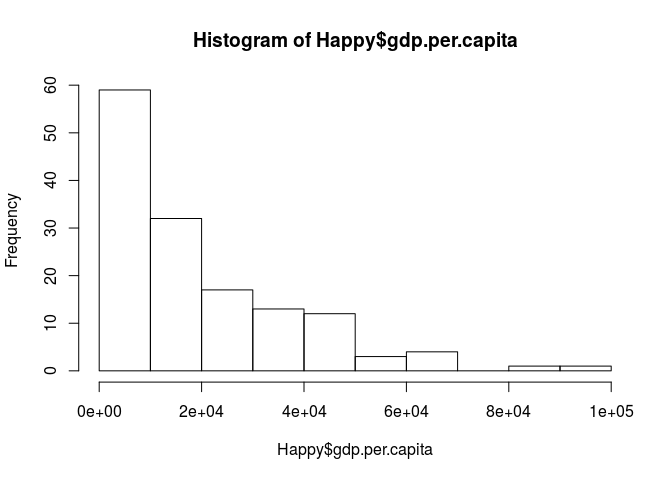
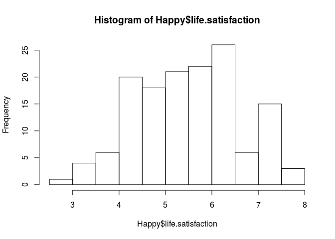
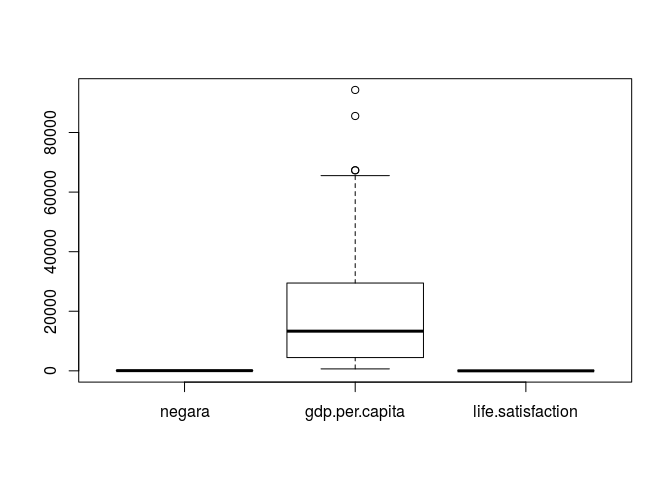
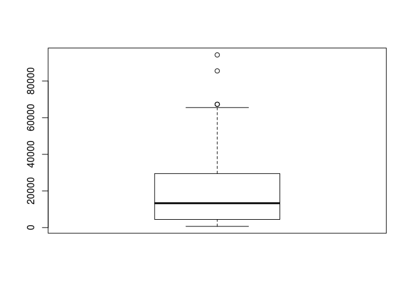
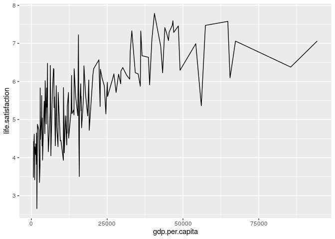

GDP - Happiness
================
Lenny M. Wibisana
3 Desember 2019

Tingkat kebahagiaan masyarakat di suatu daerah tentunya dipengaruhi oleh
berbagai faktor. Nah kali ini, kita akan melihat, bener ga sih GDP per
capita itu menjadi faktor yang mempengaruhi kebahagiaan masyarakat?

## Read Data

``` r
# input dataset ke dalam R
Happy <- read.csv("/cloud/project/Materi Training/GIZ/Latihan SOAL/GDP vs Happiness.csv")
```

``` r
# melihat 6 data awal
head(Happy)
```

    ##   X      negara gdp.per.capita life.satisfaction
    ## 1 1 Afghanistan       1803.987          2.661718
    ## 2 2     Albania      11803.431          4.639548
    ## 3 3     Algeria      13913.839          5.248912
    ## 4 4   Argentina      18933.907          6.039330
    ## 5 5     Armenia       8787.580          4.287736
    ## 6 6   Australia      44648.710          7.257038

``` r
# melihat variabel apa saja yang ada di dataset dan tipe data tiap variabelnya
str(Happy)
```

    ## 'data.frame':    142 obs. of  4 variables:
    ##  $ X                : int  1 2 3 4 5 6 7 8 9 10 ...
    ##  $ negara           : Factor w/ 142 levels "Afghanistan",..: 1 2 3 4 5 6 7 8 9 10 ...
    ##  $ gdp.per.capita   : num  1804 11803 13914 18934 8788 ...
    ##  $ life.satisfaction: num  2.66 4.64 5.25 6.04 4.29 ...

Dari dataset `Happy` maka diperoleh variabel berikut: \* `X`: nomor urut
\* `negara`: Nama negara \* `gdp.per.capita`: GDP per kapita dari suatu
negara \* `life.satisfaction`: tingkat kebahagiaan suatu negara

## Preparation Data

Dari dataset `Happy` variabel `X` tidak digunakan, maka dapat di delete

``` r
Happy <- Happy[,-1]
head(Happy)
```

    ##        negara gdp.per.capita life.satisfaction
    ## 1 Afghanistan       1803.987          2.661718
    ## 2     Albania      11803.431          4.639548
    ## 3     Algeria      13913.839          5.248912
    ## 4   Argentina      18933.907          6.039330
    ## 5     Armenia       8787.580          4.287736
    ## 6   Australia      44648.710          7.257038

Cek apakah ada data yang kosong

``` r
colSums(is.na(Happy))
```

    ##            negara    gdp.per.capita life.satisfaction 
    ##                 0                 0                 0

> Tidak ada data yang kosong di tiap variabelnya

``` r
summary(Happy)
```

    ##          negara    gdp.per.capita    life.satisfaction
    ##  Afghanistan:  1   Min.   :  661.2   Min.   :2.662    
    ##  Albania    :  1   1st Qu.: 4472.9   1st Qu.:4.624    
    ##  Algeria    :  1   Median :13311.3   Median :5.566    
    ##  Argentina  :  1   Mean   :19299.0   Mean   :5.486    
    ##  Armenia    :  1   3rd Qu.:29301.7   3rd Qu.:6.262    
    ##  Australia  :  1   Max.   :94278.0   Max.   :7.788    
    ##  (Other)    :136

## Exploratory data

Sebelum membuat modelnya, mari lihat dulu sebaran tiap variabelnya

``` r
# membuat histogram gdp.per.capita
hist(Happy$gdp.per.capita)
```

<!-- --> \>
Dari hasil histogram `gdp.per.capita` tampak bahwa sebaran datanya
cenderung banyak di sebelah kiri.

``` r
# membuat histogram life.satisfaction
hist(Happy$life.satisfaction)
```

<!-- --> \>
Dari hasil histogram `life.satisfaction` tampak bahwa data memiliki
sebaran normal.

Bagaimana sebaran distribusi yang sebenarnya dari variabel
`gdp.per.capita` dan `life.satisfaction` ? Kita akan melakukan uji
kenormalan data dengan *Shapiro-Wilk*

Uji asumsi untuk normality H0: data berdistribusi normal H1: data tidak
berdistribusi normal Mencari p-value \> 0.05 agar kesimpulannya data
berdistribusi normal

``` r
# uji kenormalan variabel gpd.per.capita
shapiro.test(Happy$gdp.per.capita)
```

    ## 
    ##  Shapiro-Wilk normality test
    ## 
    ## data:  Happy$gdp.per.capita
    ## W = 0.85039, p-value = 1.061e-10

``` r
# uji kenormalam variabel life.satisfaction
shapiro.test(Happy$life.satisfaction)
```

    ## 
    ##  Shapiro-Wilk normality test
    ## 
    ## data:  Happy$life.satisfaction
    ## W = 0.98525, p-value = 0.1325

> Variabel `gdp.per.capita` tidak berdistribusi normal Variabel
> `life.satisfaction` berdistribusi normal

Cek apakah ada data outliers?

``` r
boxplot(Happy)
```

<!-- -->

``` r
# melihat data gdp.per.capita yang out memiliki angka berapa
boxplot(Happy$gdp.per.capita)$out
```

<!-- -->

    ## [1] 67335.29 94277.97 85535.38 67293.48

> Ditemukan bahwa ada 4 data `gdp.per.capita` yang memiliki nilai sangat
> tinggi.

Bagaimana plot data dari `gdp.per.capita` dengan `life.satisfaction` ?

``` r
library(ggplot2)
ggplot(Happy,
       aes(y=life.satisfaction)) +
  geom_line(aes(x=gdp.per.capita), color="black")
```

<!-- -->

Bagaimana korelasi antara `gdp.per.capita` dengan `life.satisfaction` ?

``` r
cor(Happy$gdp.per.capita, Happy$life.satisfaction,method = "spearman")
```

    ## [1] 0.7895643

> Nilai korelasinya kuat sebesar 0.79 dan bernilai positif. Bernilai
> positif artinya jika `gdp.per.capita` mengalami kenaikan maka
> `life.satisfaction` akan ikut mengalami kenaikan juga.

## Membuat model regresi

Variabel target: `life.satisfaction` Variabel prediktor:
`gdp.per.capita`

``` r
model_reg <- lm(life.satisfaction~gdp.per.capita, data = Happy)
```

Melihat summary `model_reg`

``` r
summary(model_reg)
```

    ## 
    ## Call:
    ## lm(formula = life.satisfaction ~ gdp.per.capita, data = Happy)
    ## 
    ## Residuals:
    ##      Min       1Q   Median       3Q      Max 
    ## -2.06541 -0.50551  0.00623  0.55957  1.90277 
    ## 
    ## Coefficients:
    ##                 Estimate Std. Error t value Pr(>|t|)    
    ## (Intercept)    4.649e+00  9.235e-02   50.34   <2e-16 ***
    ## gdp.per.capita 4.338e-05  3.430e-06   12.65   <2e-16 ***
    ## ---
    ## Signif. codes:  0 '***' 0.001 '**' 0.01 '*' 0.05 '.' 0.1 ' ' 1
    ## 
    ## Residual standard error: 0.7673 on 140 degrees of freedom
    ## Multiple R-squared:  0.5333, Adjusted R-squared:   0.53 
    ## F-statistic:   160 on 1 and 140 DF,  p-value: < 2.2e-16

> Pr(\<|t|)\` menunjukkan signifikansi suatu variabel prediktor terhadap
> targetnya. Jika bernilai lebih kecil dari 0.05 maka signifikan

> Estimate pada variabel prediktor `gdp.per.capita` menunjukkan
> 4.338e-05, artinya setiap kenaikan 1 harga, berkontribusi 4.338e-05
> terhadap `life.satisfaction`. Sedangkan, ketika `gdp.per.capita` 0,
> maka nilai `life.satisfaction` akan sama dengan estimate pada
> interceptnya (4.649e+00).

> Pada Simple linear regression, metric yang menjadi acuan untuk melihat
> apakah model yang dibuat sudah bagus atau belum adalah dengan melihat
> nilai multiple r-squarednya. Pada model ini, didapat nilai multiple
> R-squared: 0.5333, artinya variabel `gdp.per.capita` mampu menjelaskan
> 53.33% informasi (variansi) variabel `life.satisfaction`. Sisanya
> dijelaskan oleh variabel lain yang tidak dimasukkan ke dalam model.

> P-value \< 0.05 artinya model berpengaruh terhadap `life.satisfatcion`

Cek nilai error dari model yang dibuat

  - MSE (Mean Squared Error) Masing-masing error atau sisa dikuadratkan
    kemudian dibagi jumlah datanya
    \(MSE = \frac{1}{n}\sum({A_t-F_t})^2\)

di mana: \(A_t\) = Actual value \(F_t\) = Forecast value

  - MAPE (Mean Absolut Percentage Error)
    \(MAPE = \frac{1}{n}\sum|\frac{A_t-F_t}{A_t}|\)

di mana: \(A_t\) = Actual value \(F_t\) = Forecast value

Kekurangan MAPE: tidak bisa digunakan ketika ada actual value (\(A_t\))
yang nilainya 0 (karena \(A_t\) di formula sebagai penyebut, sehingga
nilainya tidak boleh 0)

Angka error ini semakin kecil semakin baik.

``` r
library(MLmetrics)
MSE(model_reg$fitted.values, Happy$life.satisfaction)
```

    ## [1] 0.5805273

``` r
MAPE(model_reg$fitted.values, Happy$life.satisfaction)
```

    ## [1] 0.1175632

## Kesimpulan

Hasil p-value menunjukkan bahwa memang model yang dibuat menunjukkan
adanya pengaruh dari `gdp.per.capita` terhadap `life.satisfaction`.
Namun didapati juga bahwa model ini belum maksimal, masih ada variabel
lain yang berpengaruh juga terhadap `life.satisfaction` selain
`gdp.per.capita`
