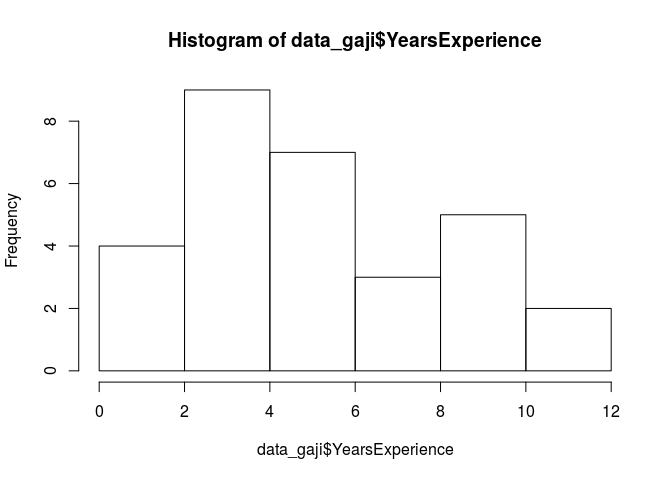
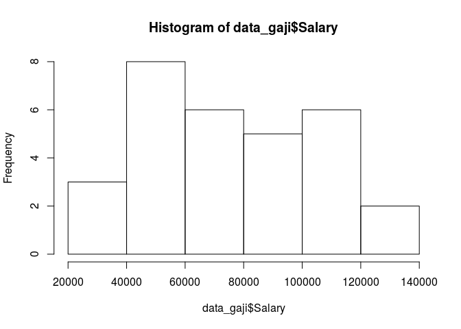
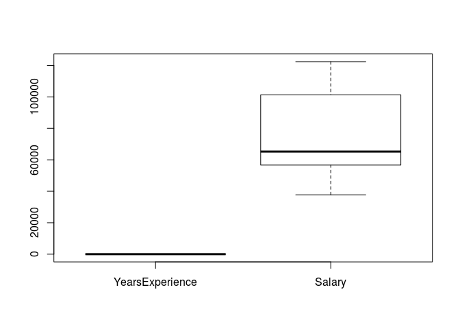
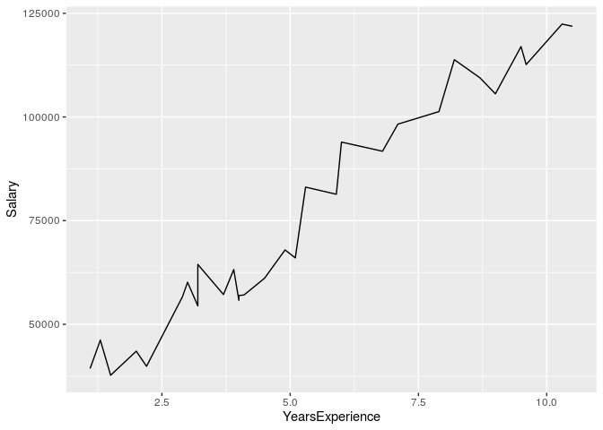

Lama Kerja vs Gaji
================
Lenny M. Wibisana
3 Desember 2019

Apakah benar lama kerja seseorang berpengaruh terhadap gaji yang
diterima
?

## Read data

``` r
data_gaji <- read.csv("/cloud/project/Materi Training/GIZ/Latihan SOAL/Lama Kerja vs Gaji.csv")
```

``` r
# lihat 6 data awal
head(data_gaji)
```

    ##   X YearsExperience Salary     EmployeeName
    ## 1 1             1.1  39343     Bondi, Karla
    ## 2 2             1.3  46205    Leach, Delina
    ## 3 3             1.5  37731  Koslosky, Kylie
    ## 4 4             2.0  43525 Chung, Brightzen
    ## 5 5             2.2  39891    Parker, Alena
    ## 6 6             2.9  56642  Laird, Fletcher

``` r
# melihat variabel apa saja yang ada di dataset dan tipe data tiap variabelnya
str(data_gaji)
```

    ## 'data.frame':    30 obs. of  4 variables:
    ##  $ X              : int  1 2 3 4 5 6 7 8 9 10 ...
    ##  $ YearsExperience: num  1.1 1.3 1.5 2 2.2 2.9 3 3.2 3.2 3.7 ...
    ##  $ Salary         : int  39343 46205 37731 43525 39891 56642 60150 54445 64445 57189 ...
    ##  $ EmployeeName   : Factor w/ 30 levels "Akina, Elijah",..: 5 20 18 7 25 19 6 17 8 28 ...

Dari dataset `data_gaji` diperoleh informasi variabel berikut: \* `X`:
nomor urut \* `YearsExperience`: lama bekerja dalam tahun \* `Salary`:
gaji \* `EmployeeName`: nama pegawai

## Preparation Data

Dari dataset `data_gaji` variabel `X` dan `EmployeeName` tidak
digunakan, maka dapat di delete

``` r
data_gaji <- data_gaji[,-c(1,4)]
head(data_gaji)
```

    ##   YearsExperience Salary
    ## 1             1.1  39343
    ## 2             1.3  46205
    ## 3             1.5  37731
    ## 4             2.0  43525
    ## 5             2.2  39891
    ## 6             2.9  56642

Cek apakah ada data yang kosong

``` r
colSums(is.na(data_gaji))
```

    ## YearsExperience          Salary 
    ##               0               0

> Tidak ada data yang kosong di tiap variabelnya

## Exploratory data

Sebelum membuat modelnya, mari lihat dulu sebaran tiap variabelnya

``` r
# membuat histogram dari variabel YearsExperience
hist(data_gaji$YearsExperience)
```

<!-- -->

``` r
# membuat histogram dari variabel salary
hist(data_gaji$Salary)
```

<!-- -->

Bagaimana sebaran distribusi yang sebenarnya dari variabel
`YearsExperience` dan `Salary` ? Kita akan melakukan uji kenormalan data
dengan *Shapiro-Wilk*

Uji asumsi untuk normality H0: data berdistribusi normal H1: data tidak
berdistribusi normal Mencari p-value \> 0.05 agar kesimpulannya data
berdistribusi normal

``` r
# uji kenormalan variabel YearsExperience
shapiro.test(data_gaji$YearsExperience)
```

    ## 
    ##  Shapiro-Wilk normality test
    ## 
    ## data:  data_gaji$YearsExperience
    ## W = 0.94206, p-value = 0.1034

``` r
# uji kenormalam variabel Salary
shapiro.test(data_gaji$Salary)
```

    ## 
    ##  Shapiro-Wilk normality test
    ## 
    ## data:  data_gaji$Salary
    ## W = 0.91032, p-value = 0.01516

> Data YearsExperience berdistribusi normal Data Salary tidak
> berdistribusi normal

Cek apakah ada data outliers?

``` r
boxplot(data_gaji)
```

<!-- --> \> Tidak ada
data outliers

Bagaimana plot data dari `YearsExperience` dengan `Salary` ?

``` r
library(ggplot2)
ggplot(data_gaji,
       aes(y=Salary)) +
  geom_line(aes(x=YearsExperience), color="black")
```

<!-- -->

Bagaimana korelasi antara `YearsExperience` dengan `Salary` ?

``` r
cor(data_gaji$YearsExperience, data_gaji$Salary, method = "spearman")
```

    ## [1] 0.9568314

> Nilai korelasinya kuat sebesar 0.96 dan bernilai positif. Bernilai
> positif artinya jika `YearsExperience` mengalami kenaikan maka
> `Salary` akan ikut mengalami kenaikan juga.

## Membuat model regresi

Variabel target: `Salary` Variabel prediktor: `YearsExperience`

``` r
model_salary <- lm(Salary~YearsExperience, data = data_gaji)
```

Melihat summary `model_salary`

``` r
summary(model_salary)
```

    ## 
    ## Call:
    ## lm(formula = Salary ~ YearsExperience, data = data_gaji)
    ## 
    ## Residuals:
    ##     Min      1Q  Median      3Q     Max 
    ## -7958.0 -4088.5  -459.9  3372.6 11448.0 
    ## 
    ## Coefficients:
    ##                 Estimate Std. Error t value Pr(>|t|)    
    ## (Intercept)      25792.2     2273.1   11.35 5.51e-12 ***
    ## YearsExperience   9450.0      378.8   24.95  < 2e-16 ***
    ## ---
    ## Signif. codes:  0 '***' 0.001 '**' 0.01 '*' 0.05 '.' 0.1 ' ' 1
    ## 
    ## Residual standard error: 5788 on 28 degrees of freedom
    ## Multiple R-squared:  0.957,  Adjusted R-squared:  0.9554 
    ## F-statistic: 622.5 on 1 and 28 DF,  p-value: < 2.2e-16

> Pr(\<|t|)\` menunjukkan signifikansi suatu variabel prediktor terhadap
> targetnya. Jika bernilai lebih kecil dari 0.05 maka signifikan

> Estimate pada variabel prediktor `YearsExperience` menunjukkan 9450,
> artinya setiap kenaikan 1 YearsExperience, berkontribusi 9450 terhadap
> `Salary`. Sedangkan, ketika `YearsExperience` 0, maka nilai `Salary`
> akan sama dengan estimate pada interceptnya (25792.2).

> Pada Simple linear regression, metric yang menjadi acuan untuk melihat
> apakah model yang dibuat sudah bagus atau belum adalah dengan melihat
> nilai multiple r-squarednya. Pada model ini, didapat nilai multiple
> R-squared: 0.957, artinya variabel `YearsExperience` mampu menjelaskan
> 95.7% informasi (variansi) variabel `Salary`. Sisanya dijelaskan oleh
> variabel lain yang tidak dimasukkan ke dalam model.

> P-value \< 0.05 artinya model berpengaruh terhadap `Salary`

Cek nilai error dari model yang dibuat

  - MSE (Mean Squared Error) Masing-masing error atau sisa dikuadratkan
    kemudian dibagi jumlah datanya
    \(MSE = \frac{1}{n}\sum({A_t-F_t})^2\)

di mana: \(A_t\) = Actual value \(F_t\) = Forecast value

  - MAPE (Mean Absolut Percentage Error)
    \(MAPE = \frac{1}{n}\sum|\frac{A_t-F_t}{A_t}|\)

di mana: \(A_t\) = Actual value \(F_t\) = Forecast value

Kekurangan MAPE: tidak bisa digunakan ketika ada actual value (\(A_t\))
yang nilainya 0 (karena \(A_t\) di formula sebagai penyebut, sehingga
nilainya tidak boleh 0)

Angka error ini semakin kecil semakin baik.

``` r
library(MLmetrics)
MAE(model_salary$fitted.values, data_gaji$Salary)
```

    ## [1] 4644.201

``` r
MSE(model_salary$fitted.values, data_gaji$Salary)
```

    ## [1] 31270952

``` r
MAPE(model_salary$fitted.values, data_gaji$Salary)
```

    ## [1] 0.07048034

> Kesimpulan:
