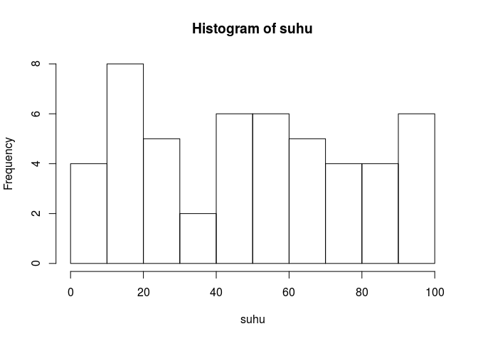
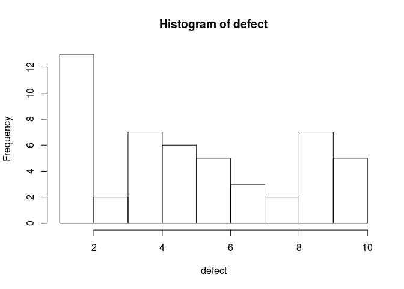
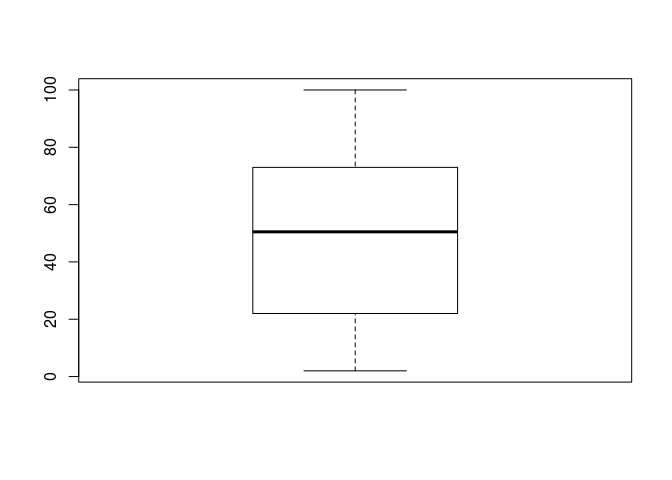
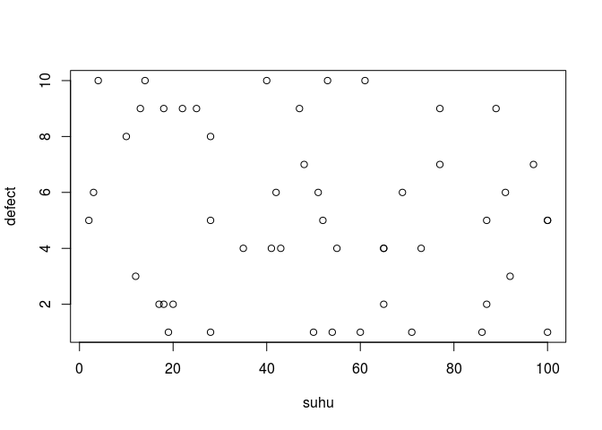
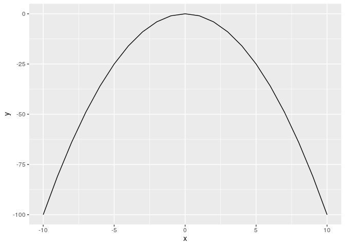
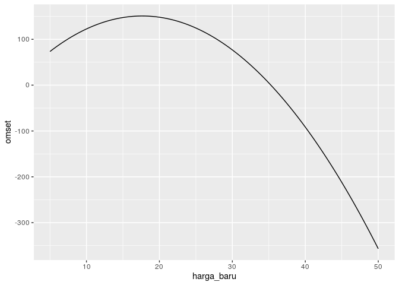

Bahan Training R - GIZ
================
@mr.ikanx & @lenny.wibisana

# Selamat datang di R

## *Objects* di R

Ada beberapa *objects* atau struktur data di R, yakni:

1.  Single variabel
2.  Vector atau array
3.  Tibble atau Data frame
4.  List

## Tipe data

Ada beberapa tipe data di data science, yakni:

1.  Character
2.  Numerik
3.  Integer (atau bisa berupa factor)
4.  Logical (TRUE / FALSE)

# Yuk kita mulai materinya
##### Sebagai catatan, karena bahasan utama training ini adalah regresi linear, maka intro to R nya akan sangat express.

## Single variabel

``` r
a = 10
a
```

    ## [1] 10

``` r
b <- 3
b
```

    ## [1] 3

``` r
a+b
```

    ## [1] 13

``` r
c=a*b^2/100
c
```

    ## [1] 0.9

``` r
kalimat='saya suka pergi ke pasar' #jika variabelnya berupa text
kalimat 
```

    ## [1] "saya suka pergi ke pasar"

**Perhatikan penggunakan tanda `"` dan `'` pada perintah di bawah
ini\!**

``` r
kalimat_baru = "i don't like pizza"
kalimat_baru
```

    ## [1] "i don't like pizza"

## Vector atau array

``` r
tes_vector=c(1,3,6,5,4,7)
tes_vector
```

    ## [1] 1 3 6 5 4 7

``` r
id=c(1:10) #contoh generating sequence
id
```

    ##  [1]  1  2  3  4  5  6  7  8  9 10

``` r
a=seq(1,10,0.5) #contoh generating sequence by 0.5
a
```

    ##  [1]  1.0  1.5  2.0  2.5  3.0  3.5  4.0  4.5  5.0  5.5  6.0  6.5  7.0  7.5
    ## [15]  8.0  8.5  9.0  9.5 10.0

``` r
sample(c(100:200),5,replace=F) #generating random number
```

    ## [1] 120 195 190 130 134

``` r
kalimat = 'saya biasa pergi ke kantor setiap jam 7 pagi'
pecah.kata=strsplit(kalimat,' ') #pecah kalimat menjadi kata dan mengubahnya menjadi array
```

Beberapa fungsi yang mungkin berguna di array:

``` r
# Yang penting di array
length(a)
```

    ## [1] 19

``` r
a[2]
```

    ## [1] 1.5

``` r
summary(a)
```

    ##    Min. 1st Qu.  Median    Mean 3rd Qu.    Max. 
    ##    1.00    3.25    5.50    5.50    7.75   10.00

``` r
# Operasi aritmatika pada array
a+3
```

    ##  [1]  4.0  4.5  5.0  5.5  6.0  6.5  7.0  7.5  8.0  8.5  9.0  9.5 10.0 10.5
    ## [15] 11.0 11.5 12.0 12.5 13.0

``` r
a*6
```

    ##  [1]  6  9 12 15 18 21 24 27 30 33 36 39 42 45 48 51 54 57 60

## Logic atau boolean

``` r
#boolean expression
1==2
```

    ## [1] FALSE

``` r
ifelse(1+2==3,'anda benar','anda salah')
```

    ## [1] "anda benar"

``` r
ifelse(1+2!=3,'anda benar','anda salah')
```

    ## [1] "anda salah"

``` r
ifelse(1+2<=3,'anda benar','anda salah')
```

    ## [1] "anda benar"

``` r
ifelse(1+2>=3,'anda benar','anda salah')
```

    ## [1] "anda benar"

### Another useful function

#### Paste

``` r
nomor=c(1:100)
nama.toko=paste('toko',nomor,sep='_')
nama.toko
```

    ##   [1] "toko_1"   "toko_2"   "toko_3"   "toko_4"   "toko_5"   "toko_6"  
    ##   [7] "toko_7"   "toko_8"   "toko_9"   "toko_10"  "toko_11"  "toko_12" 
    ##  [13] "toko_13"  "toko_14"  "toko_15"  "toko_16"  "toko_17"  "toko_18" 
    ##  [19] "toko_19"  "toko_20"  "toko_21"  "toko_22"  "toko_23"  "toko_24" 
    ##  [25] "toko_25"  "toko_26"  "toko_27"  "toko_28"  "toko_29"  "toko_30" 
    ##  [31] "toko_31"  "toko_32"  "toko_33"  "toko_34"  "toko_35"  "toko_36" 
    ##  [37] "toko_37"  "toko_38"  "toko_39"  "toko_40"  "toko_41"  "toko_42" 
    ##  [43] "toko_43"  "toko_44"  "toko_45"  "toko_46"  "toko_47"  "toko_48" 
    ##  [49] "toko_49"  "toko_50"  "toko_51"  "toko_52"  "toko_53"  "toko_54" 
    ##  [55] "toko_55"  "toko_56"  "toko_57"  "toko_58"  "toko_59"  "toko_60" 
    ##  [61] "toko_61"  "toko_62"  "toko_63"  "toko_64"  "toko_65"  "toko_66" 
    ##  [67] "toko_67"  "toko_68"  "toko_69"  "toko_70"  "toko_71"  "toko_72" 
    ##  [73] "toko_73"  "toko_74"  "toko_75"  "toko_76"  "toko_77"  "toko_78" 
    ##  [79] "toko_79"  "toko_80"  "toko_81"  "toko_82"  "toko_83"  "toko_84" 
    ##  [85] "toko_85"  "toko_86"  "toko_87"  "toko_88"  "toko_89"  "toko_90" 
    ##  [91] "toko_91"  "toko_92"  "toko_93"  "toko_94"  "toko_95"  "toko_96" 
    ##  [97] "toko_97"  "toko_98"  "toko_99"  "toko_100"

#### Print

``` r
nomor=c(1:100)
print(nomor)
```

    ##   [1]   1   2   3   4   5   6   7   8   9  10  11  12  13  14  15  16  17
    ##  [18]  18  19  20  21  22  23  24  25  26  27  28  29  30  31  32  33  34
    ##  [35]  35  36  37  38  39  40  41  42  43  44  45  46  47  48  49  50  51
    ##  [52]  52  53  54  55  56  57  58  59  60  61  62  63  64  65  66  67  68
    ##  [69]  69  70  71  72  73  74  75  76  77  78  79  80  81  82  83  84  85
    ##  [86]  86  87  88  89  90  91  92  93  94  95  96  97  98  99 100

### Sebelum masuk ke data frame:

``` r
# Misalkan kita buat dua variabel sbb:
suhu=sample(100,50,replace=T)
defect=sample(10,50,replace=T)

# Membuat histogram dari suhu
hist(suhu)
```

<!-- -->

``` r
# Membuat histogram dari defect
hist(defect)
```

<!-- -->

Untuk membuat *boxplot* bisa menggunakan perintah ini:

``` r
# Membuat boxplot dari defect
boxplot(defect)
```

<!-- -->

``` r
# Membuat boxplot dari suhu
boxplot(suhu)
```

<!-- -->

### Uji Korelasi

Kita mulai masuk ke uji korelasi. Setidaknya ada tiga informasi utama
saat kita melakukan **uji korelasi**, yakni:

1.  Apakah korelasi antara dua variabel tersebut signifikan?
2.  Apakah korelasi yang ada kuat, sedang, atau lemah?
3.  Bagaimana hubungan antara dua variabel tersebut? Berbanding lurus
    atau terbalik?

Kita bisa melakukannya di **R** dengan perintah `cor.test()`.

``` r
uji_korelasi = cor.test(suhu,defect)
uji_korelasi
```

    ## 
    ##  Pearson's product-moment correlation
    ## 
    ## data:  suhu and defect
    ## t = -1.3356, df = 48, p-value = 0.188
    ## alternative hypothesis: true correlation is not equal to 0
    ## 95 percent confidence interval:
    ##  -0.44423289  0.09400971
    ## sample estimates:
    ##        cor 
    ## -0.1892913

``` r
# Melihat p-value dari hasil uji korelasi 
uji_korelasi$p.value
```

    ## [1] 0.1879807

``` r
# Kesimpulan uji korelasi
ifelse(uji_korelasi$p.value<0.05,'Signifikan berkorelasi','Tidak signifikan berkorelasi')
```

    ## [1] "Tidak signifikan berkorelasi"

``` r
# Menampilkan angka korelasi
cor(suhu,defect)
```

    ## [1] -0.1892913

``` r
# Simple plot suhu vs defect
plot(suhu,defect)
```

<!-- -->

Apa yang bisa kita simpulkan dari data `suhu` dan `defect` tersebut?

### Uji kenormalan di **R**

Untuk melakukan uji kenormalan, setidaknya ada dua cara, yakni:

1.  Shapiro-Wilk
2.  Kolmogorov-Smirnov

Kita bisa menggunakan perintah `shapiro.test()` untuk melakukan uji
kenormalan. Contoh melakukan uji kenormalan untuk `suhu`.

``` r
stat_uji = shapiro.test(suhu)
ifelse(stat_uji$p.value < 0.05,
       'Tolak H0 -- tidak normal',
       'H0 tidak ditolak -- normal')
```

    ## [1] "Tolak H0 -- tidak normal"

## Tibble atau Data Frame

Struktur data **tibble** atau **data frame** sejatinya mirip dengan data
tradisional di **MS. EXCEL**.

### Membangun data frame dari kumpulan vector

Data frame bisa dibangun dari dua atau lebih vector yang memiliki
`length` sama.

``` r
#membuat data frame
data=data.frame(suhu,defect)
data
```

    ##    suhu defect
    ## 1    73      4
    ## 2    25      9
    ## 3    77      7
    ## 4    47      9
    ## 5    17      2
    ## 6    65      2
    ## 7    13      9
    ## 8    92      3
    ## 9   100      5
    ## 10   10      8
    ## 11   20      2
    ## 12   87      5
    ## 13   55      4
    ## 14   60      1
    ## 15   53     10
    ## 16   18      2
    ## 17   89      9
    ## 18   69      6
    ## 19   41      4
    ## 20   12      3
    ## 21   71      1
    ## 22   61     10
    ## 23   86      1
    ## 24   40     10
    ## 25  100      1
    ## 26   50      1
    ## 27   19      1
    ## 28   51      6
    ## 29   54      1
    ## 30   97      7
    ## 31   65      4
    ## 32   28      8
    ## 33   42      6
    ## 34   18      9
    ## 35   28      1
    ## 36   91      6
    ## 37   28      5
    ## 38   35      4
    ## 39   87      2
    ## 40    2      5
    ## 41   77      9
    ## 42   14     10
    ## 43    4     10
    ## 44   52      5
    ## 45   48      7
    ## 46   22      9
    ## 47   43      4
    ## 48    3      6
    ## 49   65      4
    ## 50  100      5

### Another useful function di data frame

Untuk melihat data frame bisa menggunakan fungsi `View(data)`.

``` r
str(data)
```

    ## 'data.frame':    50 obs. of  2 variables:
    ##  $ suhu  : int  73 25 77 47 17 65 13 92 100 10 ...
    ##  $ defect: int  4 9 7 9 2 2 9 3 5 8 ...

``` r
summary(data)
```

    ##       suhu            defect     
    ##  Min.   :  2.00   Min.   : 1.00  
    ##  1st Qu.: 22.75   1st Qu.: 2.25  
    ##  Median : 50.50   Median : 5.00  
    ##  Mean   : 50.08   Mean   : 5.24  
    ##  3rd Qu.: 72.50   3rd Qu.: 8.00  
    ##  Max.   :100.00   Max.   :10.00

``` r
length(data)
```

    ## [1] 2

``` r
head(data,5) #menampilkan data 5 teratas
```

    ##   suhu defect
    ## 1   73      4
    ## 2   25      9
    ## 3   77      7
    ## 4   47      9
    ## 5   17      2

``` r
tail(data,5) #menampilkan data 5 terbawah
```

    ##    suhu defect
    ## 46   22      9
    ## 47   43      4
    ## 48    3      6
    ## 49   65      4
    ## 50  100      5

``` r
data[1]
```

    ##    suhu
    ## 1    73
    ## 2    25
    ## 3    77
    ## 4    47
    ## 5    17
    ## 6    65
    ## 7    13
    ## 8    92
    ## 9   100
    ## 10   10
    ## 11   20
    ## 12   87
    ## 13   55
    ## 14   60
    ## 15   53
    ## 16   18
    ## 17   89
    ## 18   69
    ## 19   41
    ## 20   12
    ## 21   71
    ## 22   61
    ## 23   86
    ## 24   40
    ## 25  100
    ## 26   50
    ## 27   19
    ## 28   51
    ## 29   54
    ## 30   97
    ## 31   65
    ## 32   28
    ## 33   42
    ## 34   18
    ## 35   28
    ## 36   91
    ## 37   28
    ## 38   35
    ## 39   87
    ## 40    2
    ## 41   77
    ## 42   14
    ## 43    4
    ## 44   52
    ## 45   48
    ## 46   22
    ## 47   43
    ## 48    3
    ## 49   65
    ## 50  100

``` r
data[,1]
```

    ##  [1]  73  25  77  47  17  65  13  92 100  10  20  87  55  60  53  18  89
    ## [18]  69  41  12  71  61  86  40 100  50  19  51  54  97  65  28  42  18
    ## [35]  28  91  28  35  87   2  77  14   4  52  48  22  43   3  65 100

``` r
data[2]
```

    ##    defect
    ## 1       4
    ## 2       9
    ## 3       7
    ## 4       9
    ## 5       2
    ## 6       2
    ## 7       9
    ## 8       3
    ## 9       5
    ## 10      8
    ## 11      2
    ## 12      5
    ## 13      4
    ## 14      1
    ## 15     10
    ## 16      2
    ## 17      9
    ## 18      6
    ## 19      4
    ## 20      3
    ## 21      1
    ## 22     10
    ## 23      1
    ## 24     10
    ## 25      1
    ## 26      1
    ## 27      1
    ## 28      6
    ## 29      1
    ## 30      7
    ## 31      4
    ## 32      8
    ## 33      6
    ## 34      9
    ## 35      1
    ## 36      6
    ## 37      5
    ## 38      4
    ## 39      2
    ## 40      5
    ## 41      9
    ## 42     10
    ## 43     10
    ## 44      5
    ## 45      7
    ## 46      9
    ## 47      4
    ## 48      6
    ## 49      4
    ## 50      5

``` r
data[,2]
```

    ##  [1]  4  9  7  9  2  2  9  3  5  8  2  5  4  1 10  2  9  6  4  3  1 10  1
    ## [24] 10  1  1  1  6  1  7  4  8  6  9  1  6  5  4  2  5  9 10 10  5  7  9
    ## [47]  4  6  4  5

``` r
data[1,1] #melihat data di posisi row,column
```

    ## [1] 73

``` r
data[1,2] #melihat data di posisi row,column
```

    ## [1] 4

``` r
data[1,1]=NA #menghapus data di posisi row,column

# Menambah variabel
# Cara 1
data$hari = paste('hari ke',c(1:50),'dari 50 hari',sep=' ')
head(data,20)
```

    ##    suhu defect                    hari
    ## 1    NA      4  hari ke 1 dari 50 hari
    ## 2    25      9  hari ke 2 dari 50 hari
    ## 3    77      7  hari ke 3 dari 50 hari
    ## 4    47      9  hari ke 4 dari 50 hari
    ## 5    17      2  hari ke 5 dari 50 hari
    ## 6    65      2  hari ke 6 dari 50 hari
    ## 7    13      9  hari ke 7 dari 50 hari
    ## 8    92      3  hari ke 8 dari 50 hari
    ## 9   100      5  hari ke 9 dari 50 hari
    ## 10   10      8 hari ke 10 dari 50 hari
    ## 11   20      2 hari ke 11 dari 50 hari
    ## 12   87      5 hari ke 12 dari 50 hari
    ## 13   55      4 hari ke 13 dari 50 hari
    ## 14   60      1 hari ke 14 dari 50 hari
    ## 15   53     10 hari ke 15 dari 50 hari
    ## 16   18      2 hari ke 16 dari 50 hari
    ## 17   89      9 hari ke 17 dari 50 hari
    ## 18   69      6 hari ke 18 dari 50 hari
    ## 19   41      4 hari ke 19 dari 50 hari
    ## 20   12      3 hari ke 20 dari 50 hari

``` r
# Cara 2
library(dplyr)
data = data %>% mutate(bulan='Januari')
data$bulan[32:50]='Februari'
```

### Bermain dengan element dan tanda `$`

``` r
data$suhu
```

    ##  [1]  NA  25  77  47  17  65  13  92 100  10  20  87  55  60  53  18  89
    ## [18]  69  41  12  71  61  86  40 100  50  19  51  54  97  65  28  42  18
    ## [35]  28  91  28  35  87   2  77  14   4  52  48  22  43   3  65 100

``` r
data$defect
```

    ##  [1]  4  9  7  9  2  2  9  3  5  8  2  5  4  1 10  2  9  6  4  3  1 10  1
    ## [24] 10  1  1  1  6  1  7  4  8  6  9  1  6  5  4  2  5  9 10 10  5  7  9
    ## [47]  4  6  4  5

``` r
data.baru=data[-1]
data.baru
```

    ##    defect                    hari    bulan
    ## 1       4  hari ke 1 dari 50 hari  Januari
    ## 2       9  hari ke 2 dari 50 hari  Januari
    ## 3       7  hari ke 3 dari 50 hari  Januari
    ## 4       9  hari ke 4 dari 50 hari  Januari
    ## 5       2  hari ke 5 dari 50 hari  Januari
    ## 6       2  hari ke 6 dari 50 hari  Januari
    ## 7       9  hari ke 7 dari 50 hari  Januari
    ## 8       3  hari ke 8 dari 50 hari  Januari
    ## 9       5  hari ke 9 dari 50 hari  Januari
    ## 10      8 hari ke 10 dari 50 hari  Januari
    ## 11      2 hari ke 11 dari 50 hari  Januari
    ## 12      5 hari ke 12 dari 50 hari  Januari
    ## 13      4 hari ke 13 dari 50 hari  Januari
    ## 14      1 hari ke 14 dari 50 hari  Januari
    ## 15     10 hari ke 15 dari 50 hari  Januari
    ## 16      2 hari ke 16 dari 50 hari  Januari
    ## 17      9 hari ke 17 dari 50 hari  Januari
    ## 18      6 hari ke 18 dari 50 hari  Januari
    ## 19      4 hari ke 19 dari 50 hari  Januari
    ## 20      3 hari ke 20 dari 50 hari  Januari
    ## 21      1 hari ke 21 dari 50 hari  Januari
    ## 22     10 hari ke 22 dari 50 hari  Januari
    ## 23      1 hari ke 23 dari 50 hari  Januari
    ## 24     10 hari ke 24 dari 50 hari  Januari
    ## 25      1 hari ke 25 dari 50 hari  Januari
    ## 26      1 hari ke 26 dari 50 hari  Januari
    ## 27      1 hari ke 27 dari 50 hari  Januari
    ## 28      6 hari ke 28 dari 50 hari  Januari
    ## 29      1 hari ke 29 dari 50 hari  Januari
    ## 30      7 hari ke 30 dari 50 hari  Januari
    ## 31      4 hari ke 31 dari 50 hari  Januari
    ## 32      8 hari ke 32 dari 50 hari Februari
    ## 33      6 hari ke 33 dari 50 hari Februari
    ## 34      9 hari ke 34 dari 50 hari Februari
    ## 35      1 hari ke 35 dari 50 hari Februari
    ## 36      6 hari ke 36 dari 50 hari Februari
    ## 37      5 hari ke 37 dari 50 hari Februari
    ## 38      4 hari ke 38 dari 50 hari Februari
    ## 39      2 hari ke 39 dari 50 hari Februari
    ## 40      5 hari ke 40 dari 50 hari Februari
    ## 41      9 hari ke 41 dari 50 hari Februari
    ## 42     10 hari ke 42 dari 50 hari Februari
    ## 43     10 hari ke 43 dari 50 hari Februari
    ## 44      5 hari ke 44 dari 50 hari Februari
    ## 45      7 hari ke 45 dari 50 hari Februari
    ## 46      9 hari ke 46 dari 50 hari Februari
    ## 47      4 hari ke 47 dari 50 hari Februari
    ## 48      6 hari ke 48 dari 50 hari Februari
    ## 49      4 hari ke 49 dari 50 hari Februari
    ## 50      5 hari ke 50 dari 50 hari Februari

### Another useful function di data frame (part 2)

``` r
is.na(data) #melihat ada yang kosong
```

    ##        suhu defect  hari bulan
    ##  [1,]  TRUE  FALSE FALSE FALSE
    ##  [2,] FALSE  FALSE FALSE FALSE
    ##  [3,] FALSE  FALSE FALSE FALSE
    ##  [4,] FALSE  FALSE FALSE FALSE
    ##  [5,] FALSE  FALSE FALSE FALSE
    ##  [6,] FALSE  FALSE FALSE FALSE
    ##  [7,] FALSE  FALSE FALSE FALSE
    ##  [8,] FALSE  FALSE FALSE FALSE
    ##  [9,] FALSE  FALSE FALSE FALSE
    ## [10,] FALSE  FALSE FALSE FALSE
    ## [11,] FALSE  FALSE FALSE FALSE
    ## [12,] FALSE  FALSE FALSE FALSE
    ## [13,] FALSE  FALSE FALSE FALSE
    ## [14,] FALSE  FALSE FALSE FALSE
    ## [15,] FALSE  FALSE FALSE FALSE
    ## [16,] FALSE  FALSE FALSE FALSE
    ## [17,] FALSE  FALSE FALSE FALSE
    ## [18,] FALSE  FALSE FALSE FALSE
    ## [19,] FALSE  FALSE FALSE FALSE
    ## [20,] FALSE  FALSE FALSE FALSE
    ## [21,] FALSE  FALSE FALSE FALSE
    ## [22,] FALSE  FALSE FALSE FALSE
    ## [23,] FALSE  FALSE FALSE FALSE
    ## [24,] FALSE  FALSE FALSE FALSE
    ## [25,] FALSE  FALSE FALSE FALSE
    ## [26,] FALSE  FALSE FALSE FALSE
    ## [27,] FALSE  FALSE FALSE FALSE
    ## [28,] FALSE  FALSE FALSE FALSE
    ## [29,] FALSE  FALSE FALSE FALSE
    ## [30,] FALSE  FALSE FALSE FALSE
    ## [31,] FALSE  FALSE FALSE FALSE
    ## [32,] FALSE  FALSE FALSE FALSE
    ## [33,] FALSE  FALSE FALSE FALSE
    ## [34,] FALSE  FALSE FALSE FALSE
    ## [35,] FALSE  FALSE FALSE FALSE
    ## [36,] FALSE  FALSE FALSE FALSE
    ## [37,] FALSE  FALSE FALSE FALSE
    ## [38,] FALSE  FALSE FALSE FALSE
    ## [39,] FALSE  FALSE FALSE FALSE
    ## [40,] FALSE  FALSE FALSE FALSE
    ## [41,] FALSE  FALSE FALSE FALSE
    ## [42,] FALSE  FALSE FALSE FALSE
    ## [43,] FALSE  FALSE FALSE FALSE
    ## [44,] FALSE  FALSE FALSE FALSE
    ## [45,] FALSE  FALSE FALSE FALSE
    ## [46,] FALSE  FALSE FALSE FALSE
    ## [47,] FALSE  FALSE FALSE FALSE
    ## [48,] FALSE  FALSE FALSE FALSE
    ## [49,] FALSE  FALSE FALSE FALSE
    ## [50,] FALSE  FALSE FALSE FALSE

``` r
!is.na(data) #melihat pasti terisi
```

    ##        suhu defect hari bulan
    ##  [1,] FALSE   TRUE TRUE  TRUE
    ##  [2,]  TRUE   TRUE TRUE  TRUE
    ##  [3,]  TRUE   TRUE TRUE  TRUE
    ##  [4,]  TRUE   TRUE TRUE  TRUE
    ##  [5,]  TRUE   TRUE TRUE  TRUE
    ##  [6,]  TRUE   TRUE TRUE  TRUE
    ##  [7,]  TRUE   TRUE TRUE  TRUE
    ##  [8,]  TRUE   TRUE TRUE  TRUE
    ##  [9,]  TRUE   TRUE TRUE  TRUE
    ## [10,]  TRUE   TRUE TRUE  TRUE
    ## [11,]  TRUE   TRUE TRUE  TRUE
    ## [12,]  TRUE   TRUE TRUE  TRUE
    ## [13,]  TRUE   TRUE TRUE  TRUE
    ## [14,]  TRUE   TRUE TRUE  TRUE
    ## [15,]  TRUE   TRUE TRUE  TRUE
    ## [16,]  TRUE   TRUE TRUE  TRUE
    ## [17,]  TRUE   TRUE TRUE  TRUE
    ## [18,]  TRUE   TRUE TRUE  TRUE
    ## [19,]  TRUE   TRUE TRUE  TRUE
    ## [20,]  TRUE   TRUE TRUE  TRUE
    ## [21,]  TRUE   TRUE TRUE  TRUE
    ## [22,]  TRUE   TRUE TRUE  TRUE
    ## [23,]  TRUE   TRUE TRUE  TRUE
    ## [24,]  TRUE   TRUE TRUE  TRUE
    ## [25,]  TRUE   TRUE TRUE  TRUE
    ## [26,]  TRUE   TRUE TRUE  TRUE
    ## [27,]  TRUE   TRUE TRUE  TRUE
    ## [28,]  TRUE   TRUE TRUE  TRUE
    ## [29,]  TRUE   TRUE TRUE  TRUE
    ## [30,]  TRUE   TRUE TRUE  TRUE
    ## [31,]  TRUE   TRUE TRUE  TRUE
    ## [32,]  TRUE   TRUE TRUE  TRUE
    ## [33,]  TRUE   TRUE TRUE  TRUE
    ## [34,]  TRUE   TRUE TRUE  TRUE
    ## [35,]  TRUE   TRUE TRUE  TRUE
    ## [36,]  TRUE   TRUE TRUE  TRUE
    ## [37,]  TRUE   TRUE TRUE  TRUE
    ## [38,]  TRUE   TRUE TRUE  TRUE
    ## [39,]  TRUE   TRUE TRUE  TRUE
    ## [40,]  TRUE   TRUE TRUE  TRUE
    ## [41,]  TRUE   TRUE TRUE  TRUE
    ## [42,]  TRUE   TRUE TRUE  TRUE
    ## [43,]  TRUE   TRUE TRUE  TRUE
    ## [44,]  TRUE   TRUE TRUE  TRUE
    ## [45,]  TRUE   TRUE TRUE  TRUE
    ## [46,]  TRUE   TRUE TRUE  TRUE
    ## [47,]  TRUE   TRUE TRUE  TRUE
    ## [48,]  TRUE   TRUE TRUE  TRUE
    ## [49,]  TRUE   TRUE TRUE  TRUE
    ## [50,]  TRUE   TRUE TRUE  TRUE

``` r
data.baru <- data[complete.cases(data), ] #jika mau menghapus baris2 yang ada NA nya! 

data$suhu=ifelse(data$suhu<50,NA,data$suhu) #menghapus data suhu yang aneh (di bawah 50'C)
cor(data.baru$suhu,data.baru$defect) #hitung korelasi baru
```

    ## [1] -0.1842251

### Sorting data frame

Seringkali pekerjaan kita di data frame banyak melibatkan *sort* data.
Bagaimana melakukannya di **R**?

#### Cara 1

Menggunakan **base R**.

``` r
#sorting data
sorted.data=data.baru[order(data.baru$suhu),] #descending
sorted.data=data.baru[order(-data.baru$suhu),] #ascending
```

#### Cara 2

Menggunakan `library(tidyverse)` ATAU minimal dengan `library(dplyr)`

``` r
library(tidyverse)
data.baru %>% arrange(suhu)
```

    ##    suhu defect                    hari    bulan
    ## 1     2      5 hari ke 40 dari 50 hari Februari
    ## 2     3      6 hari ke 48 dari 50 hari Februari
    ## 3     4     10 hari ke 43 dari 50 hari Februari
    ## 4    10      8 hari ke 10 dari 50 hari  Januari
    ## 5    12      3 hari ke 20 dari 50 hari  Januari
    ## 6    13      9  hari ke 7 dari 50 hari  Januari
    ## 7    14     10 hari ke 42 dari 50 hari Februari
    ## 8    17      2  hari ke 5 dari 50 hari  Januari
    ## 9    18      2 hari ke 16 dari 50 hari  Januari
    ## 10   18      9 hari ke 34 dari 50 hari Februari
    ## 11   19      1 hari ke 27 dari 50 hari  Januari
    ## 12   20      2 hari ke 11 dari 50 hari  Januari
    ## 13   22      9 hari ke 46 dari 50 hari Februari
    ## 14   25      9  hari ke 2 dari 50 hari  Januari
    ## 15   28      8 hari ke 32 dari 50 hari Februari
    ## 16   28      1 hari ke 35 dari 50 hari Februari
    ## 17   28      5 hari ke 37 dari 50 hari Februari
    ## 18   35      4 hari ke 38 dari 50 hari Februari
    ## 19   40     10 hari ke 24 dari 50 hari  Januari
    ## 20   41      4 hari ke 19 dari 50 hari  Januari
    ## 21   42      6 hari ke 33 dari 50 hari Februari
    ## 22   43      4 hari ke 47 dari 50 hari Februari
    ## 23   47      9  hari ke 4 dari 50 hari  Januari
    ## 24   48      7 hari ke 45 dari 50 hari Februari
    ## 25   50      1 hari ke 26 dari 50 hari  Januari
    ## 26   51      6 hari ke 28 dari 50 hari  Januari
    ## 27   52      5 hari ke 44 dari 50 hari Februari
    ## 28   53     10 hari ke 15 dari 50 hari  Januari
    ## 29   54      1 hari ke 29 dari 50 hari  Januari
    ## 30   55      4 hari ke 13 dari 50 hari  Januari
    ## 31   60      1 hari ke 14 dari 50 hari  Januari
    ## 32   61     10 hari ke 22 dari 50 hari  Januari
    ## 33   65      2  hari ke 6 dari 50 hari  Januari
    ## 34   65      4 hari ke 31 dari 50 hari  Januari
    ## 35   65      4 hari ke 49 dari 50 hari Februari
    ## 36   69      6 hari ke 18 dari 50 hari  Januari
    ## 37   71      1 hari ke 21 dari 50 hari  Januari
    ## 38   77      7  hari ke 3 dari 50 hari  Januari
    ## 39   77      9 hari ke 41 dari 50 hari Februari
    ## 40   86      1 hari ke 23 dari 50 hari  Januari
    ## 41   87      5 hari ke 12 dari 50 hari  Januari
    ## 42   87      2 hari ke 39 dari 50 hari Februari
    ## 43   89      9 hari ke 17 dari 50 hari  Januari
    ## 44   91      6 hari ke 36 dari 50 hari Februari
    ## 45   92      3  hari ke 8 dari 50 hari  Januari
    ## 46   97      7 hari ke 30 dari 50 hari  Januari
    ## 47  100      5  hari ke 9 dari 50 hari  Januari
    ## 48  100      1 hari ke 25 dari 50 hari  Januari
    ## 49  100      5 hari ke 50 dari 50 hari Februari

``` r
data.baru %>% arrange(desc(defect))
```

    ##    suhu defect                    hari    bulan
    ## 1    53     10 hari ke 15 dari 50 hari  Januari
    ## 2    61     10 hari ke 22 dari 50 hari  Januari
    ## 3    40     10 hari ke 24 dari 50 hari  Januari
    ## 4    14     10 hari ke 42 dari 50 hari Februari
    ## 5     4     10 hari ke 43 dari 50 hari Februari
    ## 6    25      9  hari ke 2 dari 50 hari  Januari
    ## 7    47      9  hari ke 4 dari 50 hari  Januari
    ## 8    13      9  hari ke 7 dari 50 hari  Januari
    ## 9    89      9 hari ke 17 dari 50 hari  Januari
    ## 10   18      9 hari ke 34 dari 50 hari Februari
    ## 11   77      9 hari ke 41 dari 50 hari Februari
    ## 12   22      9 hari ke 46 dari 50 hari Februari
    ## 13   10      8 hari ke 10 dari 50 hari  Januari
    ## 14   28      8 hari ke 32 dari 50 hari Februari
    ## 15   77      7  hari ke 3 dari 50 hari  Januari
    ## 16   97      7 hari ke 30 dari 50 hari  Januari
    ## 17   48      7 hari ke 45 dari 50 hari Februari
    ## 18   69      6 hari ke 18 dari 50 hari  Januari
    ## 19   51      6 hari ke 28 dari 50 hari  Januari
    ## 20   42      6 hari ke 33 dari 50 hari Februari
    ## 21   91      6 hari ke 36 dari 50 hari Februari
    ## 22    3      6 hari ke 48 dari 50 hari Februari
    ## 23  100      5  hari ke 9 dari 50 hari  Januari
    ## 24   87      5 hari ke 12 dari 50 hari  Januari
    ## 25   28      5 hari ke 37 dari 50 hari Februari
    ## 26    2      5 hari ke 40 dari 50 hari Februari
    ## 27   52      5 hari ke 44 dari 50 hari Februari
    ## 28  100      5 hari ke 50 dari 50 hari Februari
    ## 29   55      4 hari ke 13 dari 50 hari  Januari
    ## 30   41      4 hari ke 19 dari 50 hari  Januari
    ## 31   65      4 hari ke 31 dari 50 hari  Januari
    ## 32   35      4 hari ke 38 dari 50 hari Februari
    ## 33   43      4 hari ke 47 dari 50 hari Februari
    ## 34   65      4 hari ke 49 dari 50 hari Februari
    ## 35   92      3  hari ke 8 dari 50 hari  Januari
    ## 36   12      3 hari ke 20 dari 50 hari  Januari
    ## 37   17      2  hari ke 5 dari 50 hari  Januari
    ## 38   65      2  hari ke 6 dari 50 hari  Januari
    ## 39   20      2 hari ke 11 dari 50 hari  Januari
    ## 40   18      2 hari ke 16 dari 50 hari  Januari
    ## 41   87      2 hari ke 39 dari 50 hari Februari
    ## 42   60      1 hari ke 14 dari 50 hari  Januari
    ## 43   71      1 hari ke 21 dari 50 hari  Januari
    ## 44   86      1 hari ke 23 dari 50 hari  Januari
    ## 45  100      1 hari ke 25 dari 50 hari  Januari
    ## 46   50      1 hari ke 26 dari 50 hari  Januari
    ## 47   19      1 hari ke 27 dari 50 hari  Januari
    ## 48   54      1 hari ke 29 dari 50 hari  Januari
    ## 49   28      1 hari ke 35 dari 50 hari Februari

### Menghapus global environment

``` r
rm(defect) #hanya menghapus variabel defect
rm(list=ls()) #digunakan untuk membersihkan global data environment
```

### Set working directory

`setwd('/cloud/project/Materi Training/GIZ')`

### Get working directory

``` r
getwd()
```

    ## [1] "/cloud/project/Materi Training/GIZ"

-----

# Kita mulai bagian serunya yah\!\!\!

## Membuat model *price elasticity*

Secara logika, semakin tinggi harga suatu barang, semakin sedikit orang
yang akan membelinya. Secara simpel kita bisa bilang bahwa `harga`
berkorelasi negatif dengan sales `qty`. Tapi untuk mengatakan ada
kausalitas antara `harga`dan sales `qty`, kita harus cek dulu model
regresinya.

Selain itu, kita ingin menghitung suatu nilai *fixed* (kita sebut saja
suatu *price elasticity index*). Dimana jika `harga` naik sebesar **a
%** maka sales `qty` akan turun sebesar **index %**\_.

Contoh yah, misalkan saya punya data jualan harian suatu barang beserta
harganya di suatu minimarket sebagai berikut:

``` r
library(dplyr)
data = read.csv('/cloud/project/Materi Training/GIZ/latihan regresi.csv') %>% 
  mutate(X = NULL)
str(data)
```

    ## 'data.frame':    60 obs. of  3 variables:
    ##  $ id   : int  1 4 5 6 9 15 19 27 30 32 ...
    ##  $ harga: num  18.4 17.3 21 19 15.8 17.5 17.7 15.3 17.1 21.1 ...
    ##  $ qty  : num  9.05 9.5 6.16 8.64 8.91 ...

``` r
summary(data)
```

    ##        id             harga            qty        
    ##  Min.   :  1.00   Min.   :15.00   Min.   : 5.632  
    ##  1st Qu.: 40.50   1st Qu.:16.88   1st Qu.: 7.277  
    ##  Median : 74.50   Median :18.85   Median : 8.159  
    ##  Mean   : 77.12   Mean   :18.76   Mean   : 8.013  
    ##  3rd Qu.:118.75   3rd Qu.:20.55   3rd Qu.: 8.804  
    ##  Max.   :148.00   Max.   :22.00   Max.   :10.626

``` r
head(data,10)
```

    ##    id harga     qty
    ## 1   1  18.4  9.0534
    ## 2   4  17.3  9.4958
    ## 3   5  21.0  6.1620
    ## 4   6  19.0  8.6400
    ## 5   9  15.8  8.9076
    ## 6  15  17.5  8.0800
    ## 7  19  17.7  8.3040
    ## 8  27  15.3 10.1024
    ## 9  30  17.1  9.2708
    ## 10 32  21.1  6.3516

Berapa sih nilai kodelasi antara `harga` dan `qty`?

``` r
korel = cor(data$harga,data$qty)
korel
```

    ## [1] -0.8323464

Ternyata angka korelasinya kuat negatif. Artinya, jika kita membuat
model regresi linear dari kedua data ini, maka akan didapat
**R-Squared** sebesar kuadrat nilai korelasinya. *Nah*, sekarang kita
coba buat model regresinya *yuk*.

``` r
model_reg = lm(qty~harga,data = data)
summary(model_reg)
```

    ## 
    ## Call:
    ## lm(formula = qty ~ harga, data = data)
    ## 
    ## Residuals:
    ##     Min      1Q  Median      3Q     Max 
    ## -1.1620 -0.5572  0.1328  0.5908  0.9959 
    ## 
    ## Coefficients:
    ##             Estimate Std. Error t value Pr(>|t|)    
    ## (Intercept)  17.1082     0.7998   21.39   <2e-16 ***
    ## harga        -0.4849     0.0424  -11.44   <2e-16 ***
    ## ---
    ## Signif. codes:  0 '***' 0.001 '**' 0.01 '*' 0.05 '.' 0.1 ' ' 1
    ## 
    ## Residual standard error: 0.6545 on 58 degrees of freedom
    ## Multiple R-squared:  0.6928, Adjusted R-squared:  0.6875 
    ## F-statistic: 130.8 on 1 and 58 DF,  p-value: < 2.2e-16

## Evaluasi model

Sekarang kita lihat *goodness of fit* dari model regresi di atas. Untuk
mengevaluasi apakah suatu model regresi baik, kita bisa lihat dari
beberapa hal seperti:

1.  **R-squared**
2.  **P-value**
3.  MAE ( *mean absolut error* )
4.  Lainnya

### R squared

Nilainya bisa diambil dari nilai **multiple R-squared** pada model atau
bisa juga dihitung menggunakan:

``` r
r_squared = modelr::rsquare(model_reg,data)
r_squared
```

    ## [1] 0.6928005

Mari kita cek apakah nilai **R-Squared** sama dengan korelasi yang
dikuadratkan yah. Ini sengaja saya *round* biar memudahkan yah.

``` r
round(r_squared,5) == round(korel^2,5)
```

    ## [1] TRUE

**R-squared** bisa diartikan sebagai berapa persen variabel X meng-
*explain* variabel Y.

### P-value

Nilai **P-value** didapatkan dari `summary(model_reg)`, yakni mendekati
nol (sangat kecil). Oleh karena `p-value < 0.05` bisa diambil kesimpulan
bahwa model `harga` berpengaruh terhadap sales `qty`.

### MAE

*Mean absolut error* dapat diartikan sebagai rata-rata nilai mutlak
*error* yang dapat kita terima. Tidak ada angka pasti harus berapa, tapi
semakin kecil *error*, berarti semakin baik model kita.

Menurut pengetahuan saya, **MAE** digunakan jika kita memiliki lebih
dari satu model regresi yang ingin dibandingkan mana yang terbaik.

``` r
mean_absolut_error = modelr::mae(model_reg,data) 
mean_absolut_error
```

    ## [1] 0.563642

### Kesimpulan

Berhubung dari **P-value** dan **R-squared** menghasilkan nilai yang
baik, dapat disimpulkan bahwa `harga` mempengaruhi dan mengakibatkan
perubahan pada sales `qty` secara negatif.

### Cara lain

Sebenarnya ada cara lain untuk melakukan analisa regresi linear
menggunakan **R**, yakni dengan memanfaatkan *library* `ggplot2` dan
`ggpubr`.

``` r
library(ggplot2)
library(ggpubr)
```

    ## Loading required package: magrittr

    ## 
    ## Attaching package: 'magrittr'

    ## The following object is masked from 'package:purrr':
    ## 
    ##     set_names

    ## The following object is masked from 'package:tidyr':
    ## 
    ##     extract

``` r
data %>% ggplot(aes(x=harga,y=qty)) + 
  geom_point() + 
  geom_smooth(method='lm') +
  theme_pubclean() + 
  stat_regline_equation(label.y = 7,aes(label =  paste(..eq.label.., ..rr.label.., sep = "~~~~"))) +
  labs(title = 'Model Regresi: Price Elasticity Index',
                          subtitle = 'Data harga vs sales qty',
                          caption = 'Created using R',
                          x = 'Harga produk (dalam ribu rupiah)',
                          y = 'Sales Qty') +
  theme(axis.text = element_blank(),
        axis.ticks = element_blank(),
        plot.title = element_text(size=25,face='bold.italic'),
        plot.caption = element_text(size=10,face='italic'))
```

<!-- -->

## Optimization dari model regresi

Kita telah mendapatkan model regresi linear yang baik. Kita juga sudah
menghitung *price elasticty index*. Pertanyaan selanjutnya adalah:
*Apakah kita bisa menghitung harga terbaik untuk produk tersebut?*

Mari kita definisikan terlebih dahulu, apa itu harga terbaik? Harga
terbaik adalah harga yang membuat kita mendapatkan omset paling
maksimal.

Bagaimana menghitung omset?

Omset didefinisikan sebagai: `omset = harga*qty`

Coba kita ingat kembali, kita telah memiliki formula regresi:
`qty=m*harga + c`

Jika kita substitusi persamaan `qty` ke persamaan `omset`, maka kita
akan dapatkan:

`omset = harga*(m*harga + c)`

`omset = m*harga^2 + c*harga`

Berhubung nilai `m` adalah negatif, maka saya bisa tuliskan persamaan
finalnya menjadi:

`omset = -m*harga^2 + c*harga`

*Oke*, mari kita ingat kuliah kalkulus I dulu. Jika kita punya persamaan
kuadrat dengan konstanta depan negatif, apa artinya?

### Inget Kalkulus I\!

Sebagai *reminder*, coba yah kalau saya buat grafik dari persamaan `y =
x^2` seperti di bawah ini:

``` r
x = c(-10:10)
y = x^2
contoh = data.frame(x,y)
contoh %>% ggplot(aes(x,y)) + geom_line()
```

<!-- -->

Jika kita punya persamaan kuadrat positif semacam ini, akan selalu ada
nilai `x` yang memberikan `y` minimum.

Sekarang jika saya memiliki persamaan kuadrat `y = - x^2`, bentuk
grafiknya sebagai berikut:

``` r
x = c(-10:10)
y = -x^2
contoh = data.frame(x,y)
contoh %>% ggplot(aes(x,y)) + geom_line()
```

<!-- -->

Jadi, jika kita memiliki persamaan kuadrat dengan konstanta negatif,
maka akan selalu ada nilai `x` yang memberikan `y` maksimum\!

### Balik lagi ke regresi kita

Nah, berhubung kita punya formula regresi berupa persamaan kuadrat, maka
dipastikan akan selalu ada `harga` yang memberikan `omset` maksimum.

Sekarang mari kita lakukan simulasi untuk mendapatkan `harga` paling
optimal.

``` r
harga_baru = seq(5,50,.5)
data_simulasi = data.frame(harga = harga_baru)
qty_baru = predict(model_reg,
                   newdata = data_simulasi)
omset = harga_baru * qty_baru
hasil = data.frame(omset,harga_baru,qty_baru)
hasil %>% 
  ggplot(aes(x=harga_baru,y=omset)) +
  geom_line()
```

<!-- -->

Secara grafis dapat dilihat bahwa sebenarnya ada satu titik `harga_baru`
yang memberikan `omset` paling tinggi. Yakni pada harga:

``` r
hasil %>% 
  filter(omset == max(omset)) %>%
  select(harga_baru)
```

    ##   harga_baru
    ## 1       17.5

*So*, harga optimal sudah kita dapatkan.

*Any question?*
