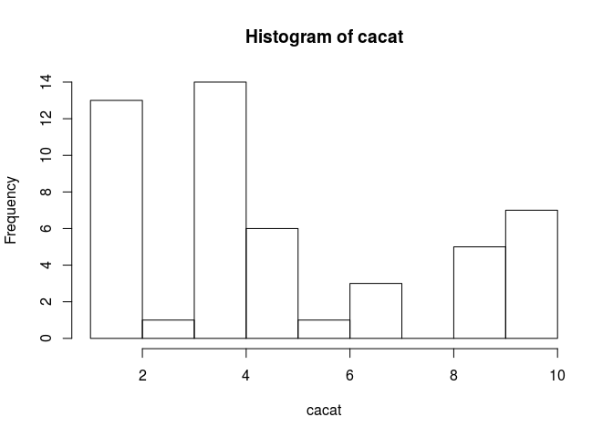
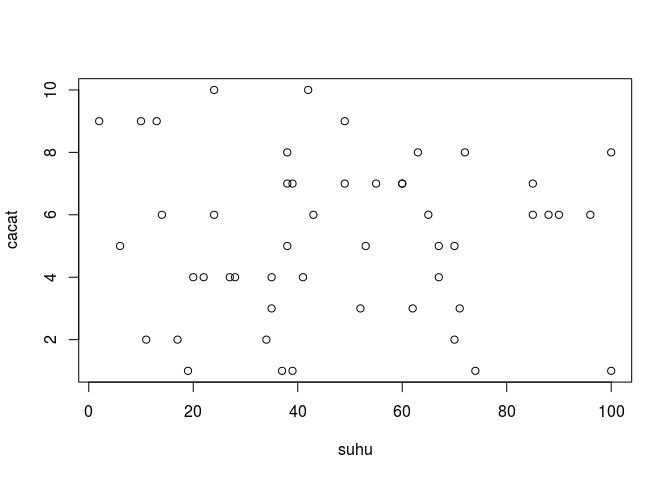

Bahan Training R - GIZ
================

# Selamat datang di R

## *Objects* di R

Ada beberapa *objects* atau struktur data di R, yakni:

1.  Single variabel
2.  Vector atau array
3.  Tibble atau Data frame
4.  List

## Tipe data

Ada beberapa tipe data di data science, yakni:

1.  Character
2.  Numerik
3.  Integer (atau bisa berupa factor)
4.  Logical (TRUE / FALSE)

# Yuk kita mulai materinya

# Selamat datang di R

## Single variabel

``` r
a = 10
b <- 3
a+b
```

    ## [1] 13

``` r
c=a*b^2/100
kalimat='saya suka pergi ke pasar' #jika variabelnya berupa text
kalimat_baru = "i don't like pizza"
```

## Vector atau array

``` r
tes_vector=c(1,3,6,5,4,7)
id=c(1:10) #contoh generating sequence
a=seq(1,10,0.5) #contoh generating sequence by 0.5
sample(c(100:200),5,replace=F) #generating random number
```

    ## [1] 194 130 139 169 153

``` r
kalimat = 'saya biasa pergi ke kantor setiap jam 7 pagi'
pecah.kata=strsplit(kalimat,' ') #pecah kalimat menjadi kata dan mengubahnya menjadi array

# Yang penting di array
length(a)
```

    ## [1] 19

``` r
a[2]
```

    ## [1] 1.5

``` r
summary(a)
```

    ##    Min. 1st Qu.  Median    Mean 3rd Qu.    Max. 
    ##    1.00    3.25    5.50    5.50    7.75   10.00

``` r
# Operasi aritmatika pada array
a+3
```

    ##  [1]  4.0  4.5  5.0  5.5  6.0  6.5  7.0  7.5  8.0  8.5  9.0  9.5 10.0 10.5
    ## [15] 11.0 11.5 12.0 12.5 13.0

``` r
a*6
```

    ##  [1]  6  9 12 15 18 21 24 27 30 33 36 39 42 45 48 51 54 57 60

## Logic atau boolean

``` r
#boolean expression
1==2
```

    ## [1] FALSE

``` r
ifelse(1+2==3,'anda benar','anda salah')
```

    ## [1] "anda benar"

``` r
ifelse(1+2!=3,'anda benar','anda salah')
```

    ## [1] "anda salah"

``` r
ifelse(1+2<=3,'anda benar','anda salah')
```

    ## [1] "anda benar"

``` r
ifelse(1+2>=3,'anda benar','anda salah')
```

    ## [1] "anda benar"

``` r
ifelse(1+2<3,'anda benar','anda salah')
```

    ## [1] "anda salah"

``` r
ifelse(1+2>3,'anda benar','anda salah')
```

    ## [1] "anda salah"

### Another useful function

#### Paste

``` r
nomor=c(1:100)
nama.toko=paste('toko',nomor,sep='_')
nama.toko
```

    ##   [1] "toko_1"   "toko_2"   "toko_3"   "toko_4"   "toko_5"   "toko_6"  
    ##   [7] "toko_7"   "toko_8"   "toko_9"   "toko_10"  "toko_11"  "toko_12" 
    ##  [13] "toko_13"  "toko_14"  "toko_15"  "toko_16"  "toko_17"  "toko_18" 
    ##  [19] "toko_19"  "toko_20"  "toko_21"  "toko_22"  "toko_23"  "toko_24" 
    ##  [25] "toko_25"  "toko_26"  "toko_27"  "toko_28"  "toko_29"  "toko_30" 
    ##  [31] "toko_31"  "toko_32"  "toko_33"  "toko_34"  "toko_35"  "toko_36" 
    ##  [37] "toko_37"  "toko_38"  "toko_39"  "toko_40"  "toko_41"  "toko_42" 
    ##  [43] "toko_43"  "toko_44"  "toko_45"  "toko_46"  "toko_47"  "toko_48" 
    ##  [49] "toko_49"  "toko_50"  "toko_51"  "toko_52"  "toko_53"  "toko_54" 
    ##  [55] "toko_55"  "toko_56"  "toko_57"  "toko_58"  "toko_59"  "toko_60" 
    ##  [61] "toko_61"  "toko_62"  "toko_63"  "toko_64"  "toko_65"  "toko_66" 
    ##  [67] "toko_67"  "toko_68"  "toko_69"  "toko_70"  "toko_71"  "toko_72" 
    ##  [73] "toko_73"  "toko_74"  "toko_75"  "toko_76"  "toko_77"  "toko_78" 
    ##  [79] "toko_79"  "toko_80"  "toko_81"  "toko_82"  "toko_83"  "toko_84" 
    ##  [85] "toko_85"  "toko_86"  "toko_87"  "toko_88"  "toko_89"  "toko_90" 
    ##  [91] "toko_91"  "toko_92"  "toko_93"  "toko_94"  "toko_95"  "toko_96" 
    ##  [97] "toko_97"  "toko_98"  "toko_99"  "toko_100"

#### Print

``` r
nomor=c(1:100)
print(nomor)
```

    ##   [1]   1   2   3   4   5   6   7   8   9  10  11  12  13  14  15  16  17
    ##  [18]  18  19  20  21  22  23  24  25  26  27  28  29  30  31  32  33  34
    ##  [35]  35  36  37  38  39  40  41  42  43  44  45  46  47  48  49  50  51
    ##  [52]  52  53  54  55  56  57  58  59  60  61  62  63  64  65  66  67  68
    ##  [69]  69  70  71  72  73  74  75  76  77  78  79  80  81  82  83  84  85
    ##  [86]  86  87  88  89  90  91  92  93  94  95  96  97  98  99 100

## Tibble atau Data Frame

Struktur data tibble atau data frame sejatinya mirip dengan data
tradisional di **MS. EXCEL**.

### Sebelum masuk ke data frame:

``` r
# Misalkan kita buat dua variabel sbb:
suhu=sample(100,50,replace=T)
cacat=sample(10,50,replace=T)

# Membuat histogram dari suhu
hist(suhu)
```

<!-- -->

``` r
# Membuat histogram dari cacat
hist(cacat)
```

<!-- -->

``` r
# Uji Korelasi
cor.test(suhu,cacat)
```

    ## 
    ##  Pearson's product-moment correlation
    ## 
    ## data:  suhu and cacat
    ## t = -0.11272, df = 48, p-value = 0.9107
    ## alternative hypothesis: true correlation is not equal to 0
    ## 95 percent confidence interval:
    ##  -0.2932875  0.2632721
    ## sample estimates:
    ##         cor 
    ## -0.01626777

``` r
# save into variabel
uji_korelasi = cor.test(suhu,cacat)

uji_korelasi$p.value
```

    ## [1] 0.9107216

``` r
ifelse(uji_korelasi$p.value<0.05,'Signifikan berkorelasi','Tidak signifikan berkorelasi')
```

    ## [1] "Tidak signifikan berkorelasi"

``` r
# Hanya menampilkan angka korelasi saja
cor(suhu,cacat)
```

    ## [1] -0.01626777

``` r
# Simple plot suhu vs cacat
plot(suhu,cacat)
```

<!-- -->

### Membangun data frame dari kumpulan vector

Data frame bisa dibangun dari dua atau lebih vector yang memiliki
`length` sama.

``` r
#membuat data frame
data=data.frame(suhu,cacat)
data
```

    ##    suhu cacat
    ## 1    88     6
    ## 2    55     7
    ## 3    53     5
    ## 4    70     2
    ## 5    17     2
    ## 6     2     9
    ## 7    63     8
    ## 8    62     3
    ## 9    24     6
    ## 10   34     2
    ## 11   60     7
    ## 12   19     1
    ## 13   38     7
    ## 14   22     4
    ## 15   85     7
    ## 16   67     4
    ## 17   49     9
    ## 18   42    10
    ## 19    6     5
    ## 20   24    10
    ## 21   38     8
    ## 22   38     5
    ## 23   39     1
    ## 24   39     7
    ## 25   71     3
    ## 26  100     1
    ## 27   43     6
    ## 28   74     1
    ## 29   28     4
    ## 30   20     4
    ## 31   52     3
    ## 32   27     4
    ## 33   11     2
    ## 34   13     9
    ## 35   85     6
    ## 36   35     3
    ## 37   49     7
    ## 38   37     1
    ## 39   67     5
    ## 40  100     8
    ## 41   90     6
    ## 42   41     4
    ## 43   35     4
    ## 44   60     7
    ## 45   10     9
    ## 46   14     6
    ## 47   65     6
    ## 48   72     8
    ## 49   70     5
    ## 50   96     6

### Another useful function di data frame

Untuk melihat data frame bisa menggunakan fungsi `View(data)`.

``` r
str(data)
```

    ## 'data.frame':    50 obs. of  2 variables:
    ##  $ suhu : int  88 55 53 70 17 2 63 62 24 34 ...
    ##  $ cacat: int  6 7 5 2 2 9 8 3 6 2 ...

``` r
summary(data)
```

    ##       suhu            cacat      
    ##  Min.   :  2.00   Min.   : 1.00  
    ##  1st Qu.: 27.25   1st Qu.: 3.25  
    ##  Median : 42.50   Median : 5.50  
    ##  Mean   : 47.98   Mean   : 5.26  
    ##  3rd Qu.: 67.00   3rd Qu.: 7.00  
    ##  Max.   :100.00   Max.   :10.00

``` r
length(data)
```

    ## [1] 2

``` r
head(data,5) #menampilkan data 5 teratas
```

    ##   suhu cacat
    ## 1   88     6
    ## 2   55     7
    ## 3   53     5
    ## 4   70     2
    ## 5   17     2

``` r
tail(data,5) #menampilkan data 5 terbawah
```

    ##    suhu cacat
    ## 46   14     6
    ## 47   65     6
    ## 48   72     8
    ## 49   70     5
    ## 50   96     6

``` r
data[1]
```

    ##    suhu
    ## 1    88
    ## 2    55
    ## 3    53
    ## 4    70
    ## 5    17
    ## 6     2
    ## 7    63
    ## 8    62
    ## 9    24
    ## 10   34
    ## 11   60
    ## 12   19
    ## 13   38
    ## 14   22
    ## 15   85
    ## 16   67
    ## 17   49
    ## 18   42
    ## 19    6
    ## 20   24
    ## 21   38
    ## 22   38
    ## 23   39
    ## 24   39
    ## 25   71
    ## 26  100
    ## 27   43
    ## 28   74
    ## 29   28
    ## 30   20
    ## 31   52
    ## 32   27
    ## 33   11
    ## 34   13
    ## 35   85
    ## 36   35
    ## 37   49
    ## 38   37
    ## 39   67
    ## 40  100
    ## 41   90
    ## 42   41
    ## 43   35
    ## 44   60
    ## 45   10
    ## 46   14
    ## 47   65
    ## 48   72
    ## 49   70
    ## 50   96

``` r
data[,1]
```

    ##  [1]  88  55  53  70  17   2  63  62  24  34  60  19  38  22  85  67  49
    ## [18]  42   6  24  38  38  39  39  71 100  43  74  28  20  52  27  11  13
    ## [35]  85  35  49  37  67 100  90  41  35  60  10  14  65  72  70  96

``` r
data[2]
```

    ##    cacat
    ## 1      6
    ## 2      7
    ## 3      5
    ## 4      2
    ## 5      2
    ## 6      9
    ## 7      8
    ## 8      3
    ## 9      6
    ## 10     2
    ## 11     7
    ## 12     1
    ## 13     7
    ## 14     4
    ## 15     7
    ## 16     4
    ## 17     9
    ## 18    10
    ## 19     5
    ## 20    10
    ## 21     8
    ## 22     5
    ## 23     1
    ## 24     7
    ## 25     3
    ## 26     1
    ## 27     6
    ## 28     1
    ## 29     4
    ## 30     4
    ## 31     3
    ## 32     4
    ## 33     2
    ## 34     9
    ## 35     6
    ## 36     3
    ## 37     7
    ## 38     1
    ## 39     5
    ## 40     8
    ## 41     6
    ## 42     4
    ## 43     4
    ## 44     7
    ## 45     9
    ## 46     6
    ## 47     6
    ## 48     8
    ## 49     5
    ## 50     6

``` r
data[,2]
```

    ##  [1]  6  7  5  2  2  9  8  3  6  2  7  1  7  4  7  4  9 10  5 10  8  5  1
    ## [24]  7  3  1  6  1  4  4  3  4  2  9  6  3  7  1  5  8  6  4  4  7  9  6
    ## [47]  6  8  5  6

``` r
data[1,1] #melihat data di posisi row,column
```

    ## [1] 88

``` r
data[1,2] #melihat data di posisi row,column
```

    ## [1] 6

``` r
data[1,1]=NA #menghapus data di posisi row,column

# Menambah variabel
# Cara 1
data$hari = paste('hari ke',c(1:50),'dari 50 hari',sep=' ')
head(data,20)
```

    ##    suhu cacat                    hari
    ## 1    NA     6  hari ke 1 dari 50 hari
    ## 2    55     7  hari ke 2 dari 50 hari
    ## 3    53     5  hari ke 3 dari 50 hari
    ## 4    70     2  hari ke 4 dari 50 hari
    ## 5    17     2  hari ke 5 dari 50 hari
    ## 6     2     9  hari ke 6 dari 50 hari
    ## 7    63     8  hari ke 7 dari 50 hari
    ## 8    62     3  hari ke 8 dari 50 hari
    ## 9    24     6  hari ke 9 dari 50 hari
    ## 10   34     2 hari ke 10 dari 50 hari
    ## 11   60     7 hari ke 11 dari 50 hari
    ## 12   19     1 hari ke 12 dari 50 hari
    ## 13   38     7 hari ke 13 dari 50 hari
    ## 14   22     4 hari ke 14 dari 50 hari
    ## 15   85     7 hari ke 15 dari 50 hari
    ## 16   67     4 hari ke 16 dari 50 hari
    ## 17   49     9 hari ke 17 dari 50 hari
    ## 18   42    10 hari ke 18 dari 50 hari
    ## 19    6     5 hari ke 19 dari 50 hari
    ## 20   24    10 hari ke 20 dari 50 hari

``` r
# Cara 2
library(dplyr)
data = data %>% mutate(bulan='Januari')
data$bulan[32:50]='Februari'
```

### Bermain dengan element dan tanda `$`

``` r
data$suhu
```

    ##  [1]  NA  55  53  70  17   2  63  62  24  34  60  19  38  22  85  67  49
    ## [18]  42   6  24  38  38  39  39  71 100  43  74  28  20  52  27  11  13
    ## [35]  85  35  49  37  67 100  90  41  35  60  10  14  65  72  70  96

``` r
data$cacat
```

    ##  [1]  6  7  5  2  2  9  8  3  6  2  7  1  7  4  7  4  9 10  5 10  8  5  1
    ## [24]  7  3  1  6  1  4  4  3  4  2  9  6  3  7  1  5  8  6  4  4  7  9  6
    ## [47]  6  8  5  6

``` r
data.baru=data[-1]
data.baru
```

    ##    cacat                    hari    bulan
    ## 1      6  hari ke 1 dari 50 hari  Januari
    ## 2      7  hari ke 2 dari 50 hari  Januari
    ## 3      5  hari ke 3 dari 50 hari  Januari
    ## 4      2  hari ke 4 dari 50 hari  Januari
    ## 5      2  hari ke 5 dari 50 hari  Januari
    ## 6      9  hari ke 6 dari 50 hari  Januari
    ## 7      8  hari ke 7 dari 50 hari  Januari
    ## 8      3  hari ke 8 dari 50 hari  Januari
    ## 9      6  hari ke 9 dari 50 hari  Januari
    ## 10     2 hari ke 10 dari 50 hari  Januari
    ## 11     7 hari ke 11 dari 50 hari  Januari
    ## 12     1 hari ke 12 dari 50 hari  Januari
    ## 13     7 hari ke 13 dari 50 hari  Januari
    ## 14     4 hari ke 14 dari 50 hari  Januari
    ## 15     7 hari ke 15 dari 50 hari  Januari
    ## 16     4 hari ke 16 dari 50 hari  Januari
    ## 17     9 hari ke 17 dari 50 hari  Januari
    ## 18    10 hari ke 18 dari 50 hari  Januari
    ## 19     5 hari ke 19 dari 50 hari  Januari
    ## 20    10 hari ke 20 dari 50 hari  Januari
    ## 21     8 hari ke 21 dari 50 hari  Januari
    ## 22     5 hari ke 22 dari 50 hari  Januari
    ## 23     1 hari ke 23 dari 50 hari  Januari
    ## 24     7 hari ke 24 dari 50 hari  Januari
    ## 25     3 hari ke 25 dari 50 hari  Januari
    ## 26     1 hari ke 26 dari 50 hari  Januari
    ## 27     6 hari ke 27 dari 50 hari  Januari
    ## 28     1 hari ke 28 dari 50 hari  Januari
    ## 29     4 hari ke 29 dari 50 hari  Januari
    ## 30     4 hari ke 30 dari 50 hari  Januari
    ## 31     3 hari ke 31 dari 50 hari  Januari
    ## 32     4 hari ke 32 dari 50 hari Februari
    ## 33     2 hari ke 33 dari 50 hari Februari
    ## 34     9 hari ke 34 dari 50 hari Februari
    ## 35     6 hari ke 35 dari 50 hari Februari
    ## 36     3 hari ke 36 dari 50 hari Februari
    ## 37     7 hari ke 37 dari 50 hari Februari
    ## 38     1 hari ke 38 dari 50 hari Februari
    ## 39     5 hari ke 39 dari 50 hari Februari
    ## 40     8 hari ke 40 dari 50 hari Februari
    ## 41     6 hari ke 41 dari 50 hari Februari
    ## 42     4 hari ke 42 dari 50 hari Februari
    ## 43     4 hari ke 43 dari 50 hari Februari
    ## 44     7 hari ke 44 dari 50 hari Februari
    ## 45     9 hari ke 45 dari 50 hari Februari
    ## 46     6 hari ke 46 dari 50 hari Februari
    ## 47     6 hari ke 47 dari 50 hari Februari
    ## 48     8 hari ke 48 dari 50 hari Februari
    ## 49     5 hari ke 49 dari 50 hari Februari
    ## 50     6 hari ke 50 dari 50 hari Februari

### Another useful function di data frame (part 2)

``` r
is.na(data) #melihat ada yang kosong
```

    ##        suhu cacat  hari bulan
    ##  [1,]  TRUE FALSE FALSE FALSE
    ##  [2,] FALSE FALSE FALSE FALSE
    ##  [3,] FALSE FALSE FALSE FALSE
    ##  [4,] FALSE FALSE FALSE FALSE
    ##  [5,] FALSE FALSE FALSE FALSE
    ##  [6,] FALSE FALSE FALSE FALSE
    ##  [7,] FALSE FALSE FALSE FALSE
    ##  [8,] FALSE FALSE FALSE FALSE
    ##  [9,] FALSE FALSE FALSE FALSE
    ## [10,] FALSE FALSE FALSE FALSE
    ## [11,] FALSE FALSE FALSE FALSE
    ## [12,] FALSE FALSE FALSE FALSE
    ## [13,] FALSE FALSE FALSE FALSE
    ## [14,] FALSE FALSE FALSE FALSE
    ## [15,] FALSE FALSE FALSE FALSE
    ## [16,] FALSE FALSE FALSE FALSE
    ## [17,] FALSE FALSE FALSE FALSE
    ## [18,] FALSE FALSE FALSE FALSE
    ## [19,] FALSE FALSE FALSE FALSE
    ## [20,] FALSE FALSE FALSE FALSE
    ## [21,] FALSE FALSE FALSE FALSE
    ## [22,] FALSE FALSE FALSE FALSE
    ## [23,] FALSE FALSE FALSE FALSE
    ## [24,] FALSE FALSE FALSE FALSE
    ## [25,] FALSE FALSE FALSE FALSE
    ## [26,] FALSE FALSE FALSE FALSE
    ## [27,] FALSE FALSE FALSE FALSE
    ## [28,] FALSE FALSE FALSE FALSE
    ## [29,] FALSE FALSE FALSE FALSE
    ## [30,] FALSE FALSE FALSE FALSE
    ## [31,] FALSE FALSE FALSE FALSE
    ## [32,] FALSE FALSE FALSE FALSE
    ## [33,] FALSE FALSE FALSE FALSE
    ## [34,] FALSE FALSE FALSE FALSE
    ## [35,] FALSE FALSE FALSE FALSE
    ## [36,] FALSE FALSE FALSE FALSE
    ## [37,] FALSE FALSE FALSE FALSE
    ## [38,] FALSE FALSE FALSE FALSE
    ## [39,] FALSE FALSE FALSE FALSE
    ## [40,] FALSE FALSE FALSE FALSE
    ## [41,] FALSE FALSE FALSE FALSE
    ## [42,] FALSE FALSE FALSE FALSE
    ## [43,] FALSE FALSE FALSE FALSE
    ## [44,] FALSE FALSE FALSE FALSE
    ## [45,] FALSE FALSE FALSE FALSE
    ## [46,] FALSE FALSE FALSE FALSE
    ## [47,] FALSE FALSE FALSE FALSE
    ## [48,] FALSE FALSE FALSE FALSE
    ## [49,] FALSE FALSE FALSE FALSE
    ## [50,] FALSE FALSE FALSE FALSE

``` r
!is.na(data) #melihat pasti terisi
```

    ##        suhu cacat hari bulan
    ##  [1,] FALSE  TRUE TRUE  TRUE
    ##  [2,]  TRUE  TRUE TRUE  TRUE
    ##  [3,]  TRUE  TRUE TRUE  TRUE
    ##  [4,]  TRUE  TRUE TRUE  TRUE
    ##  [5,]  TRUE  TRUE TRUE  TRUE
    ##  [6,]  TRUE  TRUE TRUE  TRUE
    ##  [7,]  TRUE  TRUE TRUE  TRUE
    ##  [8,]  TRUE  TRUE TRUE  TRUE
    ##  [9,]  TRUE  TRUE TRUE  TRUE
    ## [10,]  TRUE  TRUE TRUE  TRUE
    ## [11,]  TRUE  TRUE TRUE  TRUE
    ## [12,]  TRUE  TRUE TRUE  TRUE
    ## [13,]  TRUE  TRUE TRUE  TRUE
    ## [14,]  TRUE  TRUE TRUE  TRUE
    ## [15,]  TRUE  TRUE TRUE  TRUE
    ## [16,]  TRUE  TRUE TRUE  TRUE
    ## [17,]  TRUE  TRUE TRUE  TRUE
    ## [18,]  TRUE  TRUE TRUE  TRUE
    ## [19,]  TRUE  TRUE TRUE  TRUE
    ## [20,]  TRUE  TRUE TRUE  TRUE
    ## [21,]  TRUE  TRUE TRUE  TRUE
    ## [22,]  TRUE  TRUE TRUE  TRUE
    ## [23,]  TRUE  TRUE TRUE  TRUE
    ## [24,]  TRUE  TRUE TRUE  TRUE
    ## [25,]  TRUE  TRUE TRUE  TRUE
    ## [26,]  TRUE  TRUE TRUE  TRUE
    ## [27,]  TRUE  TRUE TRUE  TRUE
    ## [28,]  TRUE  TRUE TRUE  TRUE
    ## [29,]  TRUE  TRUE TRUE  TRUE
    ## [30,]  TRUE  TRUE TRUE  TRUE
    ## [31,]  TRUE  TRUE TRUE  TRUE
    ## [32,]  TRUE  TRUE TRUE  TRUE
    ## [33,]  TRUE  TRUE TRUE  TRUE
    ## [34,]  TRUE  TRUE TRUE  TRUE
    ## [35,]  TRUE  TRUE TRUE  TRUE
    ## [36,]  TRUE  TRUE TRUE  TRUE
    ## [37,]  TRUE  TRUE TRUE  TRUE
    ## [38,]  TRUE  TRUE TRUE  TRUE
    ## [39,]  TRUE  TRUE TRUE  TRUE
    ## [40,]  TRUE  TRUE TRUE  TRUE
    ## [41,]  TRUE  TRUE TRUE  TRUE
    ## [42,]  TRUE  TRUE TRUE  TRUE
    ## [43,]  TRUE  TRUE TRUE  TRUE
    ## [44,]  TRUE  TRUE TRUE  TRUE
    ## [45,]  TRUE  TRUE TRUE  TRUE
    ## [46,]  TRUE  TRUE TRUE  TRUE
    ## [47,]  TRUE  TRUE TRUE  TRUE
    ## [48,]  TRUE  TRUE TRUE  TRUE
    ## [49,]  TRUE  TRUE TRUE  TRUE
    ## [50,]  TRUE  TRUE TRUE  TRUE

``` r
data.baru <- data[complete.cases(data), ] #jika mau menghapus baris2 yang ada NA nya! 

data$suhu=ifelse(data$suhu<50,NA,data$suhu) #menghapus data suhu yang aneh (di bawah 50'C)
cor(data.baru$suhu,data.baru$cacat) #hitung korelasi baru
```

    ## [1] -0.02607325

### Sorting data frame

Seringkali pekerjaan kita di data frame banyak melibatkan *sort* data.
Bagaimana melakukannya di **R**?

#### Cara 1

Menggunakan **base R**.

``` r
#sorting data
sorted.data=data.baru[order(data.baru$suhu),] #descending
sorted.data=data.baru[order(-data.baru$suhu),] #ascending
```

#### Cara 2

Menggunakan `library(tidyverse)` ATAU minimal dengan `library(dplyr)`

``` r
library(tidyverse)
data.baru %>% arrange(suhu)
```

    ##    suhu cacat                    hari    bulan
    ## 1     2     9  hari ke 6 dari 50 hari  Januari
    ## 2     6     5 hari ke 19 dari 50 hari  Januari
    ## 3    10     9 hari ke 45 dari 50 hari Februari
    ## 4    11     2 hari ke 33 dari 50 hari Februari
    ## 5    13     9 hari ke 34 dari 50 hari Februari
    ## 6    14     6 hari ke 46 dari 50 hari Februari
    ## 7    17     2  hari ke 5 dari 50 hari  Januari
    ## 8    19     1 hari ke 12 dari 50 hari  Januari
    ## 9    20     4 hari ke 30 dari 50 hari  Januari
    ## 10   22     4 hari ke 14 dari 50 hari  Januari
    ## 11   24     6  hari ke 9 dari 50 hari  Januari
    ## 12   24    10 hari ke 20 dari 50 hari  Januari
    ## 13   27     4 hari ke 32 dari 50 hari Februari
    ## 14   28     4 hari ke 29 dari 50 hari  Januari
    ## 15   34     2 hari ke 10 dari 50 hari  Januari
    ## 16   35     3 hari ke 36 dari 50 hari Februari
    ## 17   35     4 hari ke 43 dari 50 hari Februari
    ## 18   37     1 hari ke 38 dari 50 hari Februari
    ## 19   38     7 hari ke 13 dari 50 hari  Januari
    ## 20   38     8 hari ke 21 dari 50 hari  Januari
    ## 21   38     5 hari ke 22 dari 50 hari  Januari
    ## 22   39     1 hari ke 23 dari 50 hari  Januari
    ## 23   39     7 hari ke 24 dari 50 hari  Januari
    ## 24   41     4 hari ke 42 dari 50 hari Februari
    ## 25   42    10 hari ke 18 dari 50 hari  Januari
    ## 26   43     6 hari ke 27 dari 50 hari  Januari
    ## 27   49     9 hari ke 17 dari 50 hari  Januari
    ## 28   49     7 hari ke 37 dari 50 hari Februari
    ## 29   52     3 hari ke 31 dari 50 hari  Januari
    ## 30   53     5  hari ke 3 dari 50 hari  Januari
    ## 31   55     7  hari ke 2 dari 50 hari  Januari
    ## 32   60     7 hari ke 11 dari 50 hari  Januari
    ## 33   60     7 hari ke 44 dari 50 hari Februari
    ## 34   62     3  hari ke 8 dari 50 hari  Januari
    ## 35   63     8  hari ke 7 dari 50 hari  Januari
    ## 36   65     6 hari ke 47 dari 50 hari Februari
    ## 37   67     4 hari ke 16 dari 50 hari  Januari
    ## 38   67     5 hari ke 39 dari 50 hari Februari
    ## 39   70     2  hari ke 4 dari 50 hari  Januari
    ## 40   70     5 hari ke 49 dari 50 hari Februari
    ## 41   71     3 hari ke 25 dari 50 hari  Januari
    ## 42   72     8 hari ke 48 dari 50 hari Februari
    ## 43   74     1 hari ke 28 dari 50 hari  Januari
    ## 44   85     7 hari ke 15 dari 50 hari  Januari
    ## 45   85     6 hari ke 35 dari 50 hari Februari
    ## 46   90     6 hari ke 41 dari 50 hari Februari
    ## 47   96     6 hari ke 50 dari 50 hari Februari
    ## 48  100     1 hari ke 26 dari 50 hari  Januari
    ## 49  100     8 hari ke 40 dari 50 hari Februari

``` r
data.baru %>% arrange(desc(cacat))
```

    ##    suhu cacat                    hari    bulan
    ## 1    42    10 hari ke 18 dari 50 hari  Januari
    ## 2    24    10 hari ke 20 dari 50 hari  Januari
    ## 3     2     9  hari ke 6 dari 50 hari  Januari
    ## 4    49     9 hari ke 17 dari 50 hari  Januari
    ## 5    13     9 hari ke 34 dari 50 hari Februari
    ## 6    10     9 hari ke 45 dari 50 hari Februari
    ## 7    63     8  hari ke 7 dari 50 hari  Januari
    ## 8    38     8 hari ke 21 dari 50 hari  Januari
    ## 9   100     8 hari ke 40 dari 50 hari Februari
    ## 10   72     8 hari ke 48 dari 50 hari Februari
    ## 11   55     7  hari ke 2 dari 50 hari  Januari
    ## 12   60     7 hari ke 11 dari 50 hari  Januari
    ## 13   38     7 hari ke 13 dari 50 hari  Januari
    ## 14   85     7 hari ke 15 dari 50 hari  Januari
    ## 15   39     7 hari ke 24 dari 50 hari  Januari
    ## 16   49     7 hari ke 37 dari 50 hari Februari
    ## 17   60     7 hari ke 44 dari 50 hari Februari
    ## 18   24     6  hari ke 9 dari 50 hari  Januari
    ## 19   43     6 hari ke 27 dari 50 hari  Januari
    ## 20   85     6 hari ke 35 dari 50 hari Februari
    ## 21   90     6 hari ke 41 dari 50 hari Februari
    ## 22   14     6 hari ke 46 dari 50 hari Februari
    ## 23   65     6 hari ke 47 dari 50 hari Februari
    ## 24   96     6 hari ke 50 dari 50 hari Februari
    ## 25   53     5  hari ke 3 dari 50 hari  Januari
    ## 26    6     5 hari ke 19 dari 50 hari  Januari
    ## 27   38     5 hari ke 22 dari 50 hari  Januari
    ## 28   67     5 hari ke 39 dari 50 hari Februari
    ## 29   70     5 hari ke 49 dari 50 hari Februari
    ## 30   22     4 hari ke 14 dari 50 hari  Januari
    ## 31   67     4 hari ke 16 dari 50 hari  Januari
    ## 32   28     4 hari ke 29 dari 50 hari  Januari
    ## 33   20     4 hari ke 30 dari 50 hari  Januari
    ## 34   27     4 hari ke 32 dari 50 hari Februari
    ## 35   41     4 hari ke 42 dari 50 hari Februari
    ## 36   35     4 hari ke 43 dari 50 hari Februari
    ## 37   62     3  hari ke 8 dari 50 hari  Januari
    ## 38   71     3 hari ke 25 dari 50 hari  Januari
    ## 39   52     3 hari ke 31 dari 50 hari  Januari
    ## 40   35     3 hari ke 36 dari 50 hari Februari
    ## 41   70     2  hari ke 4 dari 50 hari  Januari
    ## 42   17     2  hari ke 5 dari 50 hari  Januari
    ## 43   34     2 hari ke 10 dari 50 hari  Januari
    ## 44   11     2 hari ke 33 dari 50 hari Februari
    ## 45   19     1 hari ke 12 dari 50 hari  Januari
    ## 46   39     1 hari ke 23 dari 50 hari  Januari
    ## 47  100     1 hari ke 26 dari 50 hari  Januari
    ## 48   74     1 hari ke 28 dari 50 hari  Januari
    ## 49   37     1 hari ke 38 dari 50 hari Februari

### Menghapus global environment

``` r
rm(cacat) #hanya menghapus variabel cacat
rm(list=ls()) #digunakan untuk membersihkan global data environment
```

### Set working directory

`setwd('/cloud/project/Materi Training/GIZ')`

### Get working directory

`getwd()`

# Kita mulai bagian serunya yah\!\!\!

## Membuat model *price elasticity*

Secara logika, semakin tinggi harga suatu barang, semakin sedikit orang
yang akan membelinya. Secara simpel kita bisa bilang bahwa `harga`
berkorelasi negatif dengan sales `qty`. Tapi untuk mengatakan ada
kausalitas antara `harga`dan sales `qty`, kita harus cek dulu model
regresinya.

Selain itu, kita ingin menghitung suatu nilai *fixed* (kita sebut saja
suatu *price elasticity index*). Dimana jika `harga` naik sebesar **a
%** maka sales `qty` akan turun sebesar **index %**\_.

Contoh yah, misalkan saya punya data jualan harian suatu barang beserta
harganya di suatu minimarket sebagai berikut:

``` r
library(dplyr)
data = read.csv('/cloud/project/Materi Training/GIZ/latihan regresi.csv') %>% 
  mutate(X = NULL)
str(data)
```

    ## 'data.frame':    60 obs. of  3 variables:
    ##  $ id   : int  1 4 5 6 9 15 19 27 30 32 ...
    ##  $ harga: num  18.4 17.3 21 19 15.8 17.5 17.7 15.3 17.1 21.1 ...
    ##  $ qty  : num  9.05 9.5 6.16 8.64 8.91 ...

``` r
summary(data)
```

    ##        id             harga            qty        
    ##  Min.   :  1.00   Min.   :15.00   Min.   : 5.632  
    ##  1st Qu.: 40.50   1st Qu.:16.88   1st Qu.: 7.277  
    ##  Median : 74.50   Median :18.85   Median : 8.159  
    ##  Mean   : 77.12   Mean   :18.76   Mean   : 8.013  
    ##  3rd Qu.:118.75   3rd Qu.:20.55   3rd Qu.: 8.804  
    ##  Max.   :148.00   Max.   :22.00   Max.   :10.626

``` r
head(data,10)
```

    ##    id harga     qty
    ## 1   1  18.4  9.0534
    ## 2   4  17.3  9.4958
    ## 3   5  21.0  6.1620
    ## 4   6  19.0  8.6400
    ## 5   9  15.8  8.9076
    ## 6  15  17.5  8.0800
    ## 7  19  17.7  8.3040
    ## 8  27  15.3 10.1024
    ## 9  30  17.1  9.2708
    ## 10 32  21.1  6.3516

Berapa sih nilai kodelasi antara `harga` dan `qty`?

``` r
korel = cor(data$harga,data$qty)
korel
```

    ## [1] -0.8323464

Ternyata angka korelasinya kuat negatif. Artinya, jika kita membuat
model regresi linear dari kedua data ini, maka akan didapat
**R-Squared** sebesar kuadrat nilai korelasinya. *Nah*, sekarang kita
coba buat model regresinya *yuk*.

``` r
model_reg = lm(qty~harga,data = data)
summary(model_reg)
```

    ## 
    ## Call:
    ## lm(formula = qty ~ harga, data = data)
    ## 
    ## Residuals:
    ##     Min      1Q  Median      3Q     Max 
    ## -1.1620 -0.5572  0.1328  0.5908  0.9959 
    ## 
    ## Coefficients:
    ##             Estimate Std. Error t value Pr(>|t|)    
    ## (Intercept)  17.1082     0.7998   21.39   <2e-16 ***
    ## harga        -0.4849     0.0424  -11.44   <2e-16 ***
    ## ---
    ## Signif. codes:  0 '***' 0.001 '**' 0.01 '*' 0.05 '.' 0.1 ' ' 1
    ## 
    ## Residual standard error: 0.6545 on 58 degrees of freedom
    ## Multiple R-squared:  0.6928, Adjusted R-squared:  0.6875 
    ## F-statistic: 130.8 on 1 and 58 DF,  p-value: < 2.2e-16

## Evaluasi model

Sekarang kita lihat *goodness of fit* dari model regresi di atas. Untuk
mengevaluasi apakah suatu model regresi baik, kita bisa lihat dari
beberapa hal seperti:

1.  **R-squared**
2.  **P-value**
3.  MAE ( *mean absolut error* )
4.  Lainnya

### R squared

Nilainya bisa diambil dari nilai **multiple R-squared** pada model atau
bisa juga dihitung menggunakan:

``` r
r_squared = modelr::rsquare(model_reg,data)
r_squared
```

    ## [1] 0.6928005

Mari kita cek apakah nilai **R-Squared** sama dengan korelasi yang
dikuadratkan yah. Ini sengaja saya *round* biar memudahkan yah.

``` r
round(r_squared,5) == round(korel^2,5)
```

    ## [1] TRUE

**R-squared** bisa diartikan sebagai berapa persen variabel X meng-
*explain* variabel Y.

### P-value

Nilai **P-value** didapatkan dari `summary(model_reg)`, yakni mendekati
nol (sangat kecil). Oleh karena `p-value < 0.05` bisa diambil kesimpulan
bahwa model `harga` berpengaruh terhadap sales `qty`.

### MAE

*Mean absolut error* dapat diartikan sebagai rata-rata nilai mutlak
*error* yang dapat kita terima. Tidak ada angka pasti harus berapa, tapi
semakin kecil *error*, berarti semakin baik model kita.

Menurut pengetahuan saya, **MAE** digunakan jika kita memiliki lebih
dari satu model regresi yang ingin dibandingkan mana yang terbaik.

``` r
mean_absolut_error = modelr::mae(model_reg,data) 
mean_absolut_error
```

    ## [1] 0.563642

### Kesimpulan

Berhubung dari **P-value** dan **R-squared** menghasilkan nilai yang
baik, dapat disimpulkan bahwa `harga` mempengaruhi dan mengakibatkan
perubahan pada sales `qty` secara negatif.

### Cara lain

Sebenarnya ada cara lain untuk melakukan analisa regresi linear
menggunakan **R**, yakni dengan memanfaatkan *library* `ggplot2` dan
`ggpubr`.

``` r
library(ggplot2)
library(ggpubr)
```

    ## Loading required package: magrittr

    ## 
    ## Attaching package: 'magrittr'

    ## The following object is masked from 'package:purrr':
    ## 
    ##     set_names

    ## The following object is masked from 'package:tidyr':
    ## 
    ##     extract

``` r
data %>% ggplot(aes(x=harga,y=qty)) + 
  geom_point() + 
  geom_smooth(method='lm') +
  theme_pubclean() + 
  stat_regline_equation(label.y = 7,aes(label =  paste(..eq.label.., ..rr.label.., sep = "~~~~"))) +
  labs(title = 'Model Regresi: Price Elasticity Index',
                          subtitle = 'Data harga vs sales qty',
                          caption = 'Created using R',
                          x = 'Harga produk (dalam ribu rupiah)',
                          y = 'Sales Qty') +
  theme(axis.text = element_blank(),
        axis.ticks = element_blank(),
        plot.title = element_text(size=25,face='bold.italic'),
        plot.caption = element_text(size=10,face='italic'))
```

<!-- -->

## Optimization dari model regresi

Kita telah mendapatkan model regresi linear yang baik. Kita juga sudah
menghitung *price elasticty index*. Pertanyaan selanjutnya adalah:
*Apakah kita bisa menghitung harga terbaik untuk produk tersebut?*

Mari kita definisikan terlebih dahulu, apa itu harga terbaik? Harga
terbaik adalah harga yang membuat kita mendapatkan omset paling
maksimal.

Bagaimana menghitung omset?

Omset didefinisikan sebagai: `omset = harga*qty`

Coba kita ingat kembali, kita telah memiliki formula regresi:
`qty=m*harga + c`

Jika kita substitusi persamaan `qty` ke persamaan `omset`, maka kita
akan dapatkan:

`omset = harga*(m*harga + c)`

`omset = m*harga^2 + c*harga`

Berhubung nilai `m` adalah negatif, maka saya bisa tuliskan persamaan
finalnya menjadi:

`omset = -m*harga^2 + c*harga`

*Oke*, mari kita ingat kuliah kalkulus I dulu. Jika kita punya persamaan
kuadrat dengan konstanta depan negatif, apa artinya?

### Inget Kalkulus I\!

Sebagai *reminder*, coba yah kalau saya buat grafik dari persamaan `y =
x^2` seperti di bawah ini:

``` r
x = c(-10:10)
y = x^2
contoh = data.frame(x,y)
contoh %>% ggplot(aes(x,y)) + geom_line()
```

<!-- -->

Jika kita punya persamaan kuadrat positif semacam ini, akan selalu ada
nilai `x` yang memberikan `y` minimum.

Sekarang jika saya memiliki persamaan kuadrat `y = - x^2`, bentuk
grafiknya sebagai berikut:

``` r
x = c(-10:10)
y = -x^2
contoh = data.frame(x,y)
contoh %>% ggplot(aes(x,y)) + geom_line()
```

<!-- -->

Jadi, jika kita memiliki persamaan kuadrat dengan konstanta negatif,
maka akan selalu ada nilai `x` yang memberikan `y` maksimum\!

### Balik lagi ke regresi kita

Nah, berhubung kita punya formula regresi berupa persamaan kuadrat, maka
dipastikan akan selalu ada `harga` yang memberikan `omset` maksimum.

Sekarang mari kita lakukan simulasi untuk mendapatkan `harga` paling
optimal.

``` r
harga_baru = seq(5,50,.5)
data_simulasi = data.frame(harga = harga_baru)
qty_baru = predict(model_reg,
                   newdata = data_simulasi)
omset = harga_baru * qty_baru
hasil = data.frame(omset,harga_baru,qty_baru)
hasil %>% 
  ggplot(aes(x=harga_baru,y=omset)) +
  geom_line()
```

<!-- -->

Secara grafis dapat dilihat bahwa sebenarnya ada satu titik `harga_baru`
yang memberikan `omset` paling tinggi. Yakni pada harga:

``` r
hasil %>% 
  filter(omset == max(omset)) %>%
  select(harga_baru)
```

    ##   harga_baru
    ## 1       17.5

*So*, harga optimal sudah kita dapatkan.

*Any question?*
