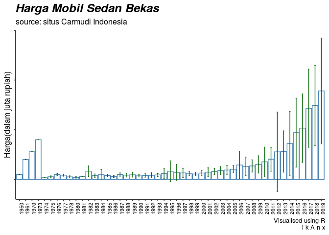

Data Carpentry: Bebersih Data Carmudi
================

# Pendahuluan

Salah satu keunggulan **R** dibandingkan dengan *analytics tools*
lainnya adalah kemampuannya untuk memanipulasi data. **Manipulasi**
dalam artian positif, yakni *preprocessing data* atau *data carpentry*.

Di dunia ini, tanpa kita sadari data tersebar sangat banyak. Namun tidak
semuanya berbentuk *structured data*. Sebagian besar sebenarnya masuk ke
dalam *unstructured data* atau *semi structured data*.

Sekarang kita akan mencoba untuk mengolah *unstructured data* menjadi
informasi atau *insight*.

# *Libraries* yang Digunakan

Berikut adalah beberapa *libraries* yang digunakan dalam *training* kali
ini:

1.  `rvest`: *web scraping*.
2.  `dplyr`: *data carpentry*.
3.  `tidytext`: *text data carpentry*.
4.  `tidyr`: *data carpentry* (*advance*).
5.  `ggplot2`: visualisasi data.

<!-- end list -->

``` r
library(dplyr)
library(rvest)
library(tidytext)
library(tidyr)
library(ggplot2)
```

# Data yang Digunakan

Kita akan *scrap* data situs
[carmudi](https://www.carmudi.co.id/cars/saloon/condition:all/) tentang
*listing* mobil sedan bekas.

Kalau kita lihat situsnya, ada 71 *pages*. Kita akan *scrap* semua
informasinya.

## Langkah pertama

Kita akan *define* semua *urls* dari carmudi lalu kita buat fungsi *web
scrap*-nya.

``` r
#link dari carmudi
url = paste('https://www.carmudi.co.id/cars/saloon/condition:all/?page=',
            c(1:71),
            sep='')

#Bikin fungsi scrap carmudi
scrap = function(url){
  data = 
    read_html(url) %>% {
      tibble(
        nama = html_nodes(.,'.title-blue') %>% html_text(),
        harga = html_nodes(.,'.price a') %>% html_text(),
        lokasi = html_nodes(.,'.catalog-listing-item-location span') %>%
          html_text()
      )
    }
  return(data)
}
```

## Langkah kedua

Saya *scrap* datanya dari *link* pertama hingga selesai. Saya masih
senang menggunakan *looping* dibandingkan menggunakan fungsi `lapply()`.
Sepertinya lebih *firm* saja menurut saya.

``` r
#kita mulai scrap datanya
i = 1
sedan.data = scrap(url[i])

for(i in 2:length(url)){
  temp = scrap(url[i])
  sedan.data = rbind(sedan.data,temp)
}
str(sedan.data)
```

    ## Classes 'tbl_df', 'tbl' and 'data.frame':    2104 obs. of  3 variables:
    ##  $ nama  : chr  "\n2000 Toyota Corolla SE.G " "\n2013 Mercedes-Benz E300 AMG " "\n2016 Honda City Ivtec " "\n2014 Honda Civic 1.8 Ivtec " ...
    ##  $ harga : chr  "60 Juta" "430 Juta" "195 Juta" "185 Juta" ...
    ##  $ lokasi: chr  "\nKabupaten Sidoarjo " "\nJakarta Utara " "\nKota Jakarta Selatan " "\nKota Jakarta Selatan " ...

``` r
head(sedan.data,15)
```

    ## # A tibble: 15 x 3
    ##    nama                                      harga    lokasi               
    ##    <chr>                                     <chr>    <chr>                
    ##  1 "\n2000 Toyota Corolla SE.G "             60 Juta  "\nKabupaten Sidoarj…
    ##  2 "\n2013 Mercedes-Benz E300 AMG "          430 Juta "\nJakarta Utara "   
    ##  3 "\n2016 Honda City Ivtec "                195 Juta "\nKota Jakarta Sela…
    ##  4 "\n2014 Honda Civic 1.8 Ivtec "           185 Juta "\nKota Jakarta Sela…
    ##  5 "\n2011 Toyota Camry V 2.4 Matic "        150 Juta "\nJakarta Timur "   
    ##  6 "\n2008 Suzuki Baleno Matic "             100 Juta "\nMalang "          
    ##  7 "\n2008 Toyota Corolla Altis 1.8 VVTI Al… 92.5 Ju… "\nDKI Jakarta "     
    ##  8 "\n2010 Honda Accord 2.4 VTIL "           129 Juta "\nJakarta Barat "   
    ##  9 "\n2014 Toyota Camry 2.5 V AT "           189 Juta "\nJakarta Barat "   
    ## 10 "\n2014 Toyota Vios G Allnew A/T "        129 Juta "\nDKI Jakarta "     
    ## 11 "\n2016 BMW 320i Sport LCi Black On Blac… 565 Juta "\nJakarta Selatan " 
    ## 12 "\n2017 Mercedes-Benz E250 Avantgarde Re… 975 Juta "\nJakarta Selatan " 
    ## 13 "\n2018 Mercedes-Benz E200 Avantgarde Ni… 975 Juta "\nJakarta Selatan " 
    ## 14 "\n2018 BMW 520i Luxury Reg.2019 Black O… 895 Juta "\nJakarta Selatan " 
    ## 15 "\n2007 Honda Civic "                     110 Juta "\nJakarta Utara "

## Hasil scrap data

Didapatkan ada `2104` baris data mobil sedan bekas yang di- *listing* di
**carmudi**.

Kalau kita lihat sekilas, data tersebut seolah-olah *structured*. Namun
kalau diperhatikan secara seksama, sebenarnya data tersebut
*semi-structured*. Variabel `harga` berupa *character* karena tulisan
juta. Sedangkan variabel `nama` masih campur aduk adanya tahun produksi
dan varian mobil.

*So*, kita memiliki dua masalah, yakni:

1.  Bagaimana mengubah `harga` menjadi numerik agar bisa dianalisa?
2.  Bagaimana mengekstrak `tahun` dari variabel `nama`.
3.  Mungkinkah bagi kita menganalisa per `brand`?

## Proses Data *Carpentry*

### Membereskan variabel `harga`

Kita mulai dari membereskan variabel yang paling gampang, yakni
`harga`.

``` r
sedan.data = sedan.data %>% separate(harga,into=c('angka','unit'),sep=' ')

unique(sedan.data$unit)
```

    ## [1] "Juta"   "Milyar"

``` r
sedan.data = 
sedan.data %>% mutate(angka = as.numeric(angka),
                      unit = ifelse(unit == 'Juta',1000000,1000000000),
                      unit = as.numeric(unit),
                      harga = angka*unit,
                      angka = NULL,
                      unit = NULL)

head(sedan.data,15)
```

    ## # A tibble: 15 x 3
    ##    nama                                      lokasi                   harga
    ##    <chr>                                     <chr>                    <dbl>
    ##  1 "\n2000 Toyota Corolla SE.G "             "\nKabupaten Sidoarj…   6.00e7
    ##  2 "\n2013 Mercedes-Benz E300 AMG "          "\nJakarta Utara "      4.30e8
    ##  3 "\n2016 Honda City Ivtec "                "\nKota Jakarta Sela…   1.95e8
    ##  4 "\n2014 Honda Civic 1.8 Ivtec "           "\nKota Jakarta Sela…   1.85e8
    ##  5 "\n2011 Toyota Camry V 2.4 Matic "        "\nJakarta Timur "      1.50e8
    ##  6 "\n2008 Suzuki Baleno Matic "             "\nMalang "             1.00e8
    ##  7 "\n2008 Toyota Corolla Altis 1.8 VVTI Al… "\nDKI Jakarta "        9.25e7
    ##  8 "\n2010 Honda Accord 2.4 VTIL "           "\nJakarta Barat "      1.29e8
    ##  9 "\n2014 Toyota Camry 2.5 V AT "           "\nJakarta Barat "      1.89e8
    ## 10 "\n2014 Toyota Vios G Allnew A/T "        "\nDKI Jakarta "        1.29e8
    ## 11 "\n2016 BMW 320i Sport LCi Black On Blac… "\nJakarta Selatan "    5.65e8
    ## 12 "\n2017 Mercedes-Benz E250 Avantgarde Re… "\nJakarta Selatan "    9.75e8
    ## 13 "\n2018 Mercedes-Benz E200 Avantgarde Ni… "\nJakarta Selatan "    9.75e8
    ## 14 "\n2018 BMW 520i Luxury Reg.2019 Black O… "\nJakarta Selatan "    8.95e8
    ## 15 "\n2007 Honda Civic "                     "\nJakarta Utara "      1.10e8

*Done\!\!\!* Selesai.

### Membereskan variabel `nama` dan mengekstrak `tahun`

Oke, sekarang kita akan membereskan variabel `nama`. Sebelum
melakukannya, saya akan menghapuskan tanda `\n` dan menambahkan variabel
`id` untuk memudahkan proses ekstrak `tahun` nantinya.

``` r
sedan.data = 
  sedan.data %>% 
  mutate(nama = gsub('\\\n','',nama),
         id = c(1:length(nama))) 
head(sedan.data,15)
```

    ## # A tibble: 15 x 4
    ##    nama                                 lokasi                  harga    id
    ##    <chr>                                <chr>                   <dbl> <int>
    ##  1 "2000 Toyota Corolla SE.G "          "\nKabupaten Sidoar…   6.00e7     1
    ##  2 "2013 Mercedes-Benz E300 AMG "       "\nJakarta Utara "     4.30e8     2
    ##  3 "2016 Honda City Ivtec "             "\nKota Jakarta Sel…   1.95e8     3
    ##  4 "2014 Honda Civic 1.8 Ivtec "        "\nKota Jakarta Sel…   1.85e8     4
    ##  5 "2011 Toyota Camry V 2.4 Matic "     "\nJakarta Timur "     1.50e8     5
    ##  6 "2008 Suzuki Baleno Matic "          "\nMalang "            1.00e8     6
    ##  7 "2008 Toyota Corolla Altis 1.8 VVTI… "\nDKI Jakarta "       9.25e7     7
    ##  8 "2010 Honda Accord 2.4 VTIL "        "\nJakarta Barat "     1.29e8     8
    ##  9 "2014 Toyota Camry 2.5 V AT "        "\nJakarta Barat "     1.89e8     9
    ## 10 "2014 Toyota Vios G Allnew A/T "     "\nDKI Jakarta "       1.29e8    10
    ## 11 "2016 BMW 320i Sport LCi Black On B… "\nJakarta Selatan "   5.65e8    11
    ## 12 "2017 Mercedes-Benz E250 Avantgarde… "\nJakarta Selatan "   9.75e8    12
    ## 13 "2018 Mercedes-Benz E200 Avantgarde… "\nJakarta Selatan "   9.75e8    13
    ## 14 "2018 BMW 520i Luxury Reg.2019 Blac… "\nJakarta Selatan "   8.95e8    14
    ## 15 "2007 Honda Civic "                  "\nJakarta Utara "     1.10e8    15

Nah, sekarang untuk mengekstrak `tahun` saya akan gunakan metode yang
sama untuk membuat *word cloud* atau *word counting*. Pandang variabel
`nama` sebagai satu kalimat utuh yang kemudian akan dipisah-pisah per
kata. Setiap angka yang muncul akan kita jadikan variabel `tahun`.

``` r
new = 
  sedan.data %>% select(id,nama) %>%
  unnest_tokens('words',nama) %>% 
  mutate(words = as.numeric(words)) %>%
  filter(!is.na(words),words>1900,words<2021)
```

    ## Warning: NAs introduced by coercion

``` r
sedan.data = merge(sedan.data,new)
colnames(sedan.data)[5] = 'tahun'
head(sedan.data,15)
```

    ##    id                                         nama                  lokasi
    ## 1   1                    2000 Toyota Corolla SE.G    \nKabupaten Sidoarjo 
    ## 2   2                 2013 Mercedes-Benz E300 AMG         \nJakarta Utara 
    ## 3   3                       2016 Honda City Ivtec  \nKota Jakarta Selatan 
    ## 4   4                  2014 Honda Civic 1.8 Ivtec  \nKota Jakarta Selatan 
    ## 5   5               2011 Toyota Camry V 2.4 Matic         \nJakarta Timur 
    ## 6   6                    2008 Suzuki Baleno Matic                \nMalang 
    ## 7   7  2008 Toyota Corolla Altis 1.8 VVTI Alln...           \nDKI Jakarta 
    ## 8   8                  2010 Honda Accord 2.4 VTIL         \nJakarta Barat 
    ## 9   9                  2014 Toyota Camry 2.5 V AT         \nJakarta Barat 
    ## 10 10               2014 Toyota Vios G Allnew A/T           \nDKI Jakarta 
    ## 11 11 2016 BMW 320i Sport LCi Black On Black A...       \nJakarta Selatan 
    ## 12 12 2017 Mercedes-Benz E250 Avantgarde Reg.2...       \nJakarta Selatan 
    ## 13 13 2018 Mercedes-Benz E200 Avantgarde Nik20...       \nJakarta Selatan 
    ## 14 14 2018 BMW 520i Luxury Reg.2019 Black On B...       \nJakarta Selatan 
    ## 15 14 2018 BMW 520i Luxury Reg.2019 Black On B...       \nJakarta Selatan 
    ##       harga tahun
    ## 1  6.00e+07  2000
    ## 2  4.30e+08  2013
    ## 3  1.95e+08  2016
    ## 4  1.85e+08  2014
    ## 5  1.50e+08  2011
    ## 6  1.00e+08  2008
    ## 7  9.25e+07  2008
    ## 8  1.29e+08  2010
    ## 9  1.89e+08  2014
    ## 10 1.29e+08  2014
    ## 11 5.65e+08  2016
    ## 12 9.75e+08  2017
    ## 13 9.75e+08  2018
    ## 14 8.95e+08  2018
    ## 15 8.95e+08  2019

*Done\!\!\!* Selesai.

# *Error Bar* Plot untuk harga mobil

*Nah*, saya sudah mendapatkan data yang saya butuhkan. Sekarang saya
akan membuat *error bar*.

<!-- -->
