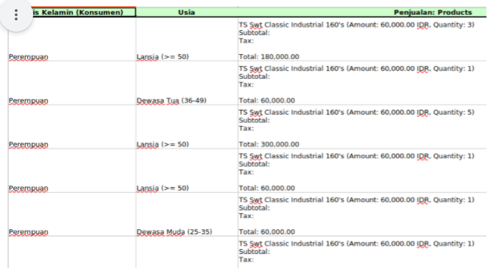

```{r setup, include=FALSE}
knitr::opts_chunk$set(echo = TRUE)
setwd("~/belajaR/Materi Training/Titip Post Test Digital")
```

# Pertanyaan 1:

Salah satu cara modern untuk mendapatkan data adalah... kecuali:

- Mengambil data transaksi e-commerce
- Melakukan survey online
- Mengambil rekaman cctv
- __Melakukan observasi pengunjung toko secara langsung__

# Pertanyaan 2:

BENAR atau SALAH: Prediksi berarti meramal sesuatu dengan menggunakan data dari kondisi. Sedangkan forecast berarti meramal sesuatu menggunakan data historis.

- __BENAR__
- SALAH

# Pertanyaan 3:

Berikut ini adalah contoh unstructured data, kecuali...

- Komentar netizen di halaman Facebook
- Review pembeli di halaman Tokopedia
- __Rating tingkat kesukaan konsumen terhadap produk__
- Notulen focus group discussion

# Pertanyaan 4:

Berikut adalah hal yang dilakukan pada saat mempersiapkan data mentah agar bisa dianalisa, kecuali...

- Mengecek konsistensi data
- Menghapus nilai pencilan
- Mengisi data kosong dengan mean, median, atau modus
- __Menghitung berapa banyak variabel yang ada__

# Pertanyaan 5:

Apa masalah yang timbul terkait data akibat dari digitalisasi? kecuali...

- Bagaimana cara mengambil data
- __Bagaimana membuat report dengan cepat__
- Tidak semua data yang ada bersih
- Bagaimana mengekstrak insight dari data

# Pertanyaan 6:

BENAR atau SALAH: Data dalam tabel Excel berikut ini adalah salah satu contoh structured data.

```{r out.width = "90%",echo=FALSE}

```

- BENAR
- __SALAH__

# Pertanyaan 7:

BENAR atau SALAH: Jika kita memiliki structured data, maka kita tidak perlu melakukan proses pre-processing dan cleaning data. Data tersebut bisa langsung kita analisa.

- BENAR
- __SALAH__

# Pertanyaan 8:

Machine Learning atau Artificial Intelligence akan sangat mudah untuk mengambil alih pekerjaan yang bersifat:

- __Repetitif dan well-defined__
- Mengawinkan berbagai macam data source
- Membutuhkan pertimbangan business owner

# Pertanyaan 9:

BENAR atau SALAH: Proses menganalisa dan mengekstrak informasi membutuhkan tools dan knowledge yang tepat.

- __BENAR__
- SALAH

# Pertanyaan 10:

Salah satu manfaat data dalam digitalisasi adalah... kecuali:

- Memberikan insight dan call to action terhadap bisnis
- __Membuat proses kerja menjadi lebih simpel dan akurat__
- Menentukan improvement yang dilakukan sudah tepat atau tidak