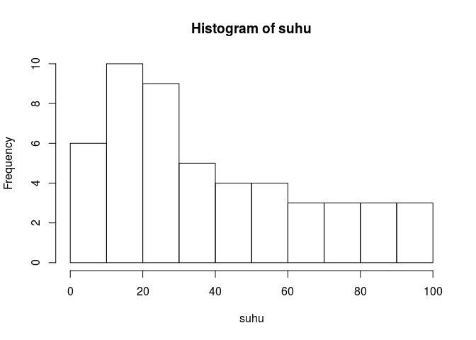
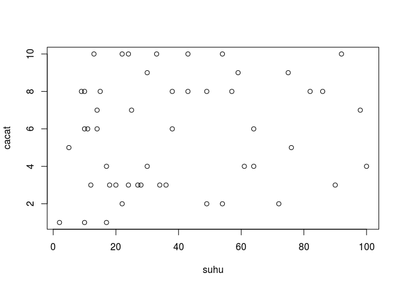

Replikasi Training GIZ di @nutrifood part 1
================

Ceritanya beberapa waktu silam, @nutrifood mendapatkan *training data
analytics* menggunakan **Python** dari GIZ. Sebagai tindak lanjutnya,
peserta training dari @nutrifood yang berjumlah lima orang (termasuk
saya) wajib untuk mereplikasi training tersebut kepada karyawan lainnya.

Oleh karena beberapa hal, materi yang akan kami berikan kepada *trainee*
selanjutnya akan dimodifikasi menjadi *training* **R**. Materi yang
disampaikanpun kami modifikasi menjadi sebagai berikut:

1.  Intro to R
2.  Korelasi
3.  Regresi (*extracting insight*)
4.  Optimasi (*take action from insight*)

*notes:*

Tgkyu **@lenny.wibisana** untuk tambahan materi dan data untuk latihan
regresinya.

*Alhamdulillah*, pihak GIZ bisa memaklumi dan menerima usulan materi
*training* yang akan kami lakukan 6 Desember 2019 nanti.

Karena materinya cukup padat dan harus disampaikan dalam waktu satu hari
kerja saja, maka materinya akan dibuat *express*.

Sebagai gambaran, berikut adalah materi yang akan disampaikan:

# Intro to R (Express Version)

## Berkenalan dengan berbagai macam tipe data

Tidak hanya di **R**, sejatinya kita mengenal beberapa tipe data, yakni:

1.  Character
2.  Numerik
3.  Boolean (logic)

Perlu diperhatikan bahwa secara hierarki tipe data memiliki urutan
sebagai berikut:

Character \>\> Numerik \>\> Boolean

## Berkenalan dengan berbagai tipe object di R

### Ada yang berupa single variable

``` r
#define variabel
a=7
b<-3
a+b
```

    ## [1] 10

``` r
c=a+b
kalimat='saya suka pergi ke pasar' #jika variabelnya berupa text
```

### Ada yang berupa array atau vector

``` r
#define array atau vector
tes_vector=c(1,3,6,5,4,7)
a=c(1:10) #contoh generating sequence
a=seq(1,10,0.5) #contoh generating sequence by 0.5
sample(100,5,replace=F) #generating random number
```

    ## [1]  6 16 70 98 21

``` r
kalimat = 'saya biasa pergi ke kantor setiap jam 7 pagi'
pecah.kata=strsplit(kalimat,' ') #pecah kalimat menjadi kata dan mengubahnya menjadi array
```

### Beberapa fungsi yang penting di array

``` r
length(a)
```

    ## [1] 19

``` r
a[2]
```

    ## [1] 1.5

``` r
summary(a)
```

    ##    Min. 1st Qu.  Median    Mean 3rd Qu.    Max. 
    ##    1.00    3.25    5.50    5.50    7.75   10.00

### Array juga bisa diberikan atau dilakukan operasi aritmatika

``` r
a+3
```

    ##  [1]  4.0  4.5  5.0  5.5  6.0  6.5  7.0  7.5  8.0  8.5  9.0  9.5 10.0 10.5
    ## [15] 11.0 11.5 12.0 12.5 13.0

``` r
a*6
```

    ##  [1]  6  9 12 15 18 21 24 27 30 33 36 39 42 45 48 51 54 57 60

### Boolean expression atau logical operator

``` r
#TRUE or FALSE
1==2
```

    ## [1] FALSE

``` r
ifelse(1+2==3,'anda benar','anda salah')
```

    ## [1] "anda benar"

``` r
ifelse(1+2!=3,'anda benar','anda salah')
```

    ## [1] "anda salah"

``` r
ifelse(1+2<=3,'anda benar','anda salah')
```

    ## [1] "anda benar"

``` r
ifelse(1+2>=3,'anda benar','anda salah')
```

    ## [1] "anda benar"

``` r
ifelse(1+2<3,'anda benar','anda salah')
```

    ## [1] "anda salah"

``` r
ifelse(1+2>3,'anda benar','anda salah')
```

    ## [1] "anda salah"

## Beberapa fungsi yang berguna di R

### Generate sequencial number

``` r
nomor=c(1:100)
nomor_2=seq(10,20,.2)
```

### Mengenal paste

``` r
nomor=c(1:100)
nama.toko=paste('toko',nomor,sep='-')
```

### Mengenal print

``` r
print(nomor)
```

    ##   [1]   1   2   3   4   5   6   7   8   9  10  11  12  13  14  15  16  17
    ##  [18]  18  19  20  21  22  23  24  25  26  27  28  29  30  31  32  33  34
    ##  [35]  35  36  37  38  39  40  41  42  43  44  45  46  47  48  49  50  51
    ##  [52]  52  53  54  55  56  57  58  59  60  61  62  63  64  65  66  67  68
    ##  [69]  69  70  71  72  73  74  75  76  77  78  79  80  81  82  83  84  85
    ##  [86]  86  87  88  89  90  91  92  93  94  95  96  97  98  99 100

## Bridging utk ke data frame

Bentuk data seperti tabel (di excel), disebut **data.frame** atau
**tibble** di **R**. Bentuk data tabel tersebut juga bisa didefinisikan
sebagai gabungan beberapa *array* yang memiliki panjang sama.

Sebelum membahas lebih lanjut, kita lihat dulu beberapa fungsi yang
mungkin akan berguna bagi hidup kita kelak:

``` r
suhu=sample(100,50,replace=T)
cacat=sample(10,50,replace=T)
hist(suhu)
```

<!-- -->

``` r
cor(suhu,cacat) #korelasi antara suhu dan cacat
```

    ## [1] 0.1476856

``` r
plot(suhu,cacat)
```

<!-- -->

### Bagaimana membuat data frame?

Data frame disusun atas beberapa array yang memiliki panjang sama.

``` r
data=data.frame(suhu,cacat)
data
```

    ##    suhu cacat
    ## 1     9     8
    ## 2    75     9
    ## 3    14     7
    ## 4    28     3
    ## 5    24    10
    ## 6    90     3
    ## 7    36     3
    ## 8     5     5
    ## 9    25     7
    ## 10   10     8
    ## 11   30     9
    ## 12   92    10
    ## 13   61     4
    ## 14   72     2
    ## 15   64     4
    ## 16   11     6
    ## 17   24     3
    ## 18   57     8
    ## 19   54     2
    ## 20    2     1
    ## 21   17     1
    ## 22   33    10
    ## 23   38     6
    ## 24   10     6
    ## 25   30     4
    ## 26   59     9
    ## 27   86     8
    ## 28   34     3
    ## 29  100     4
    ## 30   27     3
    ## 31   15     8
    ## 32   14     6
    ## 33   43     8
    ## 34   49     2
    ## 35   18     3
    ## 36   38     8
    ## 37   64     6
    ## 38   49     8
    ## 39   20     3
    ## 40   12     3
    ## 41   10     1
    ## 42   76     5
    ## 43   82     8
    ## 44   22    10
    ## 45   98     7
    ## 46   22     2
    ## 47   13    10
    ## 48   43    10
    ## 49   54    10
    ## 50   17     4

### Beberapa fungsi yang penting di data frame

``` r
str(data)
```

    ## 'data.frame':    50 obs. of  2 variables:
    ##  $ suhu : int  9 75 14 28 24 90 36 5 25 10 ...
    ##  $ cacat: int  8 9 7 3 10 3 3 5 7 8 ...

``` r
summary(data)
```

    ##       suhu            cacat      
    ##  Min.   :  2.00   Min.   : 1.00  
    ##  1st Qu.: 17.00   1st Qu.: 3.00  
    ##  Median : 31.50   Median : 6.00  
    ##  Mean   : 39.52   Mean   : 5.76  
    ##  3rd Qu.: 58.50   3rd Qu.: 8.00  
    ##  Max.   :100.00   Max.   :10.00

``` r
length(data)
```

    ## [1] 2

``` r
head(data,5) #menampilkan data 5 teratas
```

    ##   suhu cacat
    ## 1    9     8
    ## 2   75     9
    ## 3   14     7
    ## 4   28     3
    ## 5   24    10

``` r
tail(data,5) #menampilkan data 5 terbawah
```

    ##    suhu cacat
    ## 46   22     2
    ## 47   13    10
    ## 48   43    10
    ## 49   54    10
    ## 50   17     4

``` r
#View(data) --> untuk melihat data
data[1]
```

    ##    suhu
    ## 1     9
    ## 2    75
    ## 3    14
    ## 4    28
    ## 5    24
    ## 6    90
    ## 7    36
    ## 8     5
    ## 9    25
    ## 10   10
    ## 11   30
    ## 12   92
    ## 13   61
    ## 14   72
    ## 15   64
    ## 16   11
    ## 17   24
    ## 18   57
    ## 19   54
    ## 20    2
    ## 21   17
    ## 22   33
    ## 23   38
    ## 24   10
    ## 25   30
    ## 26   59
    ## 27   86
    ## 28   34
    ## 29  100
    ## 30   27
    ## 31   15
    ## 32   14
    ## 33   43
    ## 34   49
    ## 35   18
    ## 36   38
    ## 37   64
    ## 38   49
    ## 39   20
    ## 40   12
    ## 41   10
    ## 42   76
    ## 43   82
    ## 44   22
    ## 45   98
    ## 46   22
    ## 47   13
    ## 48   43
    ## 49   54
    ## 50   17

``` r
data[,1]
```

    ##  [1]   9  75  14  28  24  90  36   5  25  10  30  92  61  72  64  11  24
    ## [18]  57  54   2  17  33  38  10  30  59  86  34 100  27  15  14  43  49
    ## [35]  18  38  64  49  20  12  10  76  82  22  98  22  13  43  54  17

``` r
data[2]
```

    ##    cacat
    ## 1      8
    ## 2      9
    ## 3      7
    ## 4      3
    ## 5     10
    ## 6      3
    ## 7      3
    ## 8      5
    ## 9      7
    ## 10     8
    ## 11     9
    ## 12    10
    ## 13     4
    ## 14     2
    ## 15     4
    ## 16     6
    ## 17     3
    ## 18     8
    ## 19     2
    ## 20     1
    ## 21     1
    ## 22    10
    ## 23     6
    ## 24     6
    ## 25     4
    ## 26     9
    ## 27     8
    ## 28     3
    ## 29     4
    ## 30     3
    ## 31     8
    ## 32     6
    ## 33     8
    ## 34     2
    ## 35     3
    ## 36     8
    ## 37     6
    ## 38     8
    ## 39     3
    ## 40     3
    ## 41     1
    ## 42     5
    ## 43     8
    ## 44    10
    ## 45     7
    ## 46     2
    ## 47    10
    ## 48    10
    ## 49    10
    ## 50     4

``` r
data[,2]
```

    ##  [1]  8  9  7  3 10  3  3  5  7  8  9 10  4  2  4  6  3  8  2  1  1 10  6
    ## [24]  6  4  9  8  3  4  3  8  6  8  2  3  8  6  8  3  3  1  5  8 10  7  2
    ## [47] 10 10 10  4

``` r
data[1,1] #melihat data di posisi row,column
```

    ## [1] 9

``` r
data[1,2] #melihat data di posisi row,column
```

    ## [1] 8

``` r
data[1,1]=NA #menghapus data di posisi row,column

data$suhu
```

    ##  [1]  NA  75  14  28  24  90  36   5  25  10  30  92  61  72  64  11  24
    ## [18]  57  54   2  17  33  38  10  30  59  86  34 100  27  15  14  43  49
    ## [35]  18  38  64  49  20  12  10  76  82  22  98  22  13  43  54  17

``` r
data$cacat
```

    ##  [1]  8  9  7  3 10  3  3  5  7  8  9 10  4  2  4  6  3  8  2  1  1 10  6
    ## [24]  6  4  9  8  3  4  3  8  6  8  2  3  8  6  8  3  3  1  5  8 10  7  2
    ## [47] 10 10 10  4

``` r
data[-1]
```

    ##    cacat
    ## 1      8
    ## 2      9
    ## 3      7
    ## 4      3
    ## 5     10
    ## 6      3
    ## 7      3
    ## 8      5
    ## 9      7
    ## 10     8
    ## 11     9
    ## 12    10
    ## 13     4
    ## 14     2
    ## 15     4
    ## 16     6
    ## 17     3
    ## 18     8
    ## 19     2
    ## 20     1
    ## 21     1
    ## 22    10
    ## 23     6
    ## 24     6
    ## 25     4
    ## 26     9
    ## 27     8
    ## 28     3
    ## 29     4
    ## 30     3
    ## 31     8
    ## 32     6
    ## 33     8
    ## 34     2
    ## 35     3
    ## 36     8
    ## 37     6
    ## 38     8
    ## 39     3
    ## 40     3
    ## 41     1
    ## 42     5
    ## 43     8
    ## 44    10
    ## 45     7
    ## 46     2
    ## 47    10
    ## 48    10
    ## 49    10
    ## 50     4

``` r
is.na(data) #melihat ada yang kosong
```

    ##        suhu cacat
    ##  [1,]  TRUE FALSE
    ##  [2,] FALSE FALSE
    ##  [3,] FALSE FALSE
    ##  [4,] FALSE FALSE
    ##  [5,] FALSE FALSE
    ##  [6,] FALSE FALSE
    ##  [7,] FALSE FALSE
    ##  [8,] FALSE FALSE
    ##  [9,] FALSE FALSE
    ## [10,] FALSE FALSE
    ## [11,] FALSE FALSE
    ## [12,] FALSE FALSE
    ## [13,] FALSE FALSE
    ## [14,] FALSE FALSE
    ## [15,] FALSE FALSE
    ## [16,] FALSE FALSE
    ## [17,] FALSE FALSE
    ## [18,] FALSE FALSE
    ## [19,] FALSE FALSE
    ## [20,] FALSE FALSE
    ## [21,] FALSE FALSE
    ## [22,] FALSE FALSE
    ## [23,] FALSE FALSE
    ## [24,] FALSE FALSE
    ## [25,] FALSE FALSE
    ## [26,] FALSE FALSE
    ## [27,] FALSE FALSE
    ## [28,] FALSE FALSE
    ## [29,] FALSE FALSE
    ## [30,] FALSE FALSE
    ## [31,] FALSE FALSE
    ## [32,] FALSE FALSE
    ## [33,] FALSE FALSE
    ## [34,] FALSE FALSE
    ## [35,] FALSE FALSE
    ## [36,] FALSE FALSE
    ## [37,] FALSE FALSE
    ## [38,] FALSE FALSE
    ## [39,] FALSE FALSE
    ## [40,] FALSE FALSE
    ## [41,] FALSE FALSE
    ## [42,] FALSE FALSE
    ## [43,] FALSE FALSE
    ## [44,] FALSE FALSE
    ## [45,] FALSE FALSE
    ## [46,] FALSE FALSE
    ## [47,] FALSE FALSE
    ## [48,] FALSE FALSE
    ## [49,] FALSE FALSE
    ## [50,] FALSE FALSE

``` r
!is.na(data) #melihat pasti terisi
```

    ##        suhu cacat
    ##  [1,] FALSE  TRUE
    ##  [2,]  TRUE  TRUE
    ##  [3,]  TRUE  TRUE
    ##  [4,]  TRUE  TRUE
    ##  [5,]  TRUE  TRUE
    ##  [6,]  TRUE  TRUE
    ##  [7,]  TRUE  TRUE
    ##  [8,]  TRUE  TRUE
    ##  [9,]  TRUE  TRUE
    ## [10,]  TRUE  TRUE
    ## [11,]  TRUE  TRUE
    ## [12,]  TRUE  TRUE
    ## [13,]  TRUE  TRUE
    ## [14,]  TRUE  TRUE
    ## [15,]  TRUE  TRUE
    ## [16,]  TRUE  TRUE
    ## [17,]  TRUE  TRUE
    ## [18,]  TRUE  TRUE
    ## [19,]  TRUE  TRUE
    ## [20,]  TRUE  TRUE
    ## [21,]  TRUE  TRUE
    ## [22,]  TRUE  TRUE
    ## [23,]  TRUE  TRUE
    ## [24,]  TRUE  TRUE
    ## [25,]  TRUE  TRUE
    ## [26,]  TRUE  TRUE
    ## [27,]  TRUE  TRUE
    ## [28,]  TRUE  TRUE
    ## [29,]  TRUE  TRUE
    ## [30,]  TRUE  TRUE
    ## [31,]  TRUE  TRUE
    ## [32,]  TRUE  TRUE
    ## [33,]  TRUE  TRUE
    ## [34,]  TRUE  TRUE
    ## [35,]  TRUE  TRUE
    ## [36,]  TRUE  TRUE
    ## [37,]  TRUE  TRUE
    ## [38,]  TRUE  TRUE
    ## [39,]  TRUE  TRUE
    ## [40,]  TRUE  TRUE
    ## [41,]  TRUE  TRUE
    ## [42,]  TRUE  TRUE
    ## [43,]  TRUE  TRUE
    ## [44,]  TRUE  TRUE
    ## [45,]  TRUE  TRUE
    ## [46,]  TRUE  TRUE
    ## [47,]  TRUE  TRUE
    ## [48,]  TRUE  TRUE
    ## [49,]  TRUE  TRUE
    ## [50,]  TRUE  TRUE

``` r
data.baru = data[complete.cases(data), ] #jika mau menghapus baris2 yang ada NA nya! 
data.baru
```

    ##    suhu cacat
    ## 2    75     9
    ## 3    14     7
    ## 4    28     3
    ## 5    24    10
    ## 6    90     3
    ## 7    36     3
    ## 8     5     5
    ## 9    25     7
    ## 10   10     8
    ## 11   30     9
    ## 12   92    10
    ## 13   61     4
    ## 14   72     2
    ## 15   64     4
    ## 16   11     6
    ## 17   24     3
    ## 18   57     8
    ## 19   54     2
    ## 20    2     1
    ## 21   17     1
    ## 22   33    10
    ## 23   38     6
    ## 24   10     6
    ## 25   30     4
    ## 26   59     9
    ## 27   86     8
    ## 28   34     3
    ## 29  100     4
    ## 30   27     3
    ## 31   15     8
    ## 32   14     6
    ## 33   43     8
    ## 34   49     2
    ## 35   18     3
    ## 36   38     8
    ## 37   64     6
    ## 38   49     8
    ## 39   20     3
    ## 40   12     3
    ## 41   10     1
    ## 42   76     5
    ## 43   82     8
    ## 44   22    10
    ## 45   98     7
    ## 46   22     2
    ## 47   13    10
    ## 48   43    10
    ## 49   54    10
    ## 50   17     4

``` r
ifelse(data$suhu<50,NA,data$suhu) #menghapus data suhu yang aneh (di bawah 50'C)
```

    ##  [1]  NA  75  NA  NA  NA  90  NA  NA  NA  NA  NA  92  61  72  64  NA  NA
    ## [18]  57  54  NA  NA  NA  NA  NA  NA  59  86  NA 100  NA  NA  NA  NA  NA
    ## [35]  NA  NA  64  NA  NA  NA  NA  76  82  NA  98  NA  NA  NA  54  NA

``` r
cor(data.baru$suhu,data.baru$cacat) #hitung korelasi baru
```

    ## [1] 0.168646

``` r
#sorting data
data.baru[order(data.baru$suhu),] #descending
```

    ##    suhu cacat
    ## 20    2     1
    ## 8     5     5
    ## 10   10     8
    ## 24   10     6
    ## 41   10     1
    ## 16   11     6
    ## 40   12     3
    ## 47   13    10
    ## 3    14     7
    ## 32   14     6
    ## 31   15     8
    ## 21   17     1
    ## 50   17     4
    ## 35   18     3
    ## 39   20     3
    ## 44   22    10
    ## 46   22     2
    ## 5    24    10
    ## 17   24     3
    ## 9    25     7
    ## 30   27     3
    ## 4    28     3
    ## 11   30     9
    ## 25   30     4
    ## 22   33    10
    ## 28   34     3
    ## 7    36     3
    ## 23   38     6
    ## 36   38     8
    ## 33   43     8
    ## 48   43    10
    ## 34   49     2
    ## 38   49     8
    ## 19   54     2
    ## 49   54    10
    ## 18   57     8
    ## 26   59     9
    ## 13   61     4
    ## 15   64     4
    ## 37   64     6
    ## 14   72     2
    ## 2    75     9
    ## 42   76     5
    ## 43   82     8
    ## 27   86     8
    ## 6    90     3
    ## 12   92    10
    ## 45   98     7
    ## 29  100     4

``` r
data.baru[order(-data.baru$suhu),] #ascending
```

    ##    suhu cacat
    ## 29  100     4
    ## 45   98     7
    ## 12   92    10
    ## 6    90     3
    ## 27   86     8
    ## 43   82     8
    ## 42   76     5
    ## 2    75     9
    ## 14   72     2
    ## 15   64     4
    ## 37   64     6
    ## 13   61     4
    ## 26   59     9
    ## 18   57     8
    ## 19   54     2
    ## 49   54    10
    ## 34   49     2
    ## 38   49     8
    ## 33   43     8
    ## 48   43    10
    ## 23   38     6
    ## 36   38     8
    ## 7    36     3
    ## 28   34     3
    ## 22   33    10
    ## 11   30     9
    ## 25   30     4
    ## 4    28     3
    ## 30   27     3
    ## 9    25     7
    ## 5    24    10
    ## 17   24     3
    ## 44   22    10
    ## 46   22     2
    ## 39   20     3
    ## 35   18     3
    ## 21   17     1
    ## 50   17     4
    ## 31   15     8
    ## 3    14     7
    ## 32   14     6
    ## 47   13    10
    ## 40   12     3
    ## 16   11     6
    ## 10   10     8
    ## 24   10     6
    ## 41   10     1
    ## 8     5     5
    ## 20    2     1

## Beberapa fungsi lain terkait dengan bekerja dengan R

``` r
rm(list=ls()) #digunakan untuk membersihkan global data environment

#set working directory
#setwd('D:/Project_R/Belajar R/sharing session')
```
